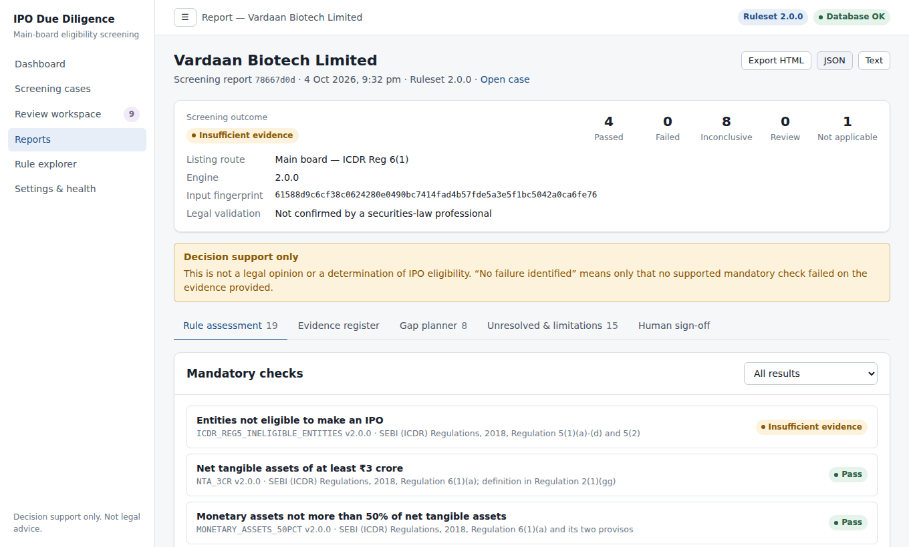
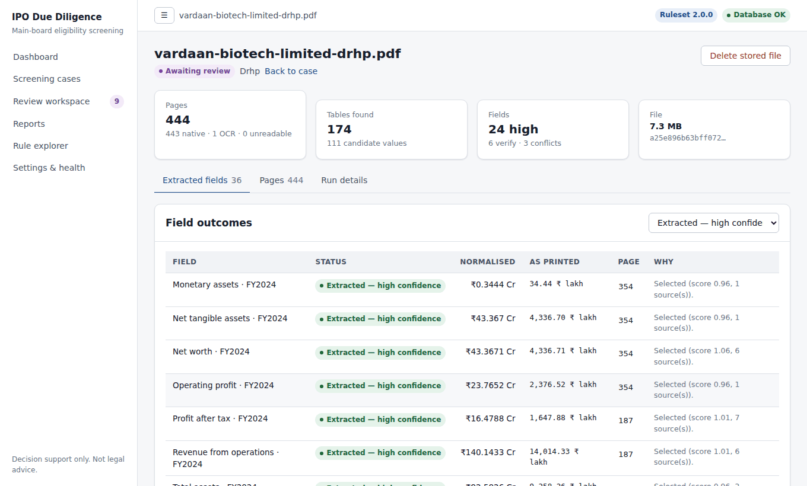
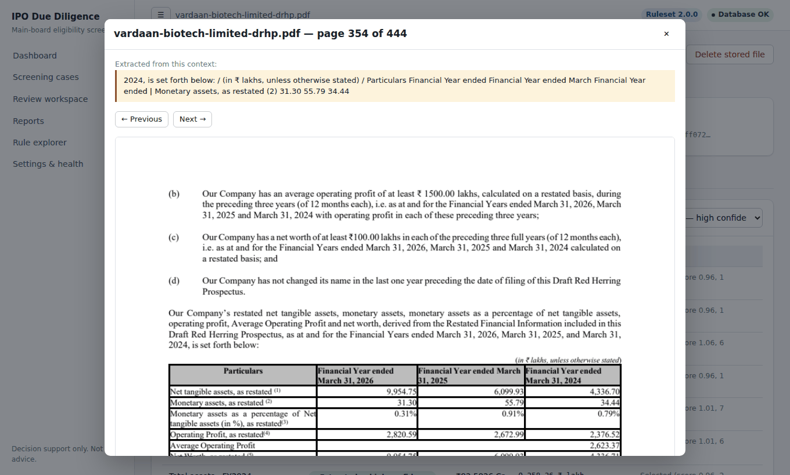
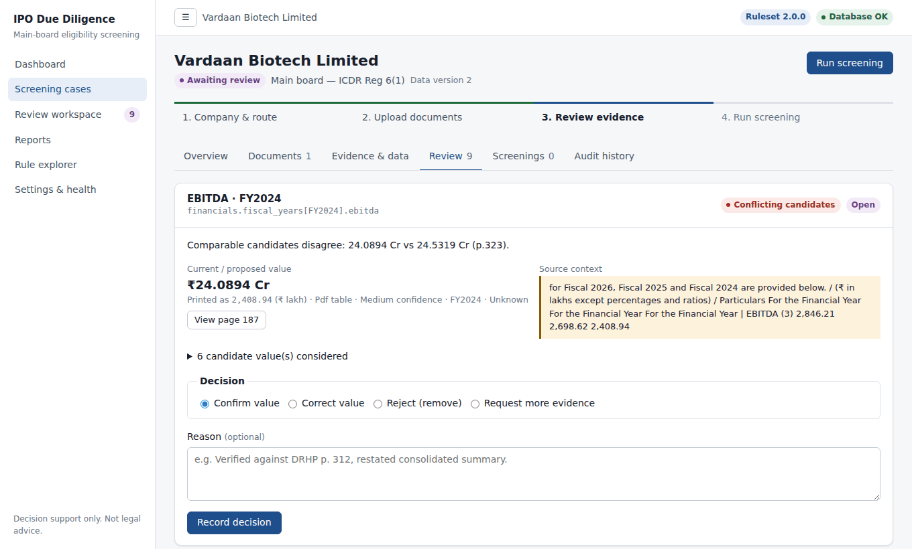
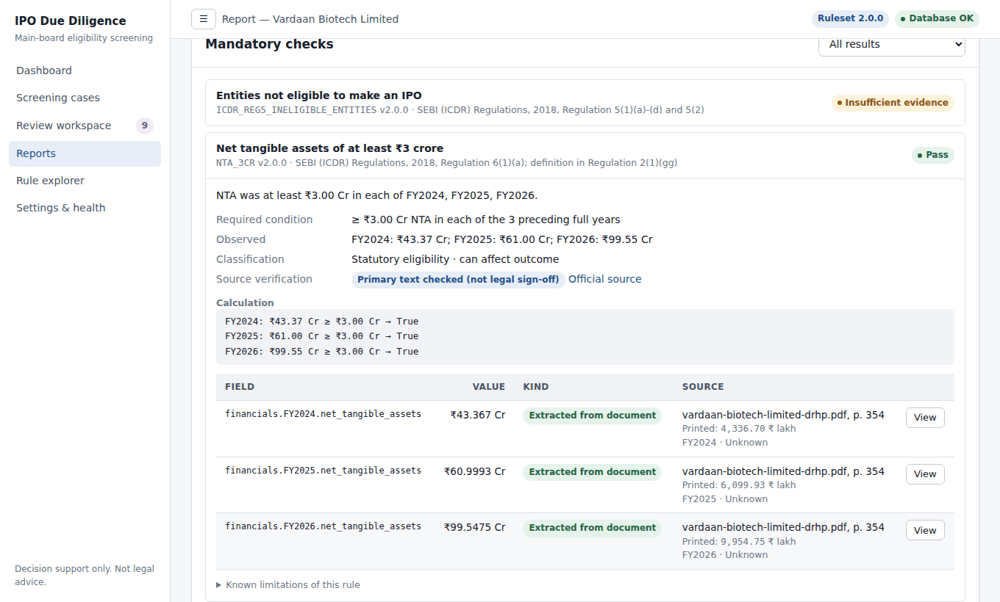
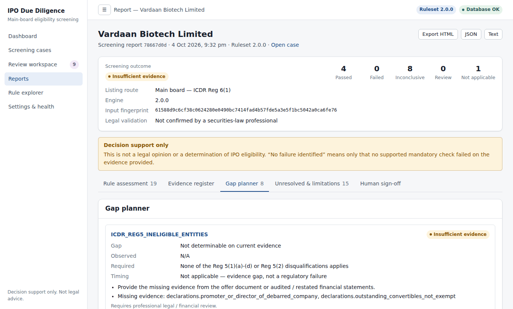
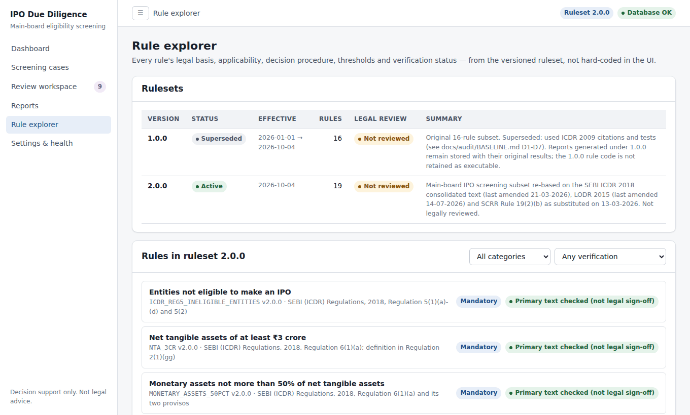

<div align="center">

# IPO Due Diligence Engine

**Evidence-first IPO eligibility screening for Indian companies.**




</div>

> [!IMPORTANT]
> This is a screening assistant, **not legal advice**. The rules have not yet been
> reviewed by a securities lawyer, and the engine never declares a company "eligible".
> A human reviewer always makes the final decision.

## What it does

To list on the BSE or NSE main board, an Indian company must meet SEBI's **ICDR
Regulations, 2018**: minimum net tangible assets, operating profit and net worth over
three years, plus promoter, lock-in and public-shareholding conditions. Checking these
means searching a 400–600-page **Draft Red Herring Prospectus (DRHP)** for the right
figures.

This engine reads the DRHP and finds those figures. It sends anything uncertain to a
human reviewer, checks the case against 19 versioned rules, and produces a report in
which every number links back to its source page. Everything runs on your machine:
there is no AI/LLM, no cloud service and no API key.

## Features

*Screenshots are taken from the app processing a real public DRHP (Vardaan Biotech
Limited, filed with SEBI).*

<table>
<tr>
<td width="50%" valign="top">

<b>Reads the DRHP.</b> Finds each eligibility figure, with its page, the figure as
printed, its unit (lakh/million/crore) and a confidence status. Scanned pages are read
with OCR.
</td>
<td width="50%" valign="top">

<b>Shows the source.</b> One click opens the exact PDF page beside the value, so it can
be checked in seconds.
</td>
</tr>
<tr>
<td valign="top">

<b>Never guesses.</b> Conflicting or uncertain values go to a review queue. A reviewer
confirms, corrects or rejects each one, and correcting or rejecting needs a reason.
</td>
<td valign="top">

<b>Explains every rule.</b> Each rule shows the regulation, the calculation, its
evidence with page links, and whether its source has been verified.
</td>
</tr>
<tr>
<td valign="top">

<b>Plans the gaps.</b> Lists what's missing or failing and how to fix it, and keeps
"evidence missing" separate from an actual regulatory failure.
</td>
<td valign="top">

<b>Versioned rules.</b> Every rule is tied to its SEBI provision and source document,
with a verification status. Superseded rulesets are kept for audit.
</td>
</tr>
</table>

Reports can be exported as HTML, JSON or text, and a reviewer can sign them off. Every
edit and decision is recorded in a permanent audit trail.

## What it checks

It supports **main board, ICDR Regulation 6(1) and 6(2)**. The SME platform is reported
as unsupported.

| Rule | Regulation |
|---|---|
| Ineligible entities (debarred, wilful defaulter, …) | ICDR Reg 5 |
| Net tangible assets ≥ ₹3 Cr, monetary assets ≤ 50% · operating profit avg ≥ ₹15 Cr · net worth ≥ ₹1 Cr | ICDR Reg 6(1)(a)–(c) |
| Name-change test · QIB route conditions | ICDR Reg 6(1)(d), 6(2) |
| Promoter contribution ≥ 20% · lock-in | ICDR Reg 14, 16 |
| Minimum public offer (2026 tiers) | SCRR 19(2)(b) ⚠️ secondary sources |
| Post-issue capital, market cap, issue size | BSE / NSE ⚠️ unverified |
| Advisory: board, audit committee, track record, RPT, auditor, litigation | LODR 17–18, heuristics |

A case gets one of these outcomes: `NO_FAILURE_IDENTIFIED` (which does **not** mean the
company is eligible), `SCREENING_FAILURE`, `AWAITING_HUMAN_REVIEW`,
`INSUFFICIENT_EVIDENCE` or `UNSUPPORTED_SCOPE`. Full details:
[docs/REGULATIONS.md](docs/REGULATIONS.md).

## Accuracy

Extraction was measured on **13 real SEBI DRHPs**, with 12 eligibility figures per
document. The holdout documents were added only after the code was frozen and were
never used for tuning.

| | Development (8 docs) | Holdout (5 docs) |
|---|---|---|
| Correct value and page | 81 / 84 | **57 / 60** |
| Correct value, different page than expected | 3 | 3 |
| Wrong value | 0 | **0** |
| Missed | 0 | 0 |

The answer keys have not yet been verified by a human, so treat these figures as
indicative. Method and full history, including an earlier, weaker holdout (21/36), are
in [docs/BENCHMARK.md](docs/BENCHMARK.md).

## Run it locally

**Requirements:** Python 3.12, Node.js 20+, Git. Tesseract is optional (see below).

### 1. Set up (once)

```bash
git clone https://github.com/VenkateshPanda0/ipo-due-diligence-engine.git
cd ipo-due-diligence-engine

python3.12 -m venv .venv
.venv/bin/pip install -e ".[dev]"

cd frontend && npm ci && cd ..
```

<details>
<summary>Windows</summary>

```powershell
py -3.12 -m venv .venv
.venv\Scripts\pip install -e ".[dev]"
cd frontend; npm ci; cd ..
```
</details>

### 2. Start (two terminals)

```bash
# Terminal 1 — backend (http://127.0.0.1:8000)
cd backend
../.venv/bin/uvicorn app.main:app --reload --port 8000

# Terminal 2 — frontend (http://localhost:3000)
cd frontend
NEXT_PUBLIC_API_BASE_URL=http://127.0.0.1:8000 npm run dev
```

<details>
<summary>Windows</summary>

```powershell
# Terminal 1
cd backend; ..\.venv\Scripts\uvicorn app.main:app --reload --port 8000

# Terminal 2
cd frontend; $env:NEXT_PUBLIC_API_BASE_URL="http://127.0.0.1:8000"; npm run dev
```
</details>

### 3. Use it

Open **http://localhost:3000**. The API docs are at http://127.0.0.1:8000/docs.

1. Click **New screening case**, then enter the company name and route.
2. Upload a DRHP PDF. You can find these on sebi.gov.in → Filings → Public Issues.
3. Confirm or correct the flagged values under **Review**.
4. Click **Run screening**, then open, export or sign off the report.

No database or API key is needed. Data is stored in `backend/data/`.

### Optional

| | |
|---|---|
| OCR for scanned PDFs | macOS `brew install tesseract` · Ubuntu `sudo apt install tesseract-ocr` · Windows: UB-Mannheim installer, added to PATH |
| Tests | `cd backend && ../.venv/bin/pytest -q tests/` · `cd frontend && npm test` |
| Docker (backend) | `docker build -t ipo-dd . && docker run -p 8000:8000 -v ipo-data:/data ipo-dd` |
| Settings | Copy `.env.example` to `.env`. Every setting has a safe default. |
| Benchmark | `.venv/bin/python scripts/benchmark_extraction.py --download --run` |
| Screenshots | With both servers running: `cd frontend && node scripts/screenshots.mjs <drhp.pdf> "<Company>"` |

**Troubleshooting:** most setup failures come from a Python version other than 3.12
(`python3.12 --version`). If the UI shows "Cannot reach the API", check that the backend
is running on port 8000.

## Built with

FastAPI · SQLite (SQLAlchemy and Alembic) · pdfium · pdfplumber · Tesseract ·
Next.js 15 · React · TanStack Query. The architecture is described in
[docs/ARCHITECTURE.md](docs/ARCHITECTURE.md).

```text
backend/app/   intelligence/ (PDF extraction) · rules/ · regulatory/ · engine/ · services/ · api/ · db/
frontend/src/  pages, components, typed API client
benchmark/     DRHP manifest and answer keys
docs/          architecture, regulations, benchmark, guides, ADRs, screenshots
```

## Documentation

[Architecture](docs/ARCHITECTURE.md) ·
[Regulations](docs/REGULATIONS.md) ·
[Document intelligence](docs/DOCUMENT_INTELLIGENCE.md) ·
[Benchmark](docs/BENCHMARK.md) ·
[Human review](docs/HUMAN_REVIEW_WORKFLOW.md) ·
[Developer guide](docs/DEVELOPER_GUIDE.md) ·
[Roadmap](docs/ROADMAP.md) ·
[Changelog](docs/CHANGELOG.md)

## License

[MIT](LICENSE) © 2026 Venkatesh Panda. Regulatory content is a good-faith reading of
public SEBI texts as of October 2026. Verify it against official sources before relying
on it.
