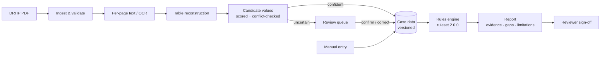

<div align="center">

# IPO Due Diligence Engine

**Evidence-first IPO eligibility screening for Indian companies.**
Reads a DRHP, finds the figures that SEBI's eligibility rules care about, checks them
against the regulations, and shows exactly where every number came from.


</div>

> [!IMPORTANT]
> This is a **screening assistant, not legal advice**. The encoded rules have **not**
> been reviewed by a securities lawyer (`REGULATORY_VALIDATION_CONFIRMED=false`), and
> the engine never says a company "is eligible". At best it says *"no failure identified
> within the supported screening scope"*. A human reviewer always makes the final call.

---

## What this repo does

Before a company in India can launch an IPO on the main board of the BSE or NSE, it has
to meet the eligibility conditions in **SEBI's ICDR Regulations, 2018**. For the
standard route (Regulation 6(1)) these include at least ₹3 crore of net tangible assets,
an average operating profit of at least ₹15 crore, and a net worth of at least ₹1 crore,
each over the preceding three years. Companies that don't meet them can still list
under Regulation 6(2), but only through a book-built issue with at least 75% of the
offer reserved for institutional buyers. Promoter contribution, lock-in, minimum public
shareholding and exchange criteria apply on top.

Checking this by hand means digging through a 400–600-page **Draft Red Herring
Prospectus (DRHP)**: finding the right table, reading the right year and unit (lakhs?
millions?), and doing the arithmetic. This project automates that first pass:

1. **Reads the document.** You upload a DRHP (PDF). A local pipeline extracts text, rebuilds
   financial tables (OCR for scanned pages), and finds net tangible assets, monetary
   assets, operating profit and net worth for each year, together with the page, the
   printed figure and its unit.
2. **Asks when it isn't sure.** Any value that is ambiguous, conflicting, read by OCR,
   or missing a declared unit goes to a **review queue**. A person confirms, corrects
   or rejects it. Nothing is guessed, and a human-entered value is never overwritten.
3. **Applies the rules.** 19 rules (13 mandatory, 6 advisory), each tied to a specific
   regulation and version, evaluate the case deterministically. A rule can only
   **FAIL** on reliable evidence. Weak evidence gives **Requires human review**.
4. **Explains the result.** A report lists every rule with its calculation, the evidence
   behind it (with page links), what is missing, what to fix, and the limitations. You
   can export it as HTML, JSON or text, and a reviewer can sign it off.

Everything runs on your machine. There is no LLM, no cloud service and no API key, and
documents never leave the server.

## How it works



| Layer | What it is |
|---|---|
| **Document intelligence** (`backend/app/intelligence`) | pdfium text, geometric and ruled table reconstruction, Tesseract OCR fallback with rotation and deskew, Indian number formats (`12,34,567.89`, `(1,234)`), lakh/million/crore units, and a financial-label lexicon with traps (for example, *profit before tax is not operating profit*). |
| **Rules** (`backend/app/rules`, `backend/app/regulatory`) | One class per rule, bound to a versioned JSON spec that records the provision, parameters, source document hash and verification status. |
| **Decision engine** (`backend/app/engine`) | Rolls rule verdicts up into a case outcome and a remediation plan. Advisory rules never change the outcome. |
| **Backend** (`backend/app/api`, `services`, `db`) | FastAPI with SQLite (via SQLAlchemy and Alembic). Cases keep immutable data versions, and the audit tables are append-only. Optional API keys with roles (viewer, analyst, reviewer, admin). |
| **Frontend** (`frontend/`) | Next.js 15 and React: dashboard, cases, document viewer with page previews, review queue, reports, rule explorer and settings. Light and dark themes, works on mobile. |

## What it checks

**Supported:** the main board under ICDR Regulation 6(1) and Regulation 6(2).
**Not supported:** the SME platform (Chapter IX). An SME case is reported as
`UNSUPPORTED_SCOPE` and no rules are run.

| | Rule | Basis | Source verified? |
|---|---|---|---|
| Mandatory | Not an ineligible entity (debarred, wilful defaulter, fraudulent borrower…) | ICDR Reg 5 | ✅ primary text |
| | Net tangible assets ≥ ₹3 Cr in each of 3 years | ICDR Reg 6(1)(a) | ✅ |
| | Monetary assets ≤ 50% of NTA (with both provisos) | ICDR Reg 6(1)(a) | ✅ |
| | Average operating profit ≥ ₹15 Cr, with a profit in each of 3 years | ICDR Reg 6(1)(b) | ✅ |
| | Net worth ≥ ₹1 Cr in each of 3 years | ICDR Reg 6(1)(c) | ✅ |
| | Name-change revenue test | ICDR Reg 6(1)(d) | ✅ |
| | QIB route: book-built, ≥ 75% to QIBs, refund undertaking | ICDR Reg 6(2) | ✅ |
| | Promoter contribution ≥ 20% (with provisos) | ICDR Reg 14 | ✅ |
| | Promoter lock-in of 18 / 36 months | ICDR Reg 16 | ✅ |
| | Minimum public offer, six market-cap tiers | SCRR Rule 19(2)(b), 2026 | ⚠️ secondary sources only |
| | Post-issue capital, market cap and issue size | BSE / NSE criteria | ⚠️ unverified |
| Advisory | Board independence, audit committee | LODR Reg 17, 18 | ✅ |
| | Operating track record | NSE criteria | ⚠️ unverified |
| | Related-party transactions, auditor remarks, litigation | engineering heuristics | — |

The full traceability matrix, source hashes and open legal questions are in
[docs/REGULATIONS.md](docs/REGULATIONS.md).

### Outcomes

| Outcome | Meaning |
|---|---|
| `NO_FAILURE_IDENTIFIED` | Every mandatory rule passed on reliable evidence. This does **not** mean the company is eligible. |
| `SCREENING_FAILURE` | At least one mandatory rule failed on reliable evidence. |
| `AWAITING_HUMAN_REVIEW` | Some evidence needs a person to confirm it. |
| `INSUFFICIENT_EVIDENCE` | Required inputs are missing. |
| `UNSUPPORTED_SCOPE` | The listing route is not covered (for example, SME). |

## How accurate is the extraction?

The pipeline was measured on **8 real DRHPs filed with SEBI**. Five were used for
development and three were held out and never inspected while tuning. Each document
has 12 Regulation 6(1) figures (NTA, monetary assets, operating profit and net worth
for three years).

| | Development (5 docs) | Holdout (3 docs) |
|---|---|---|
| Correct value **and** page | 48 / 48 | 21 / 36 |
| Correct value, but from another page than the answer key expects | 0 | 6 |
| Wrong value | 0 | 0 |
| Abstained (no unit or value found) | 0 | 9 |
| Correct abstentions where the DRHP declares no unit | 6 / 9 | — |
| Listing route detected | 5 / 5 | 3 / 3 |

The holdout is the honest number: one holdout document (Vardaan Biotech) defeated the
table reader, and the pipeline abstained instead of guessing. The answer keys were
prepared by an AI assistant from `pdftotext` output and **have not been verified by a
human**, so treat these numbers as indicative. Method: [docs/BENCHMARK.md](docs/BENCHMARK.md).
Full per-field results: [docs/BENCHMARK_RESULTS.md](docs/BENCHMARK_RESULTS.md).

## Quick start

You need Python 3.12 and Node.js 20+. For scanned PDFs you can also install
Tesseract (`apt install tesseract-ocr`), but it is optional.

```bash
git clone https://github.com/VenkateshPanda0/ipo-due-diligence-engine.git
cd ipo-due-diligence-engine

python3.12 -m venv .venv
.venv/bin/pip install -e ".[dev]"
(cd frontend && npm ci)

# terminal 1: API on http://127.0.0.1:8000  (interactive docs at /docs)
cd backend && ../.venv/bin/uvicorn app.main:app --reload --port 8000

# terminal 2: UI on http://localhost:3000
cd frontend && NEXT_PUBLIC_API_BASE_URL=http://127.0.0.1:8000 npm run dev
```

There is no database to set up and no keys to configure. SQLite and the uploaded files
live in `./data`. Docker alternative (backend only):
`docker build -t ipo-dd . && docker run -p 8000:8000 -v ipo-data:/data ipo-dd`.

### A typical session

1. **New screening case.** Enter the company name and choose the route (Reg 6(1) or
   6(2)).
2. **Upload the DRHP.** Processing runs in the background with progress shown. Then
   look at what was found, page by page.
3. **Review.** Confirm or correct each flagged value against the page preview.
   Correcting or rejecting a value requires a reason.
4. **Fill in the rest.** Issue details, promoter holding and declarations can be
   entered manually.
5. **Run screening.** Open the report and export it, or record a reviewer sign-off.

## API

The versioned API lives under `/api/v1`. OpenAPI docs are at `/docs` when not running
in production.

```text
POST /api/v1/cases                          create a case
POST /api/v1/cases/{id}/documents           upload a PDF (202, processed in background)
GET  /api/v1/documents/{id}/extraction      per-field results, candidates and pages
GET  /api/v1/review-items                   review queue
POST /api/v1/review-items/{id}/resolve      confirm | correct | reject | request_more_evidence
POST /api/v1/cases/{id}/screenings          run the rules → report
GET  /api/v1/reports/{id}/export?format=    html | json | text
POST /api/v1/reports/{id}/sign-off          reviewer decision
GET  /api/v1/rules                          rule specs with citations
```

The original endpoints (`/screen/json`, `/screen/pdf`, `/reports/{id}`, `/rules`,
`/health`) still work, for compatibility.

## Configuration

Every setting has a safe local default. See [`.env.example`](.env.example). The
settings you're most likely to change:

| Variable | Default | Purpose |
|---|---|---|
| `API_KEYS` | *(empty: local single user)* | `user\|role\|key` or `user\|role\|sha256=<hex>`, comma-separated |
| `DATABASE_URL` / `DATA_DIR` | `sqlite:///./data/…` / `./data` | Where data lives |
| `OCR_ENABLED`, `MAX_OCR_PAGES` | `true`, `60` | OCR fallback budget |
| `MAX_UPLOAD_SIZE_MB`, `MAX_PDF_PAGES` | `50`, `1500` | Upload limits |
| `RETAIN_DOCUMENTS`, `RETENTION_DAYS` | `true`, `90` | PDF retention; metadata and the audit trail are kept |
| `REGULATORY_VALIDATION_CONFIRMED` | `false` | Set only after a documented legal sign-off |

## Testing

```bash
cd backend && ../.venv/bin/pytest -q tests/          # backend: unit, integration, regression
.venv/bin/ruff check backend && .venv/bin/mypy backend/app
cd frontend && npm run typecheck && npm test         # frontend unit tests
cd frontend && npm run e2e                           # Playwright, with both servers running
.venv/bin/python scripts/benchmark_extraction.py --download --run   # real-DRHP benchmark
```

As of 2026-10-04: **430** backend tests, **15** frontend unit tests and **5** Playwright
scenarios (desktop and mobile) pass. `ruff` and `mypy --strict` are clean, and the production npm
dependencies have no known vulnerabilities.

## Project structure

```text
backend/app/
  intelligence/   PDF → candidate values (ingest, pages, OCR, tables, lexicon, candidates)
  rules/          one class per regulatory rule (mandatory/ and advisory/)
  regulatory/     versioned rulesets and the source register (JSON)
  engine/         rules engine, decision engine, gap planner
  services/       cases, documents, screening, reports, human review
  api/  db/       FastAPI routers and middleware, SQLAlchemy models and migrations
  reports/        HTML / JSON / text report formatters
frontend/src/     Next.js pages, components and a typed API client
benchmark/        DRHP manifest and answer keys (PDFs downloaded on demand)
docs/             architecture, regulations, benchmark, ADRs, guides
```

## Documentation

| | |
|---|---|
| [Architecture](docs/ARCHITECTURE.md) | Components, data flow, persistence, security |
| [Regulations](docs/REGULATIONS.md) | Rule-by-rule traceability, sources, open legal questions |
| [Document intelligence](docs/DOCUMENT_INTELLIGENCE.md) | How extraction works and what it won't do |
| [Benchmark](docs/BENCHMARK.md) · [Results](docs/BENCHMARK_RESULTS.md) | Method and measured accuracy |
| [Human review](docs/HUMAN_REVIEW_WORKFLOW.md) | Field review and report sign-off |
| [Developer guide](docs/DEVELOPER_GUIDE.md) | Setup, conventions, adding rules |
| [Regulatory validation](docs/REGULATORY_VALIDATION.md) | What a legal sign-off requires |
| [Roadmap](docs/ROADMAP.md) · [Tech debt](docs/TECH_DEBT.md) · [Changelog](docs/CHANGELOG.md) · [ADRs](docs/adr/) | |

## What this is not

- **Not legal advice, and not a substitute for merchant bankers or securities counsel.**
- **No readiness score.** A single number hides why a company fails (ADR 0002).
- **No AI-decided outcomes.** Every verdict comes from deterministic, versioned code.
- **Not complete.** The SME route, disclosure obligations, sector-specific conditions
  and exemptions are not covered. Only the rules in the table above are checked.

## License

[MIT](LICENSE) © 2026 Venkatesh Panda

<sub>Regulatory content is a good-faith transcription of public SEBI texts as of 2026-10-04 and may be
incomplete or outdated. Verify against the official source before relying on it.</sub>
