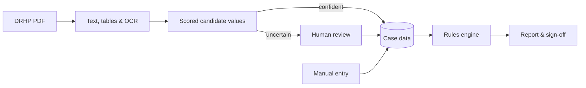

<div align="center">

# IPO Due Diligence Engine

**Evidence-first IPO eligibility screening for Indian companies.**


</div>

> [!IMPORTANT]
> This is a screening assistant, **not legal advice**. The rules have not yet been
> reviewed by a securities lawyer, and the engine never declares a company "eligible".
> A human reviewer always makes the final decision.

## What it does

To list on the BSE or NSE main board, an Indian company must meet the eligibility
conditions in **SEBI's ICDR Regulations, 2018**. These include minimum net tangible
assets, operating profit and net worth over the last three years, along with promoter
contribution, lock-in and public-shareholding requirements. Checking them by hand means
searching a 400–600-page **Draft Red Herring Prospectus (DRHP)** for the right figures.

This engine automates that first pass:

1. **Reads the DRHP.** It extracts the eligibility figures from the PDF's tables, using
   OCR for scanned pages. For each value it records the page, the printed figure and the
   unit.
2. **Flags uncertainty.** Ambiguous, conflicting or unit-less values go to a review
   queue for a person to confirm or correct. Nothing is guessed.
3. **Applies the rules.** It runs 19 versioned rules (13 mandatory, 6 advisory), each
   linked to a specific regulation. A rule can only fail on reliable evidence.
4. **Explains the result.** The report shows each rule's calculation, its evidence with
   page references, any gaps, and how to fix them. You can export it as HTML, JSON or
   text, and a reviewer can sign it off.

Everything runs on your machine. There is no AI/LLM, no cloud service and no API key.

## How it works



| Component | Technology |
|---|---|
| Document extraction | pdfium, pdfplumber, Tesseract OCR (all local) |
| Rules and decisions | Deterministic Python with versioned JSON rulesets |
| Backend | FastAPI, SQLite (SQLAlchemy and Alembic), optional role-based API keys |
| Frontend | Next.js 15, React, TanStack Query |

## What it checks

It supports **main board, ICDR Regulation 6(1) and 6(2)**. The SME platform is
reported as unsupported.

| Rule | Regulation |
|---|---|
| Ineligible entities (debarred, wilful defaulter, …) | ICDR Reg 5 |
| Net tangible assets ≥ ₹3 Cr; monetary assets ≤ 50% | ICDR Reg 6(1)(a) |
| Average operating profit ≥ ₹15 Cr | ICDR Reg 6(1)(b) |
| Net worth ≥ ₹1 Cr | ICDR Reg 6(1)(c) |
| Name-change revenue test; QIB route conditions | ICDR Reg 6(1)(d), 6(2) |
| Promoter contribution ≥ 20%; lock-in | ICDR Reg 14, 16 |
| Minimum public offer (2026 tiers) | SCRR Rule 19(2)(b) ⚠️ secondary sources |
| Post-issue capital, market cap, issue size | BSE / NSE criteria ⚠️ unverified |
| Advisory: board, audit committee, track record, RPT, auditor, litigation | LODR 17–18, heuristics |

| Outcome | Meaning |
|---|---|
| `NO_FAILURE_IDENTIFIED` | No failure was found within the supported scope. This does **not** mean the company is eligible. |
| `SCREENING_FAILURE` | A mandatory rule failed on reliable evidence. |
| `AWAITING_HUMAN_REVIEW` | Some evidence needs confirmation. |
| `INSUFFICIENT_EVIDENCE` | Required inputs are missing. |
| `UNSUPPORTED_SCOPE` | The route is not covered (for example, SME). |

## Accuracy

Extraction was measured on **8 real SEBI DRHPs**, with 12 eligibility figures per
document. Five documents were used during development; three were held out and never
used for tuning.

| | Development | Holdout |
|---|---|---|
| Correct value and page | 48 / 48 | 21 / 36 |
| Correct value, different page | 0 | 6 |
| Wrong value | 0 | 0 |
| Abstained (unit not found) | 0 | 9 |

The answer keys have not been human-verified yet, so treat these figures as indicative.
Details are in [docs/BENCHMARK.md](docs/BENCHMARK.md).

## Run it locally

**Requirements:** Python 3.12, Node.js 20+, Git. Tesseract is optional (see below).

### 1. Set up (once)

```bash
git clone https://github.com/VenkateshPanda0/ipo-due-diligence-engine.git
cd ipo-due-diligence-engine

python3.12 -m venv .venv
.venv/bin/pip install -e ".[dev]"

cd frontend && npm ci && cd ..
```

<details>
<summary>Windows</summary>

```powershell
py -3.12 -m venv .venv
.venv\Scripts\pip install -e ".[dev]"
cd frontend; npm ci; cd ..
```
</details>

### 2. Start (two terminals)

```bash
# Terminal 1 — backend (http://127.0.0.1:8000)
cd backend
../.venv/bin/uvicorn app.main:app --reload --port 8000

# Terminal 2 — frontend (http://localhost:3000)
cd frontend
NEXT_PUBLIC_API_BASE_URL=http://127.0.0.1:8000 npm run dev
```

<details>
<summary>Windows</summary>

```powershell
# Terminal 1
cd backend; ..\.venv\Scripts\uvicorn app.main:app --reload --port 8000

# Terminal 2
cd frontend; $env:NEXT_PUBLIC_API_BASE_URL="http://127.0.0.1:8000"; npm run dev
```
</details>

### 3. Use it

Open **http://localhost:3000**. The API docs are at http://127.0.0.1:8000/docs.

1. Click **New screening case**, then enter the company name and route.
2. Upload a DRHP PDF. You can find these on sebi.gov.in → Filings → Public Issues.
3. Confirm or correct the flagged values in **Review**.
4. Click **Run screening**, then open, export or sign off the report.

No database or API key is needed. Data is stored in `backend/data/`.

### Optional

| | |
|---|---|
| OCR for scanned PDFs | macOS `brew install tesseract` · Ubuntu `sudo apt install tesseract-ocr` · Windows: UB-Mannheim installer, added to PATH |
| Tests | `cd backend && ../.venv/bin/pytest -q tests/` · `cd frontend && npm test` |
| Docker (backend) | `docker build -t ipo-dd . && docker run -p 8000:8000 -v ipo-data:/data ipo-dd` |
| Settings | Copy `.env.example` to `.env`. Every setting has a safe default. |
| Benchmark | `.venv/bin/python scripts/benchmark_extraction.py --download --run` |

**Troubleshooting:** most setup failures come from a Python version other than 3.12
(`python3.12 --version`). If the UI shows "Cannot reach the API", check that the backend
is running on port 8000.

## Project structure

```text
backend/app/   intelligence/ (PDF extraction) · rules/ · regulatory/ (rulesets)
               engine/ · services/ · api/ · db/ · reports/
frontend/src/  pages, components, typed API client
benchmark/     DRHP manifest and answer keys
docs/          architecture, regulations, benchmark, guides, ADRs
```

## Documentation

[Architecture](docs/ARCHITECTURE.md) ·
[Regulations](docs/REGULATIONS.md) ·
[Document intelligence](docs/DOCUMENT_INTELLIGENCE.md) ·
[Benchmark](docs/BENCHMARK.md) ·
[Human review](docs/HUMAN_REVIEW_WORKFLOW.md) ·
[Developer guide](docs/DEVELOPER_GUIDE.md) ·
[Roadmap](docs/ROADMAP.md) ·
[Changelog](docs/CHANGELOG.md)

## License

[MIT](LICENSE) © 2026 Venkatesh Panda. Regulatory content is a good-faith reading of
public SEBI texts as of October 2026. Verify it against official sources before relying
on it.
