# Architecture — IPO Due Diligence Engine

> **Version:** 1.0.0  
> **Last Updated:** 2026-07-08  
> **Author:** Staff Engineering  
> **Status:** Living Document

---

## Table of Contents

1. [High-Level Architecture](#1-high-level-architecture)
2. [Architectural Goals](#2-architectural-goals)
3. [System Diagram](#3-system-diagram)
4. [Repository Structure](#4-repository-structure)
5. [Layered Architecture](#5-layered-architecture)
6. [Data Flow](#6-data-flow)
7. [CompanyData — Canonical Schema](#7-companydata--canonical-schema)
8. [Rules Engine](#8-rules-engine)
9. [Decision Engine](#9-decision-engine)
10. [Document Intelligence Layer](#10-document-intelligence-layer)
11. [Evidence Traceability](#11-evidence-traceability)
12. [Rule Explorer](#12-rule-explorer)
13. [API Architecture](#13-api-architecture)
14. [Frontend Architecture](#14-frontend-architecture)
15. [Testing Architecture](#15-testing-architecture)
16. [Versioning](#16-versioning)

---

## 1. High-Level Architecture

The IPO Due Diligence Engine is a **deterministic regulatory decision system** that evaluates a company's readiness for an Initial Public Offering against SEBI ICDR Regulations, NSE/BSE listing requirements, and Companies Act governance provisions.

The system is partitioned into two fundamentally distinct computational domains:

| Domain | Nature | Responsibility |
|---|---|---|
| **Document Intelligence** | Probabilistic (AI-assisted) | Extract structured financial data from unstructured PDFs, annual reports, and DRHP filings |
| **Regulatory Engine** | Deterministic (rule-based) | Evaluate extracted data against codified regulations and produce auditable eligibility reports |

The cardinal architectural invariant is the **separation boundary** between these domains. Probabilistic outputs from Document Intelligence are never consumed directly by the Regulatory Engine. All data must first be normalized into the `CompanyData` canonical schema — a validated, immutable, fully-typed domain object that serves as the single source of truth for all downstream computation.

This separation guarantees three properties:

1. **Reproducibility** — Given the same `CompanyData` and `RulesetVersion`, the engine produces byte-identical reports.
2. **Auditability** — Every eligibility verdict traces back to a specific regulation, a specific extracted value, and a specific page in the source document.
3. **Testability** — The deterministic core can be exhaustively tested without any AI infrastructure, PDF files, or external services.

---

## 2. Architectural Goals

### 2.1 Determinism

Every rule evaluation is a pure function: `f(CompanyData) → RuleResult`. No randomness, no network calls, no side effects. The same input always produces the same output. This is non-negotiable for a system whose outputs inform multi-crore financial decisions.

### 2.2 Explainability

Regulatory decisions are not black boxes. Every `PASS`, `FAIL`, or `INCONCLUSIVE` verdict carries:
- The regulation reference (e.g., SEBI ICDR Reg. 26(1))
- The required threshold (e.g., ≥ ₹15 Cr average operating profit)
- The actual extracted value (e.g., ₹12.4 Cr)
- The source citation (e.g., "Annual Report FY2024, Page 47, Table 3")

### 2.3 Maintainability

Regulations change. SEBI amends the ICDR periodically. The architecture isolates regulation knowledge into discrete `Rule` objects with explicit `RuleMetadata` citations. Adding a new rule or updating a threshold is a single-file change with a corresponding test — no shotgun surgery across layers.

### 2.4 Testability

The deterministic core is designed for 100% branch coverage. `CompanyDataFactory` generates arbitrary test scenarios. Golden dataset regression suites lock known-correct outputs. No test requires a running database, an LLM API key, or a PDF file.

### 2.5 Scalability

The architecture supports horizontal scaling at the API layer (stateless FastAPI workers) and vertical scaling at the Document Intelligence layer (parallel PDF processing). The deterministic engine itself is CPU-bound and completes in sub-second time for any single company evaluation.

---

## 3. System Diagram

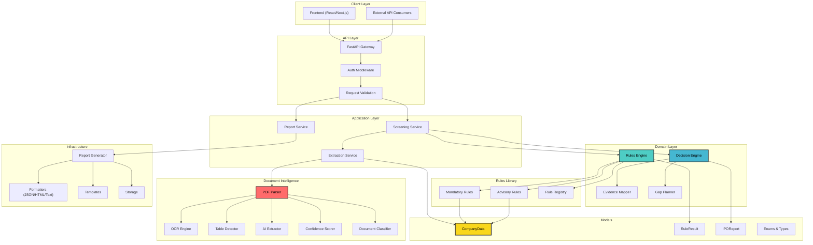

---

## 4. Repository Structure

```
ipo-due-diligence-engine/
├── backend/                          # All server-side code
│   ├── app/
│   │   ├── api/                      # FastAPI routers, schemas, dependencies, middleware
│   │   │   ├── routers/              # Endpoint definitions: screen, reports, rules
│   │   │   ├── schemas/              # Request/response Pydantic models (API-facing)
│   │   │   ├── dependencies.py       # FastAPI Depends() injection
│   │   │   └── middleware.py         # CORS, logging, request-id, error handling
│   │   │
│   │   ├── core/                     # Cross-cutting infrastructure
│   │   │   ├── config.py             # Settings via pydantic-settings (env, .env)
│   │   │   ├── security.py           # API key validation, rate limiting
│   │   │   ├── logging.py            # Structured JSON logging setup
│   │   │   └── constants.py          # System-wide constants and enums
│   │   │
│   │   ├── engine/                   # Orchestration layer (deterministic)
│   │   │   ├── rules_engine.py       # Iterates rules, collects RuleResult[]
│   │   │   ├── decision_engine.py    # Derives IPOStatus from RuleResult[]
│   │   │   ├── evidence_mapper.py    # Attaches source citations to verdicts
│   │   │   └── gap_planner.py        # Computes gaps and earliest eligibility FY
│   │   │
│   │   ├── models/                   # Domain types — pure data, no behavior
│   │   │   ├── company_data.py       # CompanyData canonical schema
│   │   │   ├── rule_result.py        # RuleResult, RuleMetadata, Verdict
│   │   │   ├── ipo_report.py         # IPOReport aggregate
│   │   │   ├── enums.py              # IPOStatus, Verdict, ConfidenceLevel, etc.
│   │   │   └── exceptions.py         # Domain exceptions (InsufficientData, etc.)
│   │   │
│   │   ├── parser/                   # Document Intelligence (probabilistic)
│   │   │   ├── pdf_parser.py         # Orchestrates extraction pipeline
│   │   │   ├── ocr_engine.py         # Tesseract/EasyOCR integration
│   │   │   ├── table_detector.py     # pdfplumber + Camelot table extraction
│   │   │   ├── ai_extractor.py       # LLM-based field extraction
│   │   │   ├── confidence_scorer.py  # Assigns HIGH/MEDIUM/LOW confidence
│   │   │   └── document_classifier.py # Identifies document type (AR, DRHP, etc.)
│   │   │
│   │   ├── reports/                  # Report generation infrastructure
│   │   │   ├── report_generator.py   # Orchestrates report assembly
│   │   │   ├── formatters/           # JSON, plain text, HTML formatters
│   │   │   └── templates/            # Jinja2 templates for HTML reports
│   │   │
│   │   ├── rules/                    # Individual regulation implementations
│   │   │   ├── base_rule.py          # Abstract BaseRule class
│   │   │   ├── mandatory/            # SEBI ICDR mandatory eligibility rules
│   │   │   │   ├── profitability.py  # Avg operating profit ≥ ₹15 Cr
│   │   │   │   ├── net_worth.py      # Net worth ≥ ₹1 Cr each of 3 years
│   │   │   │   ├── net_tangible_assets.py  # NTA ≥ ₹3 Cr each of 3 years
│   │   │   │   ├── track_record.py   # 3 full years operating history
│   │   │   │   ├── float_requirements.py   # Public offer ≥ 25%/10% by market cap
│   │   │   │   ├── promoter.py       # Promoter contribution 20%, lock-in 18m/3y
│   │   │   │   ├── issue_size.py     # Issue size ≤ 5x pre-issue net worth
│   │   │   │   └── minimum_capital.py # Post-issue paid-up ≥ ₹10 Cr, mkt cap ≥ ₹25 Cr
│   │   │   ├── advisory/             # Best-practice and governance checks
│   │   │   │   ├── governance.py     # Board independence, audit committee composition
│   │   │   │   ├── rpt.py            # Related party transaction disclosure
│   │   │   │   ├── auditor.py        # Auditor qualifications, modified opinions
│   │   │   │   └── litigation.py     # Pending litigation risk assessment
│   │   │   └── registry.py           # Discovers and registers all rules
│   │   │
│   │   ├── schemas/                  # Pydantic models for internal data contracts
│   │   │   ├── request_schemas.py    # Screening request schemas
│   │   │   └── response_schemas.py   # Report response schemas
│   │   │
│   │   └── services/                 # Application services (orchestration)
│   │       ├── screening_service.py  # End-to-end screening orchestration
│   │       ├── extraction_service.py # PDF → CompanyData pipeline
│   │       └── report_service.py     # Report retrieval and formatting
│   │
│   └── tests/
│       ├── unit/
│       │   ├── rules/                # One test file per rule, 100% branch coverage
│       │   ├── engine/               # Rules engine + decision engine tests
│       │   ├── parser/               # Parser tests (mocked AI calls)
│       │   └── reports/              # Report formatter tests
│       ├── integration/
│       │   ├── api/                  # Full HTTP roundtrip tests
│       │   └── services/             # Service-level integration tests
│       ├── regression/
│       │   └── companies/            # Golden dataset tests (known inputs → known outputs)
│       ├── fixtures/                 # CompanyDataFactory, sample PDFs, mock data
│       └── conftest.py               # Shared pytest fixtures
│
├── frontend/                         # React/Next.js client (stretch goal)
│   ├── src/
│   │   ├── pages/                    # Upload, Report, Rule Explorer
│   │   ├── components/               # UI components
│   │   ├── hooks/                    # Custom React hooks
│   │   ├── services/                 # API client layer
│   │   └── types/                    # TypeScript type definitions
│   └── public/
│
├── docs/                             # Project documentation
│   ├── SPEC.md                       # Product specification
│   ├── DEVELOPER_GUIDE.md            # Engineering guide and conventions
│   ├── ARCHITECTURE.md               # This document
│   ├── REGULATIONS.md                # SEBI/NSE/BSE regulation reference
│   ├── CHANGELOG.md                  # Version history
│   └── adr/                          # Architecture Decision Records
│
├── sample_data/                      # Example PDFs, annual reports for testing
└── scripts/                          # CLI utilities, data scripts, CI helpers
```

### Folder Responsibility Matrix

| Folder | Deterministic? | May Import From | Must Not Import From |
|---|---|---|---|
| `models/` | ✅ Yes | Standard library only | Everything else |
| `rules/` | ✅ Yes | `models/` | `parser/`, `api/`, `services/` |
| `engine/` | ✅ Yes | `models/`, `rules/` | `parser/`, `api/` |
| `parser/` | ❌ No | `models/` (output only) | `rules/`, `engine/` |
| `services/` | Mixed | `engine/`, `parser/`, `models/` | `api/` |
| `api/` | ❌ No | `services/`, `schemas/`, `models/` | `rules/`, `engine/` directly |
| `reports/` | ✅ Yes | `models/` | `parser/`, `api/` |

---

## 5. Layered Architecture

The system follows a strict layered architecture with unidirectional dependency flow. Each layer may only depend on the layer directly below it or on the domain models at the center.

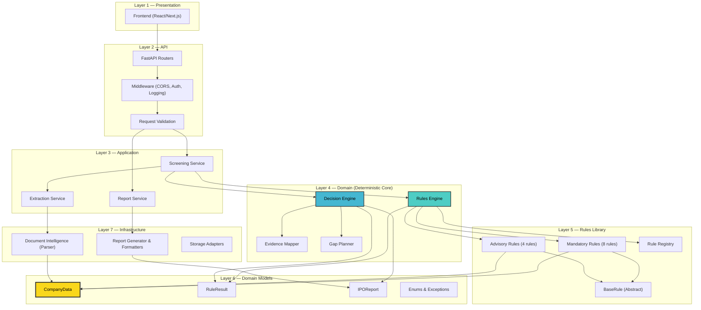

### Layer Descriptions

| Layer | Responsibility | Key Constraint |
|---|---|---|
| **Presentation** | User interface for uploading documents, viewing reports, exploring rules | No business logic; pure rendering and API calls |
| **API** | HTTP endpoint definitions, request parsing, response serialization, error mapping | Thin translation layer; delegates immediately to services |
| **Application** | Orchestrates multi-step workflows (extract → evaluate → report) | Stateless; coordinates domain objects, owns no business rules |
| **Domain (Engine)** | Executes rule evaluation, derives eligibility status, plans remediation | Pure deterministic computation; no I/O, no external calls |
| **Rules Library** | Individual regulation implementations as self-contained rule objects | Each rule is a pure function of `CompanyData`; no shared mutable state |
| **Domain Models** | Canonical data types: `CompanyData`, `RuleResult`, `IPOReport` | Immutable (frozen) after construction; no behavior, no dependencies |
| **Infrastructure** | PDF parsing, OCR, AI extraction, report formatting, storage | May be probabilistic; outputs must be validated before domain consumption |

---

## 6. Data Flow

### 6.1 PDF-to-Report Pipeline

The following diagram traces the complete lifecycle of a screening request, from PDF upload to final eligibility report.

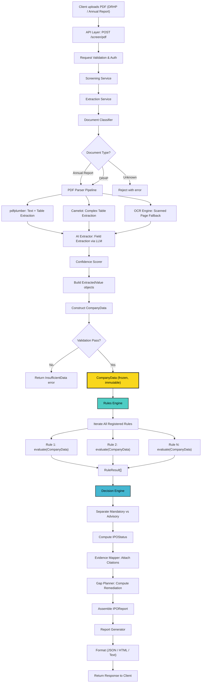

### 6.2 JSON-to-Report Pipeline (Direct Input)

For cases where structured data is already available (e.g., manual entry, integration with ERP systems), the system accepts `CompanyData` directly via `POST /screen/json`, bypassing the Document Intelligence layer entirely. This path is fully deterministic end-to-end.

### 6.3 The Separation Boundary

The critical transition occurs at the point where `CompanyData` is constructed. Before this point, all processing is probabilistic — OCR may misread digits, AI may hallucinate values, table extraction may misalign columns. After this point, all processing is deterministic — rules execute as pure functions on validated, typed data.

```
┌─────────────────────────────┐     ┌──────────────────────────────┐
│   PROBABILISTIC DOMAIN      │     │   DETERMINISTIC DOMAIN       │
│                             │     │                              │
│   PDF → OCR → AI → Extract  │ ──► │   CompanyData → Rules → Report│
│                             │     │                              │
│   Confidence: variable      │     │   Confidence: absolute       │
│   Reproducibility: no       │     │   Reproducibility: yes       │
│   Testable: partially       │     │   Testable: 100%             │
└─────────────────────────────┘     └──────────────────────────────┘
                                 ▲
                          Separation Boundary
                     (CompanyData construction)
```

---

## 7. CompanyData — Canonical Schema

`CompanyData` is the gravitational center of the architecture. Every rule, every engine method, every report generator consumes `CompanyData` and nothing else. It is a Pydantic model with `frozen=True` — immutable after construction.

### 7.1 Why CompanyData Is the Single Dependency

1. **Decoupling** — Rules don't know if data came from a PDF, manual entry, or an API integration. They only know `CompanyData`.
2. **Testability** — `CompanyDataFactory` can construct any scenario without touching the parser.
3. **Reproducibility** — Serialized `CompanyData` + `RulesetVersion` fully determines the output.
4. **Auditability** — Every field carries provenance (`ExtractedValue`) tracing to the source document.

### 7.2 ExtractedValue — The Provenance Wrapper

Every financial data point in `CompanyData` is wrapped in an `ExtractedValue[T]` generic container:

```python
class ExtractedValue(BaseModel, Generic[T], frozen=True):
    value: T                                    # The actual data (Decimal, str, int, bool)
    source_document: str                        # e.g., "Annual_Report_FY2024.pdf"
    page_number: int | None                     # Page where value was found
    extraction_method: ExtractionMethod         # PDF_TABLE | OCR | MANUAL
    confidence: ConfidenceLevel                 # HIGH | MEDIUM | LOW
    confirmed_by_human: bool = False            # Whether a human verified this value
    raw_text: str | None = None                 # Original text before parsing
```

### 7.3 Schema Structure

```mermaid
classDiagram
    class CompanyData {
        +CompanyIdentification identification
        +FinancialHistory financials
        +PromoterData promoter
        +GovernanceData governance
        +LitigationData litigation
        +RelatedPartyData rpt
        +IssueDetails issue_details
        +AuditorData auditor
        +RulesetVersion ruleset_version
    }

    class CompanyIdentification {
        +str company_name
        +str cin
        +str industry
        +date incorporation_date
        +str registered_office
    }

    class FinancialHistory {
        +list~FiscalYear~ fiscal_years
        +int years_of_operation
    }

    class FiscalYear {
        +str year_label
        +ExtractedValue~Decimal~ revenue
        +ExtractedValue~Decimal~ operating_profit
        +ExtractedValue~Decimal~ pat
        +ExtractedValue~Decimal~ net_worth
        +ExtractedValue~Decimal~ net_tangible_assets
        +ExtractedValue~Decimal~ monetary_assets
        +ExtractedValue~Decimal~ total_assets
        +ExtractedValue~Decimal~ total_liabilities
        +ExtractedValue~Decimal~ paid_up_capital
        +ExtractedValue~Decimal~ reserves_and_surplus
        +ExtractedValue~Decimal~ ebitda
    }

    class PromoterData {
        +ExtractedValue~Decimal~ holding_percentage
        +ExtractedValue~Decimal~ post_issue_holding
        +ExtractedValue~int~ lock_in_months
        +bool is_capex_issue
        +list~PromoterEntity~ entities
    }

    class GovernanceData {
        +ExtractedValue~int~ total_directors
        +ExtractedValue~int~ independent_directors
        +ExtractedValue~bool~ is_chair_executive
        +ExtractedValue~bool~ is_chair_promoter
        +AuditCommittee audit_committee
    }

    class AuditCommittee {
        +ExtractedValue~int~ total_members
        +ExtractedValue~int~ independent_members
        +ExtractedValue~bool~ chair_is_independent
    }

    class IssueDetails {
        +ExtractedValue~Decimal~ issue_size
        +ExtractedValue~Decimal~ pre_issue_net_worth
        +ExtractedValue~Decimal~ post_issue_paid_up_capital
        +ExtractedValue~Decimal~ expected_market_cap
        +ExtractedValue~Decimal~ public_offer_percentage
        +str issue_type
    }

    class LitigationData {
        +list~LitigationCase~ pending_cases
        +ExtractedValue~Decimal~ total_exposure
        +ExtractedValue~bool~ has_criminal_cases
    }

    class RelatedPartyData {
        +list~RPTTransaction~ transactions
        +ExtractedValue~Decimal~ total_rpt_value
        +ExtractedValue~bool~ arm_length_certified
    }

    class AuditorData {
        +str auditor_name
        +ExtractedValue~bool~ has_qualifications
        +ExtractedValue~bool~ has_modified_opinion
        +ExtractedValue~int~ years_as_auditor
    }

    CompanyData --> CompanyIdentification
    CompanyData --> FinancialHistory
    CompanyData --> PromoterData
    CompanyData --> GovernanceData
    CompanyData --> LitigationData
    CompanyData --> RelatedPartyData
    CompanyData --> IssueDetails
    CompanyData --> AuditorData
    FinancialHistory --> FiscalYear
    GovernanceData --> AuditCommittee
```

### 7.4 Field Groups

| Group | Purpose | Key Fields | Used By Rules |
|---|---|---|---|
| **Identification** | Company metadata | `company_name`, `cin`, `incorporation_date` | Track record rule |
| **Financial History** | 3–5 years of financial statements | Revenue, PAT, net worth, NTA per year | Profitability, net worth, NTA, monetary assets |
| **Promoter** | Promoter shareholding structure | `holding_percentage`, `lock_in_months` | Promoter contribution, lock-in rules |
| **Governance** | Board and committee composition | Director counts, independence ratios | Board independence, audit committee rules |
| **Issue Details** | IPO-specific parameters | `issue_size`, `post_issue_paid_up_capital`, `expected_market_cap` | Issue size, minimum capital, float rules |
| **Litigation** | Pending legal matters | Case count, exposure amount | Litigation risk advisory |
| **RPT** | Related party transactions | Transaction list, arm's length status | RPT disclosure advisory |
| **Auditor** | Statutory auditor information | Qualifications, modified opinions | Auditor quality advisory |

---

## 8. Rules Engine

### 8.1 Responsibilities

The Rules Engine is the execution framework for regulatory checks. It does **not** contain regulation knowledge itself — that lives in individual `Rule` objects. The engine's responsibilities are:

1. **Discovery** — Load all registered rules from the `Rule Registry`
2. **Iteration** — Execute each rule's `evaluate()` method against `CompanyData`
3. **Collection** — Gather all `RuleResult` objects into an ordered list
4. **Isolation** — Ensure rules execute independently with no shared state

### 8.2 Core Interfaces

#### BaseRule (Abstract)

```python
class BaseRule(ABC):
    """Abstract base class for all regulatory rules."""

    @property
    @abstractmethod
    def rule_id(self) -> str:
        """Unique identifier, e.g., 'SEBI_ICDR_26_1_PROFITABILITY'"""

    @property
    @abstractmethod
    def metadata(self) -> RuleMetadata:
        """Regulation citation and classification"""

    @abstractmethod
    def evaluate(self, company: CompanyData) -> RuleResult:
        """Pure function: CompanyData → RuleResult. No side effects."""
```

#### RuleResult

```python
class RuleResult(BaseModel, frozen=True):
    rule_id: str                          # Links back to the rule
    verdict: Verdict                      # PASS | FAIL | INCONCLUSIVE
    category: RuleCategory                # MANDATORY | ADVISORY
    regulation_reference: str             # e.g., "SEBI ICDR Reg. 26(1)"
    description: str                      # Human-readable rule description
    required_value: str                   # e.g., "≥ ₹15 Cr"
    actual_value: str | None              # e.g., "₹12.4 Cr"
    gap: str | None                       # e.g., "₹2.6 Cr shortfall"
    source_citation: SourceCitation | None  # Document provenance
    explanation: str                      # Detailed reasoning
    evaluated_at: datetime                # Timestamp of evaluation
```

#### RuleMetadata

```python
class RuleMetadata(BaseModel, frozen=True):
    regulation: str                       # "SEBI (ICDR) Regulations, 2018"
    section: str                          # "Regulation 26(1)"
    clause: str | None                    # "Clause (a)"
    description: str                      # Plain-English description
    category: RuleCategory                # MANDATORY | ADVISORY
    effective_date: date                  # When this version of the regulation took effect
    source_url: str | None                # Link to SEBI gazette
```

### 8.3 Rule Evaluation Flow

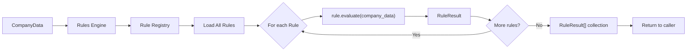

### 8.4 Mandatory Rules (SEBI ICDR)

These rules map directly to SEBI (ICDR) Regulations, 2018. A `FAIL` on any mandatory rule renders the company **Not Eligible** for a mainboard IPO via the profitability route.

| Rule ID | Regulation | Threshold | Logic |
|---|---|---|---|
| `NTA_3CR` | Reg. 26(1)(a) | NTA ≥ ₹3 Cr | Each of 3 preceding full FYs must have NTA ≥ ₹3 Cr |
| `MONETARY_ASSETS_50PCT` | Reg. 26(1)(a) proviso | Monetary assets ≤ 50% of NTA | If NTA condition met, monetary assets must not exceed 50% of NTA |
| `AVG_OPERATING_PROFIT_15CR` | Reg. 26(1)(b) | Avg ≥ ₹15 Cr | Pre-tax operating profit averaged across at least 3 of preceding 5 FYs |
| `NET_WORTH_1CR` | Reg. 26(1)(c) | Net worth ≥ ₹1 Cr | Each of 3 preceding full FYs |
| `ISSUE_SIZE_5X` | Reg. 26(2) | Issue ≤ 5× net worth | Total issue size must not exceed 5× pre-issue net worth |
| `TRACK_RECORD_3Y` | Reg. 26(1) | ≥ 3 full years | Company must have 3 full years of operating track record |
| `PUBLIC_OFFER_MIN` | Reg. 26(5) | 25% or 10% | ≥ 25% for market cap ≤ ₹1600 Cr; ≥ 10% for market cap > ₹1600 Cr |
| `PROMOTER_CONTRIBUTION_20` | Reg. 32 | ≥ 20% of post-issue capital | Promoter(s) must contribute at least 20% |
| `PROMOTER_LOCK_IN` | Reg. 36 | 18m standard, 3y capex | Lock-in period varies by issue type |
| `MIN_POST_ISSUE_CAPITAL` | Listing Reg. | ≥ ₹10 Cr | Post-issue paid-up capital minimum |
| `MIN_MARKET_CAP` | Listing Reg. | ≥ ₹25 Cr | Expected market capitalization minimum |

### 8.5 Advisory Rules

Advisory rules do not block eligibility but flag governance risks and best-practice deviations. A `FAIL` on an advisory rule produces a warning observation in the report.

| Rule ID | Regulation | Check |
|---|---|---|
| `BOARD_INDEPENDENCE` | Companies Act s.149 / LODR Reg. 17 | ≥ 1/3 independent if non-exec chair; ≥ 1/2 if exec or promoter chair |
| `AUDIT_COMMITTEE` | LODR Reg. 18 | Min 3 directors, 2/3 independent, chair must be independent |
| `RPT_DISCLOSURE` | LODR Reg. 23 | Related party transactions disclosed and certified at arm's length |
| `AUDITOR_QUALIFICATION` | Companies Act s.143 | No modified opinions or qualifications in audit reports |
| `LITIGATION_RISK` | SEBI ICDR Sch. VI | Material pending litigation disclosed with exposure quantified |

### 8.6 Rule Registry

The `Rule Registry` is responsible for discovering and instantiating all rule implementations. It supports:

- **Auto-discovery** — Scans `rules/mandatory/` and `rules/advisory/` for `BaseRule` subclasses
- **Version filtering** — Loads only rules applicable to the requested `RulesetVersion`
- **Category filtering** — Can return only mandatory or only advisory rules
- **Idempotency** — Registry state is immutable after initialization

---

## 9. Decision Engine

### 9.1 Responsibilities

The Decision Engine sits above the Rules Engine and transforms raw `RuleResult[]` into actionable intelligence:

1. **Classification** — Separates mandatory results from advisory results
2. **Eligibility Determination** — Derives `IPOStatus` from mandatory results
3. **Progress Computation** — Calculates pass/fail/inconclusive counts and percentages
4. **Gap Analysis** — Delegates to the Gap Planner for remediation planning
5. **Evidence Assembly** — Delegates to the Evidence Mapper for citation attachment
6. **Report Assembly** — Constructs the final `IPOReport` aggregate

### 9.2 Eligibility Logic

```python
def determine_status(mandatory_results: list[RuleResult]) -> IPOStatus:
    if any(r.verdict == Verdict.FAIL for r in mandatory_results):
        return IPOStatus.NOT_ELIGIBLE
    if any(r.verdict == Verdict.INCONCLUSIVE for r in mandatory_results):
        return IPOStatus.NEEDS_REVIEW
    return IPOStatus.ELIGIBLE
```

The logic is deliberately simple. No weighting, no scoring, no ML. A single mandatory `FAIL` blocks eligibility. A single `INCONCLUSIVE` (usually from low-confidence extracted data) triggers human review.

### 9.3 Decision Engine Flow

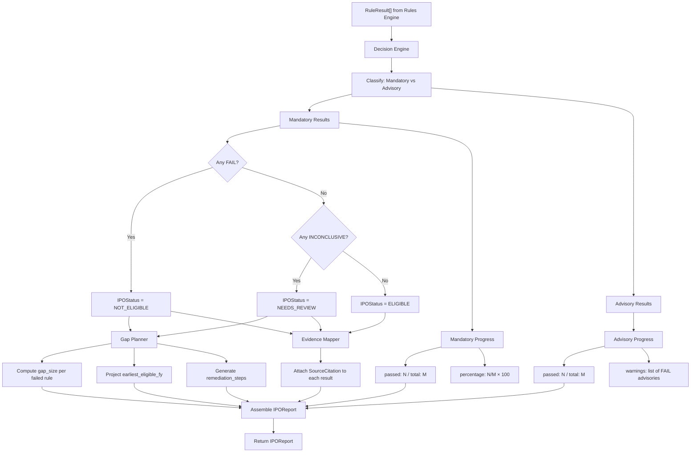

### 9.4 Progress Counting

The engine produces a progress summary for both mandatory and advisory categories:

```python
class EligibilityProgress(BaseModel, frozen=True):
    total_rules: int
    passed: int
    failed: int
    inconclusive: int
    pass_percentage: Decimal          # (passed / total_rules) × 100
    failed_rule_ids: list[str]        # For quick identification
```

### 9.5 Gap Planner

The Gap Planner operates only on `FAIL` verdicts and computes:

| Output | Description | Example |
|---|---|---|
| `gap_size` | Numeric shortfall from the threshold | "₹2.6 Cr shortfall in average operating profit" |
| `earliest_eligible_fy` | Projected FY when the company could become eligible | "FY2028 (assuming 20% profit growth)" |
| `remediation_steps` | Ordered list of actions to close the gap | ["Achieve ₹17.6 Cr operating profit in FY2026", "Maintain for 3 consecutive years"] |

The planner uses only historical financial data and simple linear/compound projections — no ML, no forecasting models. All projections are clearly labeled as estimates.

### 9.6 Observations

The Decision Engine also collects free-text observations — notable findings that don't map to a specific rule:

- "Company incorporated less than 5 years ago — limited track record"
- "Three of five fiscal years show declining revenue trend"
- "Promoter holding will drop below 20% post-dilution at upper price band"

---

## 10. Document Intelligence Layer

### 10.1 Architectural Constraint

> **The Document Intelligence layer MUST NOT contain any business logic.**

This layer's sole responsibility is converting unstructured documents into structured `ExtractedValue` objects. It does not know what constitutes a valid net worth, what the minimum NTA threshold is, or whether a company is eligible. It extracts numbers and attaches confidence scores. Period.

### 10.2 Pipeline Architecture

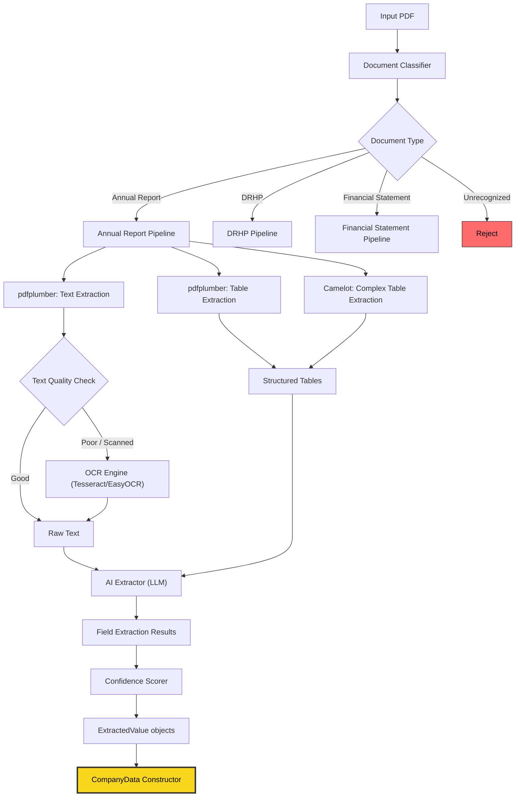

### 10.3 Component Details

#### Document Classifier

Identifies the document type using heuristic pattern matching (title pages, headers, table of contents) supplemented by LLM classification for ambiguous cases. Supported types:

- **Annual Report** — Financial statements, director's report, auditor's report
- **DRHP** — Draft Red Herring Prospectus with issue details
- **Financial Statement** — Standalone P&L, balance sheet, cash flow

#### PDF Parser (Orchestrator)

Coordinates the extraction pipeline. Decides which extraction methods to apply based on document type and page characteristics. Manages fallback chains (e.g., pdfplumber → Camelot → OCR → AI).

#### Table Extraction

Two engines are used in a fallback configuration:

1. **pdfplumber** — Primary engine. Handles well-structured tables with clear borders and consistent cell alignment. Fast and reliable for digitally-created PDFs.
2. **Camelot** — Secondary engine. Handles complex tables with merged cells, multi-line headers, and borderless layouts. Uses lattice and stream detection modes.

#### OCR Engine

Activated only when text extraction yields poor results (low character density, garbled text). Supports:

- **Tesseract** — Open-source, good for standard fonts
- **EasyOCR** — Better for mixed scripts (Hindi + English in Indian regulatory documents)

#### AI Extractor

Uses LLM calls (OpenAI GPT-4 / Anthropic Claude) to extract specific financial fields from raw text and table data. The AI receives structured prompts like:

```
Extract the following fields from this financial statement:
- Revenue from operations (₹ Crores)
- Profit after tax (₹ Crores)
- Net worth as per balance sheet (₹ Crores)

Return as JSON with field names, values, and the exact text snippet used.
```

**Critical constraint:** The AI extractor outputs raw `ExtractedValue` objects. It never evaluates, judges, or determines eligibility. The prompt explicitly instructs the model to extract, not to analyze.

#### Confidence Scorer

Assigns a `ConfidenceLevel` to each `ExtractedValue` based on extraction provenance:

| Confidence | Criteria |
|---|---|
| **HIGH** | Value extracted from a well-formed digital table via pdfplumber, cross-validated against multiple mentions in the document |
| **MEDIUM** | Value extracted via Camelot or AI from clear text, with single-source corroboration |
| **LOW** | Value extracted via OCR from a scanned page, or AI extraction with no table corroboration |

Rules that encounter `LOW` confidence values produce `INCONCLUSIVE` verdicts, triggering human review.

---

## 11. Evidence Traceability

### 11.1 The Provenance Chain

Every eligibility verdict in the final report traces back to a specific location in the source document through a four-link chain:

```
IPOReport.RuleResult.source_citation
    → SourceCitation.extracted_values[]
        → ExtractedValue.source_document + page_number
            → Original PDF, specific page, specific table
```

### 11.2 SourceCitation

```python
class SourceCitation(BaseModel, frozen=True):
    document_name: str                # "Annual_Report_FY2024.pdf"
    page_numbers: list[int]           # [47, 48]
    table_reference: str | None       # "Statement of Profit and Loss, Table 3"
    extracted_values: list[ExtractedValue]  # All values used in this rule's evaluation
    extraction_method: ExtractionMethod     # How the data was obtained
    confidence: ConfidenceLevel             # Lowest confidence among extracted values
    raw_snippets: list[str] | None    # Original text snippets
```

### 11.3 Evidence Flow

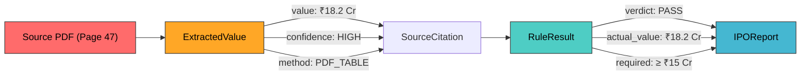

### 11.4 Why This Matters

In regulatory due diligence, a verdict without evidence is worthless. Investment bankers, legal counsel, and SEBI reviewers need to verify:

1. **What** the system concluded (verdict + explanation)
2. **Why** it concluded that (regulation reference + threshold comparison)
3. **Where** the data came from (document name + page number + table reference)
4. **How** the data was extracted (extraction method + confidence level)
5. **Whether** a human verified it (confirmed_by_human flag)

---

## 12. Rule Explorer

### 12.1 Regulation-to-Rule Mapping

The Rule Explorer provides a queryable registry that maps every implemented rule back to its source regulation. This serves two purposes:

1. **Transparency** — Users can inspect exactly which regulations are covered and how they are interpreted
2. **Completeness Audit** — Regulators or auditors can verify that all applicable rules are implemented

### 12.2 Regulation Citation Format

Every rule carries a standardized `RuleMetadata` citation:

```
SEBI (ICDR) Regulations, 2018 → Regulation 26(1) → Clause (a)
├── Description: Net tangible assets ≥ ₹3 Cr in each of 3 preceding full years
├── Category: MANDATORY
├── Effective Date: 2018-11-01
├── Source URL: https://www.sebi.gov.in/legal/regulations/...
└── Rule Implementation: NTA_3CR (net_tangible_assets.py)
```

### 12.3 Coverage Matrix

The Rule Explorer exposes a coverage matrix via `GET /rules`:

| Regulation | Section | Implemented | Rule ID | Status |
|---|---|---|---|---|
| SEBI ICDR 2018 | Reg. 26(1)(a) | ✅ | `NTA_3CR` | Active |
| SEBI ICDR 2018 | Reg. 26(1)(b) | ✅ | `AVG_OPERATING_PROFIT_15CR` | Active |
| SEBI ICDR 2018 | Reg. 26(1)(c) | ✅ | `NET_WORTH_1CR` | Active |
| SEBI ICDR 2018 | Reg. 26(2) | ✅ | `ISSUE_SIZE_5X` | Active |
| SEBI ICDR 2018 | Reg. 32 | ✅ | `PROMOTER_CONTRIBUTION_20` | Active |
| SEBI ICDR 2018 | Reg. 36 | ✅ | `PROMOTER_LOCK_IN` | Active |
| Companies Act | s.149 | ✅ | `BOARD_INDEPENDENCE` | Active |
| LODR | Reg. 17–18 | ✅ | `AUDIT_COMMITTEE` | Active |
| NSE Listing | — | ✅ | `MIN_MARKET_CAP` | Active |

### 12.4 SME Route Rules

For companies with post-issue paid-up capital ≤ ₹25 Cr, the SME platform rules apply as an alternative eligibility route:

| Rule ID | Regulation | Threshold |
|---|---|---|
| `SME_CAPITAL_LIMIT` | SEBI ICDR Ch. XB | Post-issue capital ≤ ₹25 Cr |
| `SME_EBITDA` | SEBI ICDR Ch. XB | EBITDA ≥ ₹1 Cr in at least 2 of 3 preceding FYs |
| `SME_QIB_ALLOTMENT` | SEBI ICDR Ch. XB | 75% allocation to QIBs (if applicable) |

---

## 13. API Architecture

### 13.1 Endpoint Reference

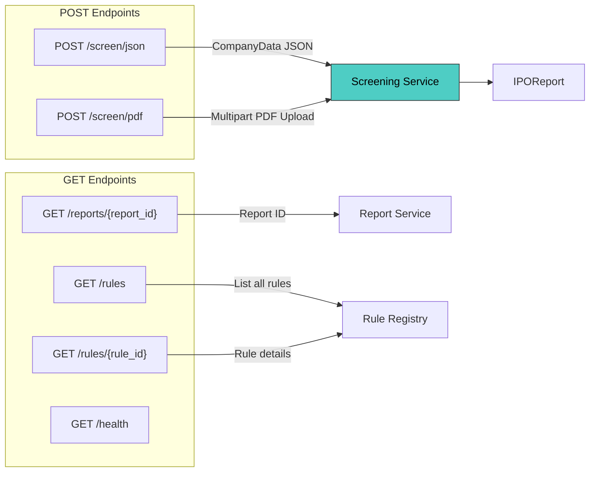

### 13.2 Endpoint Specifications

#### `POST /screen/json` — Direct Screening

Accepts structured `CompanyData` as JSON. Bypasses the Document Intelligence layer entirely. Fully deterministic.

```
Request:  CompanyDataSchema (validated Pydantic model)
Response: ScreeningResponse {
    report_id: UUID
    status: IPOStatus
    mandatory_progress: EligibilityProgress
    advisory_progress: EligibilityProgress
    mandatory_results: list[RuleResultSchema]
    advisory_results: list[RuleResultSchema]
    gap_analysis: GapAnalysis | null
    observations: list[str]
    ruleset_version: str
    evaluated_at: datetime
}
Status: 200 OK | 422 Validation Error
```

#### `POST /screen/pdf` — PDF Screening

Accepts a PDF file upload. Runs through the full Document Intelligence pipeline before screening.

```
Request:  multipart/form-data { file: UploadFile }
Response: ScreeningResponse (same as above, plus extraction_metadata)
    extraction_metadata: {
        document_type: str
        pages_processed: int
        extraction_methods_used: list[ExtractionMethod]
        overall_confidence: ConfidenceLevel
        low_confidence_fields: list[str]
    }
Status: 200 OK | 400 Bad Request | 422 Unprocessable Entity
```

#### `GET /reports/{report_id}` — Report Retrieval

Retrieves a previously generated report by ID. Supports format negotiation via `Accept` header or query parameter.

```
Request:  Path param report_id: UUID, Query param format: json|html|text
Response: IPOReport (full report with evidence chains)
Status: 200 OK | 404 Not Found
```

#### `GET /rules` — Rule Explorer

Lists all registered rules with metadata, regulation references, and current status.

```
Request:  Query params: category (mandatory|advisory), version (ruleset version)
Response: RuleListResponse {
    rules: list[RuleDetailSchema]
    total_count: int
    ruleset_version: str
    categories: { mandatory: int, advisory: int }
}
Status: 200 OK
```

#### `GET /rules/{rule_id}` — Rule Detail

Returns full detail for a specific rule including regulation text, thresholds, examples, and implementation notes.

```
Request:  Path param rule_id: str
Response: RuleDetailSchema {
    rule_id: str
    metadata: RuleMetadata
    threshold: str
    logic_description: str
    examples: list[RuleExample]
}
Status: 200 OK | 404 Not Found
```

### 13.3 Error Handling

All errors follow a consistent envelope:

```json
{
    "error": {
        "code": "INSUFFICIENT_DATA",
        "message": "Unable to extract net worth for FY2022 and FY2023",
        "details": {
            "missing_fields": ["financials.fiscal_years[1].net_worth", "financials.fiscal_years[2].net_worth"],
            "suggestion": "Upload complete annual reports or provide data via /screen/json"
        }
    }
}
```

Standard error codes:

| Code | HTTP Status | Meaning |
|---|---|---|
| `VALIDATION_ERROR` | 422 | Request body fails Pydantic validation |
| `INSUFFICIENT_DATA` | 422 | Extracted data insufficient for rule evaluation |
| `UNSUPPORTED_DOCUMENT` | 400 | Document type not recognized |
| `EXTRACTION_FAILED` | 500 | Document Intelligence pipeline failure |
| `REPORT_NOT_FOUND` | 404 | Report ID does not exist |
| `RULESET_NOT_FOUND` | 404 | Requested ruleset version does not exist |

### 13.4 Request Validation

All request validation is performed by Pydantic models at the API boundary. Domain models (`CompanyData`) perform secondary validation with domain-specific constraints (e.g., fiscal years must be chronologically ordered, `Decimal` values must be non-negative where applicable).

---

## 14. Frontend Architecture

> **Status:** Stretch Goal — The frontend is designed but not yet implemented. The system is fully functional via API.

### 14.1 Page Structure

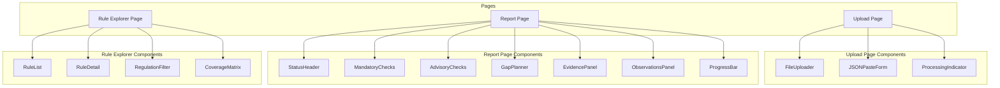

### 14.2 Page Descriptions

#### Upload Page

- **FileUploader** — Drag-and-drop PDF upload with file type validation and size limit enforcement
- **JSONPasteForm** — Alternative input method: paste or edit structured CompanyData JSON directly
- **ProcessingIndicator** — Real-time extraction progress with step-by-step status updates

#### Report Page

- **StatusHeader** — Large, prominent display of IPOStatus (`ELIGIBLE` / `NOT_ELIGIBLE` / `NEEDS_REVIEW`) with color coding (green / red / amber)
- **MandatoryChecks** — Card-based list of all mandatory rule results with pass/fail icons, expandable detail showing regulation reference, threshold, actual value, and evidence link
- **AdvisoryChecks** — Similar layout for advisory rules, styled as warnings rather than blockers
- **GapPlanner** — For failed rules: shows gap size, projected eligibility FY, and remediation steps in a timeline visualization
- **EvidencePanel** — Slide-out panel showing the source document page, highlighted extraction region, and confidence level for any selected rule result
- **ProgressBar** — Visual summary: "8 of 11 mandatory checks passed (73%)"
- **ObservationsPanel** — Free-text observations and notable findings

#### Rule Explorer Page

- **RuleList** — Filterable, searchable table of all rules with category badges
- **RuleDetail** — Expanded view showing regulation text, implementation logic description, thresholds, and example scenarios
- **RegulationFilter** — Filter by regulation source (SEBI ICDR / Companies Act / LODR / NSE / BSE)
- **CoverageMatrix** — Visual grid showing which regulations are covered by which rules

### 14.3 State Management

- **Server State** — React Query (TanStack Query) for API data fetching, caching, and synchronization
- **Client State** — React Context for UI state (selected rule, active panel, filter state)
- **URL State** — Next.js router for page navigation and report ID persistence
- **No Global Store** — Deliberately avoiding Redux/MobX; the application state is simple enough for Context + React Query

### 14.4 API Client

A typed API client layer maps to backend endpoints:

```typescript
interface IPOScreeningAPI {
    screenJSON(data: CompanyData): Promise<ScreeningResponse>;
    screenPDF(file: File): Promise<ScreeningResponse>;
    getReport(reportId: string, format?: 'json' | 'html'): Promise<IPOReport>;
    getRules(category?: 'mandatory' | 'advisory'): Promise<RuleListResponse>;
    getRuleDetail(ruleId: string): Promise<RuleDetail>;
}
```

---

### 14.5 Human Review Workflow

The frontend and API include a human-review workflow. Screening responses and JSON reports mark the output as machine assessment only with `machine_assessment_only`, `human_review_required`, and `decision_authority` fields. The report page exposes a `HumanReviewPanel` that opens a review record and records the authorised reviewer's final decision, rationale, and conditions.

API endpoints:

- `POST /reviews/reports/{report_id}` opens or returns the review record for a generated report.
- `GET /reviews/{review_id}` returns the current review state.
- `POST /reviews/{review_id}/decision` records the final human decision.

This keeps the deterministic engine responsible for evidence preparation and rule evaluation while preserving human authority for client-facing decisions.

## 15. Testing Architecture

### 15.1 Testing Pyramid

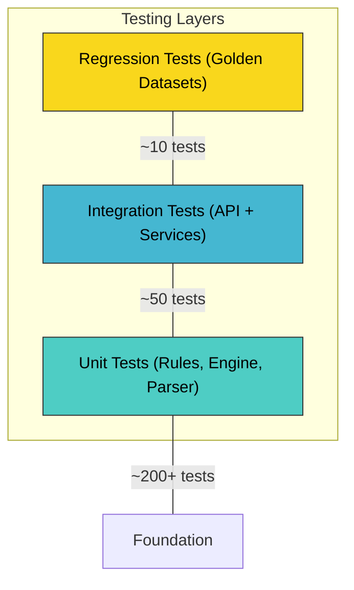

### 15.2 Unit Tests

**Scope:** Individual rules, engine methods, parser components, report formatters.

**Coverage Target:** 100% branch coverage on `rules/` and `engine/`. Every rule must have tests for:

- `PASS` case (company meets threshold)
- `FAIL` case (company misses threshold)
- `INCONCLUSIVE` case (data missing or low confidence)
- Edge cases (exactly at threshold, zero values, negative values)

**Test Structure:**

```
tests/unit/
├── rules/
│   ├── mandatory/
│   │   ├── test_profitability.py          # 8–12 test cases
│   │   ├── test_net_worth.py              # 6–10 test cases
│   │   ├── test_net_tangible_assets.py    # 8–10 test cases
│   │   ├── test_track_record.py           # 5–8 test cases
│   │   ├── test_float_requirements.py     # 6–10 test cases
│   │   ├── test_promoter.py              # 8–12 test cases
│   │   ├── test_issue_size.py            # 5–8 test cases
│   │   └── test_minimum_capital.py       # 4–6 test cases
│   └── advisory/
│       ├── test_governance.py            # 6–10 test cases
│       ├── test_rpt.py                   # 4–6 test cases
│       ├── test_auditor.py               # 4–6 test cases
│       └── test_litigation.py            # 4–6 test cases
├── engine/
│   ├── test_rules_engine.py              # Rule iteration, collection
│   ├── test_decision_engine.py           # Status derivation, progress
│   ├── test_evidence_mapper.py           # Citation attachment
│   └── test_gap_planner.py              # Gap calculation, projections
├── parser/
│   ├── test_confidence_scorer.py         # Confidence assignment logic
│   ├── test_document_classifier.py       # Document type detection
│   └── test_table_detector.py            # Table extraction validation
└── reports/
    ├── test_json_formatter.py
    ├── test_html_formatter.py
    └── test_text_formatter.py
```

**Test Factory:**

`CompanyDataFactory` generates `CompanyData` instances with configurable overrides:

```python
class CompanyDataFactory:
    @staticmethod
    def create(
        net_worth: Decimal = Decimal("5.0"),      # ₹ Crores
        nta: Decimal = Decimal("10.0"),
        operating_profit: Decimal = Decimal("20.0"),
        years_of_operation: int = 5,
        promoter_holding: Decimal = Decimal("25.0"),
        # ... all other fields with sensible defaults
    ) -> CompanyData:
        """Creates a valid CompanyData with the specified overrides."""
```

### 15.3 Integration Tests

**Scope:** Full HTTP roundtrips through FastAPI, service-level orchestration, multi-component interactions.

```
tests/integration/
├── api/
│   ├── test_screen_json.py       # POST /screen/json full roundtrip
│   ├── test_screen_pdf.py        # POST /screen/pdf with sample PDFs
│   ├── test_reports.py           # GET /reports/{id} retrieval
│   ├── test_rules.py             # GET /rules endpoint
│   └── test_error_handling.py    # Error response validation
└── services/
    ├── test_screening_service.py # Service orchestration
    └── test_extraction_service.py # PDF extraction pipeline (with mocked AI)
```

### 15.4 Regression Tests (Golden Datasets)

**Purpose:** Lock known-correct outputs for real-world company scenarios. Prevent regressions when rules are modified or new rules are added.

```
tests/regression/
└── companies/
    ├── test_large_profitable_company.py    # Should be ELIGIBLE
    ├── test_startup_insufficient_track.py  # Should fail TRACK_RECORD
    ├── test_low_profit_company.py          # Should fail PROFITABILITY
    ├── test_governance_concerns.py         # ELIGIBLE but advisory warnings
    ├── test_sme_eligible.py               # SME route eligible
    ├── test_edge_case_exact_threshold.py   # Values exactly at thresholds
    ├── test_inconclusive_low_confidence.py # NEEDS_REVIEW due to data quality
    └── golden_data/
        ├── large_profitable.json           # Frozen CompanyData
        ├── large_profitable_expected.json  # Expected IPOReport
        └── ...
```

**Golden Dataset Contract:**

```python
def test_golden_dataset(golden_company_data, expected_report):
    """
    Given frozen CompanyData and a RulesetVersion,
    the engine MUST produce byte-identical output
    to the expected report.
    """
    actual = screening_service.evaluate(golden_company_data)
    assert actual.status == expected_report.status
    assert actual.mandatory_results == expected_report.mandatory_results
    assert actual.advisory_results == expected_report.advisory_results
```

### 15.5 Coverage Requirements

| Module | Target Coverage | Enforcement |
|---|---|---|
| `rules/` | 100% branch | CI gate (pytest-cov) |
| `engine/` | 100% branch | CI gate |
| `models/` | 95%+ | CI gate |
| `parser/` | 80%+ (AI calls mocked) | CI advisory |
| `api/` | 90%+ | CI gate |
| `reports/` | 85%+ | CI gate |

---

## 16. Versioning

### 16.1 RulesetVersion

Every evaluation is tagged with a `RulesetVersion` identifier that pins the exact set of rules and thresholds used:

```python
class RulesetVersion(BaseModel, frozen=True):
    version: str          # Semantic version, e.g., "1.0.0"
    effective_date: date  # When this ruleset became active
    description: str      # e.g., "SEBI ICDR 2018, amended through 2025"
    regulations: list[str]  # List of regulation sources
```

### 16.2 Reproducibility Contract

```
Given:
    CompanyData(X) + RulesetVersion("1.0.0")
Then:
    IPOReport(Y) is deterministic and reproducible.
```

If the same `CompanyData` is evaluated against the same `RulesetVersion` at any point in time, on any machine, the output is identical. This is guaranteed by:

1. Rules are pure functions with no external dependencies
2. CompanyData is immutable (frozen)
3. No randomness, no system clock dependency in rule evaluation
4. All thresholds are constants within a RulesetVersion

### 16.3 Version Lifecycle

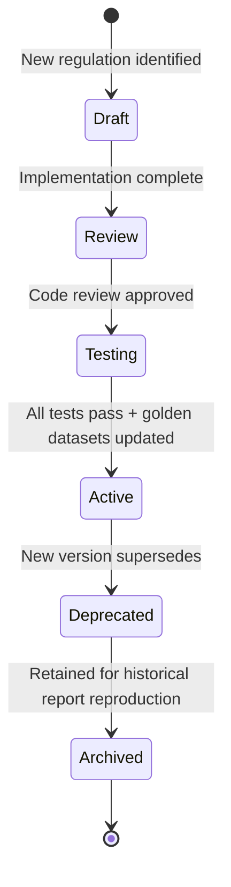

### 16.4 Handling Regulation Updates

When SEBI amends the ICDR (e.g., changing the NTA threshold from ₹3 Cr to ₹5 Cr):

1. **Create new rule version** — New file or updated threshold in the existing rule, gated by `RulesetVersion`
2. **Create new `RulesetVersion`** — e.g., `"1.1.0"` with updated `effective_date`
3. **Update Rule Registry** — Register the new rule version, mark the old as deprecated
4. **Update golden datasets** — Add new regression tests; existing tests remain unchanged (they test the old ruleset)
5. **Update CHANGELOG.md** — Document the regulation change, effective date, and impact
6. **Retain old ruleset** — Old `RulesetVersion("1.0.0")` remains available for reproducing historical reports

### 16.5 CHANGELOG Approach

The `CHANGELOG.md` follows [Keep a Changelog](https://keepachangelog.com/) format with regulation-specific extensions:

```markdown
## [1.1.0] - 2026-04-01

### Regulation Changes
- **SEBI ICDR Reg. 26(1)(a)**: NTA threshold updated from ₹3 Cr to ₹5 Cr
  - Effective: April 1, 2026
  - SEBI Circular: SEBI/HO/CFD/DIL2/CIR/P/2026/XX

### Added
- New rule `NTA_5CR` for RulesetVersion 1.1.0

### Deprecated
- Rule `NTA_3CR` deprecated (remains available for RulesetVersion 1.0.0)
```

### 16.6 Future Regulation Support

The architecture is designed to accommodate:

- **Multi-exchange rules** — NSE and BSE may have different listing requirements
- **SME platform rules** — Separate ruleset for SME IPO eligibility
- **Regulatory overlays** — LODR, Companies Act, and FEMA provisions layered on top of SEBI ICDR
- **International expansion** — Same architecture applicable to SEC (US), FCA (UK), or HKEX regulations with new rulesets

---

## Appendix A: Dependency Graph

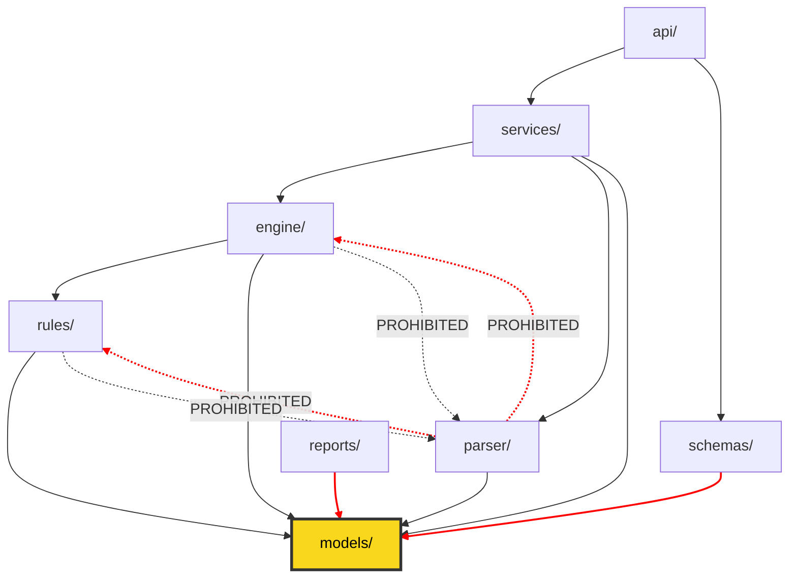

Red dashed lines indicate **prohibited dependencies**. These are enforced by import linting rules in CI.

---

## Appendix B: Key Enumerations

```python
class IPOStatus(str, Enum):
    ELIGIBLE = "eligible"
    NOT_ELIGIBLE = "not_eligible"
    NEEDS_REVIEW = "needs_review"

class Verdict(str, Enum):
    PASS = "pass"
    FAIL = "fail"
    INCONCLUSIVE = "inconclusive"

class RuleCategory(str, Enum):
    MANDATORY = "mandatory"
    ADVISORY = "advisory"

class ConfidenceLevel(str, Enum):
    HIGH = "high"
    MEDIUM = "medium"
    LOW = "low"

class ExtractionMethod(str, Enum):
    PDF_TABLE = "pdf_table"
    OCR = "ocr"
    MANUAL = "manual"
    AI_EXTRACTED = "ai_extracted"
```

---

## Appendix C: SEBI ICDR Quick Reference

| Parameter | Threshold | Regulation |
|---|---|---|
| Net Tangible Assets | ≥ ₹3 Cr (each of 3 preceding years) | Reg. 26(1)(a) |
| Monetary Asset Limit | ≤ 50% of NTA | Reg. 26(1)(a) proviso |
| Average Operating Profit | ≥ ₹15 Cr (pre-tax, 3 of 5 years) | Reg. 26(1)(b) |
| Net Worth | ≥ ₹1 Cr (each of 3 preceding years) | Reg. 26(1)(c) |
| Issue Size | ≤ 5× pre-issue net worth | Reg. 26(2) |
| Track Record | 3 full years | Reg. 26(1) |
| QIB Route | 75% allocation to QIBs | Reg. 26(2) proviso |
| Minimum Public Offer | 25% (mkt cap ≤ ₹1600 Cr), 10% (above) | Reg. 26(5) / SCRR |
| Post-Issue Paid-Up Capital | ≥ ₹10 Cr | Listing Requirements |
| Minimum Market Cap | ≥ ₹25 Cr | Listing Requirements |
| Promoter Contribution | 20% of post-issue capital | Reg. 32 |
| Promoter Lock-in | 18 months (standard), 3 years (capex) | Reg. 36 |
| SME Post-Issue Capital | ≤ ₹25 Cr | ICDR Ch. XB |
| SME EBITDA | ≥ ₹1 Cr (2 of 3 years) | ICDR Ch. XB |
| Board Independence | 1/3 (non-exec chair), 1/2 (exec/promoter chair) | Companies Act / LODR |
| Audit Committee | Min 3 directors, 2/3 independent, independent chair | LODR Reg. 18 |

---

*This document is maintained as a living artifact. For questions or proposed amendments, open an ADR in `docs/adr/`.*
