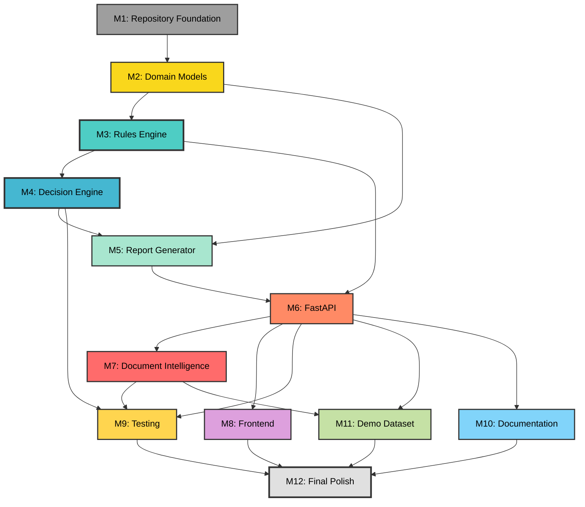

# Engineering Roadmap — IPO Due Diligence Engine

> **Version:** 1.0.0
> **Created:** 2026-07-08
> **Derived From:** [SPEC.md](./SPEC.md) · [ARCHITECTURE.md](./ARCHITECTURE.md)
> **Status:** Approved for Execution
> **Estimated Total Duration:** 14–18 weeks (solo engineer), 8–10 weeks (2-person team)

---

## Table of Contents

1. [Executive Summary](#executive-summary)
2. [Milestone 1 — Repository Foundation](#milestone-1--repository-foundation)
3. [Milestone 2 — Domain Models](#milestone-2--domain-models)
4. [Milestone 3 — Rules Engine](#milestone-3--rules-engine)
5. [Milestone 4 — Decision Engine](#milestone-4--decision-engine)
6. [Milestone 5 — Report Generator](#milestone-5--report-generator)
7. [Milestone 6 — FastAPI](#milestone-6--fastapi)
8. [Milestone 7 — Document Intelligence](#milestone-7--document-intelligence)
9. [Milestone 8 — Frontend](#milestone-8--frontend)
10. [Milestone 9 — Testing](#milestone-9--testing)
11. [Milestone 10 — Documentation](#milestone-10--documentation)
12. [Milestone 11 — Demo Dataset](#milestone-11--demo-dataset)
13. [Milestone 12 — Final Polish](#milestone-12--final-polish)
14. [Dependency Graph](#dependency-graph)
15. [Summary Statistics](#summary-statistics)

---

## Executive Summary

This roadmap decomposes the IPO Due Diligence Engine into **175 discrete engineering tasks** organized across **12 milestones**. The project is a deterministic regulatory decision engine that evaluates company IPO readiness against SEBI ICDR regulations, with AI used exclusively for document extraction.

**Critical path:** M1 → M2 → M3 → M4 → M5 → M6 (backend complete) → M9 (testing hardened). M7 (Document Intelligence) and M8 (Frontend) run in parallel after M6.

**Effort estimation scale:**

| Label | Hours | Description |
|-------|-------|-------------|
| XS | 1–2h | Trivial boilerplate, config, or single-function change |
| S | 2–4h | Single file, straightforward logic |
| M | 4–8h | Multi-file, moderate complexity, requires design thought |
| L | 8–16h | Cross-cutting, complex domain logic, significant testing |
| XL | 16–32h | Multi-component, integration-heavy, research required |

---

## Milestone 1 — Repository Foundation

### Objectives
- Establish a professional, production-grade repository structure
- Configure all tooling (linting, formatting, testing, dependency management)
- Ensure every subsequent milestone starts from a clean, standardized base

### Deliverables
- Fully initialized Python project with `pyproject.toml`
- Directory scaffold matching the ARCHITECTURE.md specification
- CI-ready configuration (linting, formatting, type checking)
- Developer documentation for local setup

### Acceptance Criteria
- [ ] `git clone && pip install -e ".[dev]"` succeeds on a clean environment
- [ ] `pytest` runs (with zero tests) without errors
- [ ] `ruff check .` and `mypy .` pass with zero issues
- [ ] Directory structure matches ARCHITECTURE.md §4 exactly

### Estimated Duration
3–4 days

### Critical Risks
| Risk | Likelihood | Impact | Mitigation |
|------|-----------|--------|------------|
| Dependency version conflicts between pdfplumber/Camelot/OCR | Medium | Medium | Pin all versions in `pyproject.toml`, test install in clean venv |
| Over-engineering initial structure | Low | Low | Follow ARCHITECTURE.md exactly, resist additions |

### Technical Debt
- None anticipated — this milestone establishes the debt-free baseline

---

| ID | Title | Description | Dependencies | Effort | Completion Criteria | Git Commit Message |
|----|-------|-------------|--------------|--------|--------------------|--------------------|
| M1-001 | Initialize Python project | Create `pyproject.toml` with project metadata, Python ≥3.11 requirement, and `[build-system]` using setuptools or hatchling. Define `[project.optional-dependencies]` groups: `dev`, `test`, `docs`. | — | XS | `pyproject.toml` exists, `pip install -e .` succeeds | `chore: initialize python project with pyproject.toml` |
| M1-002 | Create backend directory scaffold | Create the full `backend/app/` directory tree: `api/routers/`, `api/schemas/`, `core/`, `engine/`, `models/`, `parser/`, `reports/formatters/`, `reports/templates/`, `rules/mandatory/`, `rules/advisory/`, `schemas/`, `services/`. Add `__init__.py` to every package. | M1-001 | S | All directories exist with `__init__.py`; matches ARCHITECTURE.md §4 | `chore: scaffold backend directory structure` |
| M1-003 | Create test directory scaffold | Create `backend/tests/` with subdirectories: `unit/rules/mandatory/`, `unit/rules/advisory/`, `unit/engine/`, `unit/parser/`, `unit/reports/`, `integration/api/`, `integration/services/`, `regression/companies/golden_data/`, `fixtures/`. Add `conftest.py` at root. | M1-001 | S | All test directories exist; `pytest --collect-only` runs without import errors | `chore: scaffold test directory structure` |
| M1-004 | Create frontend directory scaffold | Create `frontend/src/` with subdirectories: `pages/`, `components/`, `hooks/`, `services/`, `types/`. Add `public/` directory. Create placeholder `README.md` in `frontend/`. | M1-001 | XS | Frontend directories exist; README explains stretch-goal status | `chore: scaffold frontend directory structure` |
| M1-005 | Create docs directory scaffold | Create `docs/` with placeholder files: `DEVELOPER_GUIDE.md`, `REGULATIONS.md`, `CHANGELOG.md`. Create `docs/adr/` directory with `0001-deterministic-rules-engine.md` template. | M1-001 | XS | All doc files exist with headers; ADR template follows standard format | `docs: scaffold documentation directory with ADR template` |
| M1-006 | Create sample_data and scripts directories | Create `sample_data/` with a `README.md` explaining the directory purpose. Create `scripts/` with a placeholder `README.md`. | M1-001 | XS | Both directories exist with descriptive READMEs | `chore: create sample_data and scripts directories` |
| M1-007 | Configure Ruff linter | Add `[tool.ruff]` section to `pyproject.toml`. Configure: `line-length = 100`, `target-version = "py311"`, select rules (E, F, I, UP, B, SIM, TCH), enable isort-compatible import sorting. | M1-001 | XS | `ruff check .` passes on all `__init__.py` files; config is in `pyproject.toml` | `chore: configure ruff linter with production rules` |
| M1-008 | Configure mypy type checker | Add `[tool.mypy]` section to `pyproject.toml`. Set `strict = true`, `plugins = ["pydantic.mypy"]`, configure per-module overrides for `parser/` (allow untyped defs for OCR libs). | M1-001 | XS | `mypy backend/app/` passes with zero errors on empty modules | `chore: configure mypy with strict mode and pydantic plugin` |
| M1-009 | Configure pytest | Add `[tool.pytest.ini_options]` to `pyproject.toml`. Set `testpaths = ["backend/tests"]`, `addopts = "-v --strict-markers --tb=short"`, define custom markers: `unit`, `integration`, `regression`, `slow`. | M1-001 | XS | `pytest --markers` lists all custom markers; `pytest` runs successfully | `chore: configure pytest with custom markers` |
| M1-010 | Configure pytest-cov | Add `[tool.coverage]` section to `pyproject.toml`. Configure source paths, branch coverage, set fail-under thresholds per module (rules: 100%, engine: 100%, models: 95%, parser: 80%, api: 90%). | M1-009 | XS | `pytest --cov=backend/app --cov-report=term-missing` runs; coverage thresholds are documented | `chore: configure test coverage thresholds per module` |
| M1-011 | Create .gitignore | Comprehensive `.gitignore` for Python (venv, `__pycache__`, `.mypy_cache`, `.ruff_cache`, `.pytest_cache`, `*.egg-info`, `dist/`, `build/`), Node.js (`node_modules/`, `.next/`), IDE files, OS files, and `.env`. | — | XS | All generated artifacts are ignored; `git status` is clean after tool runs | `chore: add comprehensive .gitignore` |
| M1-012 | Create .env.example | Template `.env` file with all expected environment variables: `OPENAI_API_KEY`, `ANTHROPIC_API_KEY`, `DATABASE_URL`, `LOG_LEVEL`, `RULESET_VERSION`, `CORS_ORIGINS`. All values are placeholder/empty. | M1-001 | XS | `.env.example` exists; every variable has a comment explaining its purpose | `chore: add .env.example with documented variables` |
| M1-013 | Create root README.md | Professional README with: project title, one-paragraph description, architecture diagram (text), quickstart (install, run, test), project structure overview, link to SPEC.md and ARCHITECTURE.md. | M1-001 | M | README renders correctly on GitHub; quickstart steps are accurate | `docs: create project README with architecture overview` |
| M1-014 | Add pre-commit configuration | Create `.pre-commit-config.yaml` with hooks for: ruff (lint + format), mypy, trailing whitespace, end-of-file fixer, YAML/TOML validation. | M1-007, M1-008 | S | `pre-commit run --all-files` passes; hooks auto-run on commit | `chore: add pre-commit hooks for linting and formatting` |
| M1-015 | Pin core dependencies | Add production dependencies to `pyproject.toml`: `pydantic>=2.7`, `fastapi>=0.111`, `uvicorn[standard]`, `pdfplumber`, `camelot-py[cv]`, `jinja2`, `python-multipart`. Pin versions with compatible-release operators (`~=`). | M1-001 | S | `pip install -e .` installs all deps; `python -c "import pydantic; import fastapi"` succeeds | `chore: pin core production dependencies` |
| M1-016 | Pin dev dependencies | Add dev dependencies: `pytest`, `pytest-cov`, `pytest-asyncio`, `httpx` (for FastAPI testing), `ruff`, `mypy`, `pre-commit`, `factory-boy` (for CompanyDataFactory). | M1-015 | XS | `pip install -e ".[dev]"` installs all dev deps successfully | `chore: pin development and testing dependencies` |
| M1-017 | Create Makefile / task runner | Create a `Makefile` (or `justfile`) with targets: `install`, `dev`, `test`, `test-unit`, `test-integration`, `test-regression`, `lint`, `format`, `typecheck`, `coverage`, `clean`, `run`. | M1-015, M1-016 | S | `make test`, `make lint`, `make typecheck` all execute correctly | `chore: add Makefile with standard development targets` |

---

## Milestone 2 — Domain Models

### Objectives
- Implement the `CompanyData` canonical schema and all supporting domain types
- Establish the immutable, frozen data contracts that every downstream component depends on
- Build the `CompanyDataFactory` for test data generation

### Deliverables
- All Pydantic models in `backend/app/models/`
- `ExtractedValue[T]` generic wrapper with provenance tracking
- Domain enumerations (`IPOStatus`, `Verdict`, `RuleCategory`, `ConfidenceLevel`, `ExtractionMethod`)
- Domain exceptions (`InsufficientDataError`, `ValidationError`, etc.)
- `CompanyDataFactory` test fixture

### Acceptance Criteria
- [ ] `CompanyData` is `frozen=True` and immutable after construction
- [ ] All field types use `Decimal` for financial values (no floats)
- [ ] `ExtractedValue[T]` correctly wraps any field with provenance metadata
- [ ] `CompanyDataFactory.create()` produces valid instances with sensible defaults
- [ ] All models pass `mypy --strict`
- [ ] 95%+ unit test coverage on `models/`

### Estimated Duration
4–5 days

### Critical Risks
| Risk | Likelihood | Impact | Mitigation |
|------|-----------|--------|------------|
| Schema becomes too rigid for PDF extraction edge cases | Medium | High | Design `ExtractedValue` with `Optional` fields; allow `INCONCLUSIVE` for missing data |
| Pydantic v2 `frozen=True` gotchas with nested models | Medium | Medium | Test immutability explicitly; validate that nested objects are also frozen |

### Technical Debt
- SME route fields may need to be added later (currently documented but not in core CompanyData)
- `RulesetVersion` is a simple string initially — may need richer versioning later

---

| ID | Title | Description | Dependencies | Effort | Completion Criteria | Git Commit Message |
|----|-------|-------------|--------------|--------|--------------------|--------------------|
| M2-001 | Implement domain enumerations | Create `backend/app/models/enums.py` with enums: `IPOStatus` (ELIGIBLE, NOT_ELIGIBLE, NEEDS_REVIEW), `Verdict` (PASS, FAIL, INCONCLUSIVE), `RuleCategory` (MANDATORY, ADVISORY), `ConfidenceLevel` (HIGH, MEDIUM, LOW), `ExtractionMethod` (PDF_TABLE, OCR, MANUAL, AI_EXTRACTED). All inherit from `str, Enum`. | M1-002 | S | All enums importable; `mypy` passes; values match ARCHITECTURE.md Appendix B | `feat(models): implement domain enumerations` |
| M2-002 | Implement domain exceptions | Create `backend/app/models/exceptions.py` with exception hierarchy: `DomainError(Exception)` base, `InsufficientDataError`, `RuleEvaluationError`, `ExtractionError`, `UnsupportedDocumentError`, `ReportNotFoundError`, `RulesetNotFoundError`. Each carries structured error context (error code, missing fields, suggestion). | M2-001 | S | All exceptions importable; each has `error_code` property matching API error codes from ARCHITECTURE.md §13.3 | `feat(models): implement domain exception hierarchy` |
| M2-003 | Implement ExtractedValue generic | Create `backend/app/models/extracted_value.py` with `ExtractedValue[T]` — a `BaseModel` with `Generic[T]` and `frozen=True`. Fields: `value: T`, `source_document: str`, `page_number: int | None`, `extraction_method: ExtractionMethod`, `confidence: ConfidenceLevel`, `confirmed_by_human: bool = False`, `raw_text: str | None`. | M2-001 | M | Generic works with `Decimal`, `str`, `int`, `bool`; immutable; serializes to JSON correctly; `mypy` passes | `feat(models): implement ExtractedValue generic provenance wrapper` |
| M2-004 | Implement SourceCitation model | Create `backend/app/models/source_citation.py` with `SourceCitation(BaseModel, frozen=True)`. Fields: `document_name`, `page_numbers: list[int]`, `table_reference: str | None`, `extracted_values: list[ExtractedValue]`, `extraction_method`, `confidence`, `raw_snippets: list[str] | None`. | M2-003 | S | Model validates; confidence defaults to lowest among extracted values; serializes correctly | `feat(models): implement SourceCitation for evidence traceability` |
| M2-005 | Implement CompanyIdentification | Create `CompanyIdentification` sub-model within `backend/app/models/company_data.py`. Fields: `company_name: str`, `cin: str`, `industry: str`, `incorporation_date: date`, `registered_office: str`. Frozen. | M2-001 | XS | Model validates; `cin` format can be validated with regex; immutable | `feat(models): implement CompanyIdentification sub-model` |
| M2-006 | Implement FiscalYear model | Create `FiscalYear(BaseModel, frozen=True)` in `company_data.py`. Fields: `year_label: str`, `revenue: ExtractedValue[Decimal]`, `operating_profit: ExtractedValue[Decimal]`, `pat: ExtractedValue[Decimal]`, `net_worth: ExtractedValue[Decimal]`, `net_tangible_assets: ExtractedValue[Decimal]`, `monetary_assets: ExtractedValue[Decimal]`, `total_assets: ExtractedValue[Decimal]`, `total_liabilities: ExtractedValue[Decimal]`, `paid_up_capital: ExtractedValue[Decimal]`, `reserves_and_surplus: ExtractedValue[Decimal]`, `ebitda: ExtractedValue[Decimal]`. | M2-003 | M | All Decimal fields wrapped in ExtractedValue; immutable; serializes with provenance metadata intact | `feat(models): implement FiscalYear financial data model` |
| M2-007 | Implement FinancialHistory model | Create `FinancialHistory(BaseModel, frozen=True)` with `fiscal_years: list[FiscalYear]` and `years_of_operation: int`. Add validator: fiscal years must be chronologically ordered. | M2-006 | S | Chronological ordering enforced via Pydantic validator; rejects unordered input | `feat(models): implement FinancialHistory with chronological validation` |
| M2-008 | Implement PromoterData model | Create `PromoterData(BaseModel, frozen=True)` with fields: `holding_percentage: ExtractedValue[Decimal]`, `post_issue_holding: ExtractedValue[Decimal]`, `lock_in_months: ExtractedValue[int]`, `is_capex_issue: bool`, `entities: list[PromoterEntity]`. Also create `PromoterEntity(BaseModel, frozen=True)` with `name: str`, `holding: Decimal`, `pan: str | None`. | M2-003 | S | Model validates; holding percentages validated 0–100 range; immutable | `feat(models): implement PromoterData and PromoterEntity models` |
| M2-009 | Implement GovernanceData model | Create `GovernanceData(BaseModel, frozen=True)` with `total_directors: ExtractedValue[int]`, `independent_directors: ExtractedValue[int]`, `is_chair_executive: ExtractedValue[bool]`, `is_chair_promoter: ExtractedValue[bool]`, `audit_committee: AuditCommittee`. Also create `AuditCommittee(BaseModel, frozen=True)` with `total_members`, `independent_members`, `chair_is_independent`. | M2-003 | S | Model validates; independent_directors ≤ total_directors enforced; immutable | `feat(models): implement GovernanceData and AuditCommittee models` |
| M2-010 | Implement IssueDetails model | Create `IssueDetails(BaseModel, frozen=True)` with fields: `issue_size: ExtractedValue[Decimal]`, `pre_issue_net_worth: ExtractedValue[Decimal]`, `post_issue_paid_up_capital: ExtractedValue[Decimal]`, `expected_market_cap: ExtractedValue[Decimal]`, `public_offer_percentage: ExtractedValue[Decimal]`, `issue_type: str`. | M2-003 | S | Model validates; issue_type validated against known values; immutable | `feat(models): implement IssueDetails model` |
| M2-011 | Implement LitigationData model | Create `LitigationData(BaseModel, frozen=True)` with `pending_cases: list[LitigationCase]`, `total_exposure: ExtractedValue[Decimal]`, `has_criminal_cases: ExtractedValue[bool]`. Also create `LitigationCase(BaseModel, frozen=True)` with `case_type: str`, `description: str`, `exposure: Decimal`, `court: str`, `status: str`. | M2-003 | S | Model validates; total_exposure consistent with sum of case exposures; immutable | `feat(models): implement LitigationData and LitigationCase models` |
| M2-012 | Implement RelatedPartyData model | Create `RelatedPartyData(BaseModel, frozen=True)` with `transactions: list[RPTTransaction]`, `total_rpt_value: ExtractedValue[Decimal]`, `arm_length_certified: ExtractedValue[bool]`. Also create `RPTTransaction(BaseModel, frozen=True)` with `party_name: str`, `relationship: str`, `transaction_type: str`, `value: Decimal`. | M2-003 | S | Model validates; immutable; RPT transactions serializable | `feat(models): implement RelatedPartyData and RPTTransaction models` |
| M2-013 | Implement AuditorData model | Create `AuditorData(BaseModel, frozen=True)` with `auditor_name: str`, `has_qualifications: ExtractedValue[bool]`, `has_modified_opinion: ExtractedValue[bool]`, `years_as_auditor: ExtractedValue[int]`. | M2-003 | XS | Model validates; immutable; all fields correctly typed | `feat(models): implement AuditorData model` |
| M2-014 | Implement RulesetVersion model | Create `backend/app/models/ruleset_version.py` with `RulesetVersion(BaseModel, frozen=True)`. Fields: `version: str`, `effective_date: date`, `description: str`, `regulations: list[str]`. Add a `DEFAULT_RULESET` constant for v1.0.0 (SEBI ICDR 2018). | M2-001 | S | Model validates; default version is `1.0.0`; serializes to JSON; version follows semver | `feat(models): implement RulesetVersion with default v1.0.0` |
| M2-015 | Assemble CompanyData root model | Create the top-level `CompanyData(BaseModel, frozen=True)` in `company_data.py`, composing all sub-models: `identification: CompanyIdentification`, `financials: FinancialHistory`, `promoter: PromoterData`, `governance: GovernanceData`, `litigation: LitigationData`, `rpt: RelatedPartyData`, `issue_details: IssueDetails`, `auditor: AuditorData`, `ruleset_version: RulesetVersion`. | M2-005 through M2-014 | M | Full CompanyData instantiable from nested dict; immutable; JSON round-trip preserves all ExtractedValue metadata | `feat(models): assemble CompanyData canonical root model` |
| M2-016 | Implement RuleMetadata model | Create `backend/app/models/rule_result.py` with `RuleMetadata(BaseModel, frozen=True)`. Fields: `regulation: str`, `section: str`, `clause: str | None`, `description: str`, `category: RuleCategory`, `effective_date: date`, `source_url: str | None`. | M2-001 | S | Model validates; immutable; regulation references follow standard format | `feat(models): implement RuleMetadata for regulation citations` |
| M2-017 | Implement RuleResult model | Add `RuleResult(BaseModel, frozen=True)` to `rule_result.py`. Fields: `rule_id: str`, `verdict: Verdict`, `category: RuleCategory`, `regulation_reference: str`, `description: str`, `required_value: str`, `actual_value: str | None`, `gap: str | None`, `source_citation: SourceCitation | None`, `explanation: str`, `evaluated_at: datetime`. | M2-004, M2-016 | M | Model validates; all verdict types constructable; explanation is required; immutable | `feat(models): implement RuleResult with evidence traceability` |
| M2-018 | Implement EligibilityProgress model | Create `backend/app/models/ipo_report.py` with `EligibilityProgress(BaseModel, frozen=True)`. Fields: `total_rules: int`, `passed: int`, `failed: int`, `inconclusive: int`, `pass_percentage: Decimal`, `failed_rule_ids: list[str]`. | M2-001 | S | pass_percentage computed correctly; all fields non-negative; immutable | `feat(models): implement EligibilityProgress tracking model` |
| M2-019 | Implement GapAnalysisItem model | Add `GapAnalysisItem(BaseModel, frozen=True)` to `ipo_report.py`. Fields: `rule_id: str`, `gap_size: str`, `earliest_eligible_fy: str`, `remediation_steps: list[str]`, `current_value: str`, `required_value: str`. | M2-001 | S | Model validates; remediation_steps is non-empty for gaps; immutable | `feat(models): implement GapAnalysisItem for remediation planning` |
| M2-020 | Implement IPOReport aggregate | Add `IPOReport(BaseModel, frozen=True)` to `ipo_report.py`. Fields: `report_id: UUID`, `company_name: str`, `status: IPOStatus`, `mandatory_progress: EligibilityProgress`, `advisory_progress: EligibilityProgress`, `mandatory_results: list[RuleResult]`, `advisory_results: list[RuleResult]`, `gap_analysis: list[GapAnalysisItem]`, `observations: list[str]`, `ruleset_version: RulesetVersion`, `evaluated_at: datetime`. | M2-017, M2-018, M2-019 | M | Full report constructable from components; JSON serialization produces clean output; immutable | `feat(models): implement IPOReport aggregate root` |
| M2-021 | Create models package exports | Update `backend/app/models/__init__.py` to export all public models: `CompanyData`, `RuleResult`, `IPOReport`, `ExtractedValue`, `SourceCitation`, `RuleMetadata`, `EligibilityProgress`, `GapAnalysisItem`, `RulesetVersion`, all enums, all exceptions. | M2-001 through M2-020 | XS | `from backend.app.models import CompanyData, RuleResult, IPOReport` works; no circular imports | `feat(models): configure public model exports` |
| M2-022 | Implement CompanyDataFactory | Create `backend/tests/fixtures/company_data_factory.py`. Factory method `create(**overrides)` builds a fully valid `CompanyData` with sensible defaults (profitable company, 5 years history, good governance). Every financial field wrapped in `ExtractedValue` with `HIGH` confidence. Support overrides for any nested field. | M2-015 | L | `CompanyDataFactory.create()` produces valid CompanyData; overrides work for nested fields (e.g., `net_worth=Decimal("0.5")`); factory used in subsequent rule tests | `test: implement CompanyDataFactory for test data generation` |
| M2-023 | Unit tests for domain enumerations | Write tests in `backend/tests/unit/test_enums.py` verifying: all enum values match spec, string serialization works, exhaustive value coverage. | M2-001 | XS | All enum values tested; 100% coverage on `enums.py` | `test: add unit tests for domain enumerations` |
| M2-024 | Unit tests for ExtractedValue | Write tests in `backend/tests/unit/test_extracted_value.py`: generic instantiation with Decimal/str/int/bool, immutability assertion, JSON round-trip, confidence level semantics. | M2-003 | S | All generic type parameters tested; frozen validation tested; 100% branch coverage | `test: add unit tests for ExtractedValue generic` |
| M2-025 | Unit tests for CompanyData | Write tests in `backend/tests/unit/test_company_data.py`: valid construction, immutability (assignment raises), chronological fiscal year validation, JSON serialization round-trip, factory integration. | M2-015, M2-022 | M | All sub-models tested; immutability enforced; validation errors raised for bad input; 95%+ coverage | `test: add unit tests for CompanyData canonical schema` |
| M2-026 | Unit tests for RuleResult and IPOReport | Write tests in `backend/tests/unit/test_rule_result.py` and `backend/tests/unit/test_ipo_report.py`: construction, immutability, all verdict types, progress calculation, gap analysis structure. | M2-017, M2-020 | S | All model construction paths tested; immutability enforced; 95%+ coverage | `test: add unit tests for RuleResult and IPOReport models` |

---

## Milestone 3 — Rules Engine

### Objectives
- Implement the `BaseRule` abstract class and rule evaluation framework
- Implement all 11 mandatory SEBI ICDR rules
- Implement all 5 advisory governance/risk rules
- Implement the Rule Registry with auto-discovery
- Achieve 100% branch coverage on all rules

### Deliverables
- Abstract `BaseRule` with `evaluate(CompanyData) → RuleResult` contract
- 11 mandatory rule implementations in `rules/mandatory/`
- 5 advisory rule implementations in `rules/advisory/`
- `RuleRegistry` with auto-discovery and filtering
- `RulesEngine` orchestrator
- Comprehensive unit tests for every rule (PASS/FAIL/INCONCLUSIVE/edge cases)

### Acceptance Criteria
- [ ] Every rule is a pure function: `f(CompanyData) → RuleResult` with no side effects
- [ ] Every `RuleResult` carries regulation reference and threshold information
- [ ] Registry discovers all rules automatically from the `rules/` directory
- [ ] 100% branch coverage on `rules/` and `engine/rules_engine.py`
- [ ] `INCONCLUSIVE` returned when data has `LOW` confidence
- [ ] Every rule handles missing/null data gracefully

### Estimated Duration
8–10 days

### Critical Risks
| Risk | Likelihood | Impact | Mitigation |
|------|-----------|--------|------------|
| Ambiguous regulation interpretation (e.g., "3 of 5 years" averaging) | High | High | Cross-reference with real DRHP analyses; document interpretation in ADR |
| Rule interdependencies (e.g., monetary assets depends on NTA) | Medium | Medium | Ensure each rule reads only from CompanyData, never from other RuleResults |
| Missing edge cases in threshold comparisons | Medium | High | Explicitly test boundary values (exactly-at-threshold) for every rule |

### Technical Debt
- QIB route rules (Reg. 26(2) proviso) deferred to v1.1
- SME platform rules documented but implementation is a separate milestone concern
- Rule versioning (multiple thresholds per rule for different RulesetVersions) simplified to single version

---

| ID | Title | Description | Dependencies | Effort | Completion Criteria | Git Commit Message |
|----|-------|-------------|--------------|--------|--------------------|--------------------|
| M3-001 | Implement BaseRule abstract class | Create `backend/app/rules/base_rule.py` with abstract class `BaseRule(ABC)`. Define abstract properties: `rule_id: str`, `metadata: RuleMetadata`. Define abstract method: `evaluate(company: CompanyData) -> RuleResult`. Add helper method `_build_result()` for consistent RuleResult construction. | M2-016, M2-017 | M | Abstract class enforces interface; subclasses must implement all three; `_build_result` constructs valid RuleResult with `evaluated_at` timestamp | `feat(rules): implement BaseRule abstract class` |
| M3-002 | Implement Rule Registry | Create `backend/app/rules/registry.py` with `RuleRegistry` class. Methods: `discover_rules()` (scans mandatory/ and advisory/ for BaseRule subclasses), `get_all_rules()`, `get_mandatory_rules()`, `get_advisory_rules()`, `get_rule(rule_id)`. Registry is immutable after initialization. | M3-001 | M | Auto-discovers all rules from filesystem; filters by category; raises KeyError for unknown rule_id; idempotent initialization | `feat(rules): implement RuleRegistry with auto-discovery` |
| M3-003 | Implement NTA rule (NTA_3CR) | Create `backend/app/rules/mandatory/net_tangible_assets.py`. Rule ID: `NTA_3CR`. Regulation: SEBI ICDR Reg. 26(1)(a). Logic: NTA ≥ ₹3 Cr in each of 3 preceding full fiscal years. FAIL if any year < ₹3 Cr. INCONCLUSIVE if data missing or LOW confidence. | M3-001, M2-015 | M | Rule evaluates correctly for 3+ years of data; PASS when all ≥ 3 Cr; FAIL when any < 3 Cr; INCONCLUSIVE when data missing; gap calculated | `feat(rules): implement NTA_3CR mandatory rule` |
| M3-004 | Implement monetary assets rule (MONETARY_ASSETS_50PCT) | Create `backend/app/rules/mandatory/net_tangible_assets.py` (add to same file or separate). Rule ID: `MONETARY_ASSETS_50PCT`. Regulation: Reg. 26(1)(a) proviso. Logic: monetary assets ≤ 50% of NTA in each of 3 preceding FYs. | M3-003 | S | PASS when monetary assets ≤ 50% NTA; FAIL when > 50%; handles zero NTA edge case; INCONCLUSIVE for missing data | `feat(rules): implement MONETARY_ASSETS_50PCT mandatory rule` |
| M3-005 | Implement profitability rule (AVG_OPERATING_PROFIT_15CR) | Create `backend/app/rules/mandatory/profitability.py`. Rule ID: `AVG_OPERATING_PROFIT_15CR`. Regulation: Reg. 26(1)(b). Logic: average pre-tax operating profit ≥ ₹15 Cr across at least 3 of preceding 5 FYs. Select best 3 out of up to 5 years. | M3-001, M2-015 | L | Correctly averages best 3 of 5 years; PASS at ₹15 Cr exactly; FAIL at ₹14.99 Cr; handles companies with exactly 3 years; gap computes shortfall | `feat(rules): implement AVG_OPERATING_PROFIT_15CR mandatory rule` |
| M3-006 | Implement net worth rule (NET_WORTH_1CR) | Create `backend/app/rules/mandatory/net_worth.py`. Rule ID: `NET_WORTH_1CR`. Regulation: Reg. 26(1)(c). Logic: net worth ≥ ₹1 Cr in each of 3 preceding full FYs. | M3-001, M2-015 | S | PASS when all 3 years ≥ ₹1 Cr; FAIL when any year < ₹1 Cr; correctly handles negative net worth; gap calculated per failing year | `feat(rules): implement NET_WORTH_1CR mandatory rule` |
| M3-007 | Implement issue size rule (ISSUE_SIZE_5X) | Create `backend/app/rules/mandatory/issue_size.py`. Rule ID: `ISSUE_SIZE_5X`. Regulation: Reg. 26(2). Logic: total issue size ≤ 5× pre-issue net worth. | M3-001, M2-015 | S | PASS when issue ≤ 5x; FAIL when > 5x; exactly 5x is PASS; gap quantified; handles zero net worth | `feat(rules): implement ISSUE_SIZE_5X mandatory rule` |
| M3-008 | Implement track record rule (TRACK_RECORD_3Y) | Create `backend/app/rules/mandatory/track_record.py`. Rule ID: `TRACK_RECORD_3Y`. Regulation: Reg. 26(1). Logic: company has ≥ 3 full years of operating history (via `financials.years_of_operation` or `incorporation_date` comparison). | M3-001, M2-015 | S | PASS at exactly 3 years; FAIL at 2 years; correctly calculates from incorporation_date; gap shows remaining time | `feat(rules): implement TRACK_RECORD_3Y mandatory rule` |
| M3-009 | Implement float requirements rule (PUBLIC_OFFER_MIN) | Create `backend/app/rules/mandatory/float_requirements.py`. Rule ID: `PUBLIC_OFFER_MIN`. Regulation: Reg. 26(5) / SCRR. Logic: public offer ≥ 25% if expected market cap ≤ ₹1600 Cr; ≥ 10% if > ₹1600 Cr. | M3-001, M2-015 | M | Correctly applies 25% threshold for small cap; 10% for large cap; boundary at ₹1600 Cr exact; gap shows shortfall percentage | `feat(rules): implement PUBLIC_OFFER_MIN mandatory rule` |
| M3-010 | Implement promoter contribution rule (PROMOTER_CONTRIBUTION_20) | Create `backend/app/rules/mandatory/promoter.py`. Rule ID: `PROMOTER_CONTRIBUTION_20`. Regulation: Reg. 32. Logic: promoter contribution ≥ 20% of post-issue capital. | M3-001, M2-015 | S | PASS at 20% exactly; FAIL below 20%; gap quantified; handles post-issue dilution calculation | `feat(rules): implement PROMOTER_CONTRIBUTION_20 mandatory rule` |
| M3-011 | Implement promoter lock-in rule (PROMOTER_LOCK_IN) | Add to `backend/app/rules/mandatory/promoter.py`. Rule ID: `PROMOTER_LOCK_IN`. Regulation: Reg. 36. Logic: lock-in period ≥ 18 months (standard) or ≥ 3 years (36 months for capex issues). Uses `is_capex_issue` flag. | M3-001, M2-015 | S | Applies correct lock-in based on issue type; PASS/FAIL correct for both capex and non-capex; INCONCLUSIVE when lock-in data missing | `feat(rules): implement PROMOTER_LOCK_IN mandatory rule` |
| M3-012 | Implement minimum capital rule (MIN_POST_ISSUE_CAPITAL) | Create `backend/app/rules/mandatory/minimum_capital.py`. Rule ID: `MIN_POST_ISSUE_CAPITAL`. Regulation: Listing Requirements. Logic: post-issue paid-up capital ≥ ₹10 Cr. | M3-001, M2-015 | S | PASS at ₹10 Cr exactly; FAIL below; gap computed; handles missing issue_details | `feat(rules): implement MIN_POST_ISSUE_CAPITAL mandatory rule` |
| M3-013 | Implement minimum market cap rule (MIN_MARKET_CAP) | Add to `backend/app/rules/mandatory/minimum_capital.py`. Rule ID: `MIN_MARKET_CAP`. Regulation: Listing Requirements. Logic: expected market cap ≥ ₹25 Cr. | M3-001, M2-015 | XS | PASS at ₹25 Cr exactly; FAIL below; gap computed | `feat(rules): implement MIN_MARKET_CAP mandatory rule` |
| M3-014 | Implement board independence rule (BOARD_INDEPENDENCE) | Create `backend/app/rules/advisory/governance.py`. Rule ID: `BOARD_INDEPENDENCE`. Regulation: Companies Act s.149 / LODR Reg. 17. Logic: ≥ 1/3 independent if non-exec chair; ≥ 1/2 if exec or promoter chair. | M3-001, M2-015 | M | Correctly applies different thresholds based on chair type; fractional comparisons correct (e.g., 2/6 = 1/3 passes); advisory category | `feat(rules): implement BOARD_INDEPENDENCE advisory rule` |
| M3-015 | Implement audit committee rule (AUDIT_COMMITTEE) | Add to `backend/app/rules/advisory/governance.py`. Rule ID: `AUDIT_COMMITTEE`. Regulation: LODR Reg. 18. Logic: min 3 directors, ≥ 2/3 independent, chair must be independent. | M3-001, M2-015 | S | Three-part check: count, ratio, chair independence; FAIL on any sub-check; explanation details which sub-check failed | `feat(rules): implement AUDIT_COMMITTEE advisory rule` |
| M3-016 | Implement RPT disclosure rule (RPT_DISCLOSURE) | Create `backend/app/rules/advisory/rpt.py`. Rule ID: `RPT_DISCLOSURE`. Regulation: LODR Reg. 23. Logic: all related party transactions disclosed and certified at arm's length. | M3-001, M2-015 | S | PASS when arm_length_certified is true; FAIL when false; INCONCLUSIVE when no RPT data; warns on high RPT volume | `feat(rules): implement RPT_DISCLOSURE advisory rule` |
| M3-017 | Implement auditor qualification rule (AUDITOR_QUALIFICATION) | Create `backend/app/rules/advisory/auditor.py`. Rule ID: `AUDITOR_QUALIFICATION`. Regulation: Companies Act s.143. Logic: no modified opinions or qualifications in audit reports. | M3-001, M2-015 | S | PASS when no qualifications and no modified opinions; FAIL on either; INCONCLUSIVE when auditor data missing | `feat(rules): implement AUDITOR_QUALIFICATION advisory rule` |
| M3-018 | Implement litigation risk rule (LITIGATION_RISK) | Create `backend/app/rules/advisory/litigation.py`. Rule ID: `LITIGATION_RISK`. Regulation: SEBI ICDR Schedule VI. Logic: material pending litigation disclosed with exposure quantified. Flags criminal cases separately. | M3-001, M2-015 | M | PASS when no material litigation; FAIL when criminal cases exist or exposure exceeds materiality threshold; exposure percentage calculated | `feat(rules): implement LITIGATION_RISK advisory rule` |
| M3-019 | Implement RulesEngine orchestrator | Create `backend/app/engine/rules_engine.py` with `RulesEngine` class. Methods: `evaluate_all(company: CompanyData) -> list[RuleResult]` — loads rules from registry, iterates, collects results. Ensures rule isolation (no shared mutable state between rule executions). | M3-002 | M | Iterates all registered rules; returns ordered list of RuleResult; exceptions in one rule don't crash others; rules execute independently | `feat(engine): implement RulesEngine orchestrator` |
| M3-020 | Unit tests for NTA rule | Write `backend/tests/unit/rules/mandatory/test_net_tangible_assets.py` with test cases: PASS (all 3 years ≥ ₹3 Cr), FAIL (one year < ₹3 Cr), FAIL (all years below), exactly ₹3 Cr boundary, INCONCLUSIVE (missing data), INCONCLUSIVE (LOW confidence), gap calculation verification. | M3-003, M2-022 | M | 8–10 test cases; 100% branch coverage on the rule; uses CompanyDataFactory | `test: add unit tests for NTA_3CR rule` |
| M3-021 | Unit tests for monetary assets rule | Write `backend/tests/unit/rules/mandatory/test_monetary_assets.py` with test cases: PASS (under 50%), FAIL (over 50%), exactly 50% boundary, zero NTA edge case, INCONCLUSIVE for missing data. | M3-004, M2-022 | S | 6–8 test cases; 100% branch coverage; handles division-by-zero for zero NTA | `test: add unit tests for MONETARY_ASSETS_50PCT rule` |
| M3-022 | Unit tests for profitability rule | Write `backend/tests/unit/rules/mandatory/test_profitability.py` with test cases: PASS (high profit all years), FAIL (low average), exactly ₹15 Cr boundary, 3-year company (best 3 of 3), 5-year company (best 3 of 5 selection), negative profits, INCONCLUSIVE, gap calculation. | M3-005, M2-022 | M | 8–12 test cases; 100% branch coverage; "best 3 of 5" selection logic verified | `test: add unit tests for AVG_OPERATING_PROFIT_15CR rule` |
| M3-023 | Unit tests for net worth rule | Write tests: PASS, FAIL (any year below ₹1 Cr), exactly ₹1 Cr, negative net worth, INCONCLUSIVE. | M3-006, M2-022 | S | 6–8 test cases; 100% branch coverage; negative values handled | `test: add unit tests for NET_WORTH_1CR rule` |
| M3-024 | Unit tests for issue size rule | Write tests: PASS (under 5x), FAIL (over 5x), exactly 5x, zero net worth edge case, INCONCLUSIVE. | M3-007, M2-022 | S | 5–7 test cases; 100% branch coverage; zero net worth produces FAIL | `test: add unit tests for ISSUE_SIZE_5X rule` |
| M3-025 | Unit tests for track record rule | Write tests: PASS (3 years), PASS (5 years), FAIL (2 years), FAIL (1 year), exactly 3 years boundary, INCONCLUSIVE. | M3-008, M2-022 | S | 5–8 test cases; 100% branch coverage; date calculation verified | `test: add unit tests for TRACK_RECORD_3Y rule` |
| M3-026 | Unit tests for float requirements rule | Write tests: PASS (25% for small cap), PASS (10% for large cap), FAIL (low float small cap), FAIL (low float large cap), exactly ₹1600 Cr market cap boundary, INCONCLUSIVE. | M3-009, M2-022 | M | 6–10 test cases; 100% branch coverage; both thresholds tested; boundary at ₹1600 Cr tested | `test: add unit tests for PUBLIC_OFFER_MIN rule` |
| M3-027 | Unit tests for promoter rules | Write tests for both PROMOTER_CONTRIBUTION_20 and PROMOTER_LOCK_IN: PASS/FAIL/boundary for contribution; capex vs non-capex lock-in; INCONCLUSIVE scenarios. | M3-010, M3-011, M2-022 | M | 8–12 test cases total; 100% branch coverage on both rules; capex flag correctly switches threshold | `test: add unit tests for promoter contribution and lock-in rules` |
| M3-028 | Unit tests for minimum capital rules | Write tests for MIN_POST_ISSUE_CAPITAL and MIN_MARKET_CAP: PASS/FAIL/boundary for each. | M3-012, M3-013, M2-022 | S | 4–6 test cases per rule; 100% branch coverage | `test: add unit tests for minimum capital and market cap rules` |
| M3-029 | Unit tests for advisory governance rules | Write tests for BOARD_INDEPENDENCE and AUDIT_COMMITTEE: correct threshold application by chair type, fractional independence ratios, sub-check failures, INCONCLUSIVE. | M3-014, M3-015, M2-022 | M | 6–10 test cases per rule; 100% branch coverage; chair-type switching verified | `test: add unit tests for board independence and audit committee rules` |
| M3-030 | Unit tests for advisory risk rules | Write tests for RPT_DISCLOSURE, AUDITOR_QUALIFICATION, LITIGATION_RISK: PASS/FAIL/INCONCLUSIVE for each; criminal case flagging; arm's length certification. | M3-016, M3-017, M3-018, M2-022 | M | 4–6 test cases per rule; 100% branch coverage; all three advisory risk rules covered | `test: add unit tests for RPT, auditor, and litigation advisory rules` |
| M3-031 | Unit tests for Rule Registry | Write `backend/tests/unit/rules/test_registry.py`: discovery finds all rules, category filtering, rule_id lookup, unknown rule_id raises error, registry is immutable after init. | M3-002 | S | Registry discovers all 16 rules; filter by MANDATORY returns 11; filter by ADVISORY returns 5; immutability tested | `test: add unit tests for RuleRegistry auto-discovery` |
| M3-032 | Unit tests for RulesEngine | Write `backend/tests/unit/engine/test_rules_engine.py`: evaluates all rules, returns ordered RuleResult list, handles rule exceptions gracefully, rule isolation verified. | M3-019 | M | Engine returns correct count of results; exception in one rule doesn't block others; results are ordered consistently | `test: add unit tests for RulesEngine orchestrator` |

---

## Milestone 4 — Decision Engine

### Objectives
- Implement the Decision Engine that derives `IPOStatus` from `RuleResult[]`
- Build the Evidence Mapper for citation attachment
- Build the Gap Planner for remediation analysis
- Assemble the complete `IPOReport` from engine outputs

### Deliverables
- `DecisionEngine` in `backend/app/engine/decision_engine.py`
- `EvidenceMapper` in `backend/app/engine/evidence_mapper.py`
- `GapPlanner` in `backend/app/engine/gap_planner.py`
- End-to-end pipeline: `CompanyData → RulesEngine → DecisionEngine → IPOReport`

### Acceptance Criteria
- [ ] Single mandatory FAIL → `NOT_ELIGIBLE`
- [ ] Single mandatory INCONCLUSIVE → `NEEDS_REVIEW`
- [ ] All mandatory PASS → `ELIGIBLE`
- [ ] Advisory FAILs do not block eligibility
- [ ] Progress counts are accurate (passed/failed/inconclusive/total)
- [ ] Gap analysis computed for every failed mandatory rule
- [ ] Evidence citations linked from RuleResult back to source documents
- [ ] 100% branch coverage on `engine/`

### Estimated Duration
5–6 days

### Critical Risks
| Risk | Likelihood | Impact | Mitigation |
|------|-----------|--------|------------|
| Gap projections based on linear trends may be misleading | Medium | Low | Label all projections as estimates; document assumptions |
| Evidence mapping breaks when ExtractedValue has no source | Medium | Medium | Handle null gracefully; skip citation for manually-entered data |

### Technical Debt
- Gap Planner uses simple linear projection only — CAGR or trend-based projection deferred
- Observations are hardcoded pattern matches — future: pluggable observation generators

---

| ID | Title | Description | Dependencies | Effort | Completion Criteria | Git Commit Message |
|----|-------|-------------|--------------|--------|--------------------|--------------------|
| M4-001 | Implement Decision Engine status logic | Create `backend/app/engine/decision_engine.py` with `DecisionEngine` class. Core method: `determine_status(mandatory_results: list[RuleResult]) -> IPOStatus`. Logic: any FAIL → NOT_ELIGIBLE; any INCONCLUSIVE → NEEDS_REVIEW; all PASS → ELIGIBLE. | M2-017, M2-001 | S | Status logic matches ARCHITECTURE.md §9.2 exactly; no weighting; deterministic | `feat(engine): implement DecisionEngine status determination` |
| M4-002 | Implement mandatory/advisory classification | Add `classify_results(results: list[RuleResult]) -> tuple[list[RuleResult], list[RuleResult]]` to DecisionEngine. Separates results by `RuleCategory.MANDATORY` vs `ADVISORY`. | M4-001 | XS | Correctly separates; returns empty lists when no rules of a category; ordering preserved | `feat(engine): implement result classification by category` |
| M4-003 | Implement progress computation | Add `compute_progress(results: list[RuleResult]) -> EligibilityProgress` to DecisionEngine. Calculates passed/failed/inconclusive counts, pass_percentage, and failed_rule_ids list. | M4-001, M2-018 | S | Counts are accurate; percentage calculated with Decimal precision; empty results produce zero counts | `feat(engine): implement eligibility progress computation` |
| M4-004 | Implement observation generator | Add `generate_observations(company: CompanyData, results: list[RuleResult]) -> list[str]` to DecisionEngine. Pattern-match notable findings: declining revenue trend, incorporation < 5 years, promoter dilution below 20% at upper band, multiple advisory failures. | M4-001, M2-015 | M | At least 5 observation patterns implemented; each produces human-readable text; no false positives on normal data | `feat(engine): implement observation pattern generator` |
| M4-005 | Implement Evidence Mapper | Create `backend/app/engine/evidence_mapper.py` with `EvidenceMapper` class. Method: `attach_citations(results: list[RuleResult], company: CompanyData) -> list[RuleResult]`. For each RuleResult, traces back through CompanyData fields to build SourceCitation from the ExtractedValue provenance. | M2-004, M2-017 | L | Every RuleResult gets a SourceCitation (when provenance available); citation includes document name, page numbers, extraction method, confidence; handles manually-entered data without source gracefully | `feat(engine): implement EvidenceMapper for citation attachment` |
| M4-006 | Implement Gap Planner | Create `backend/app/engine/gap_planner.py` with `GapPlanner` class. Method: `compute_gaps(failed_results: list[RuleResult], company: CompanyData) -> list[GapAnalysisItem]`. For each failed mandatory rule: compute numeric gap, project earliest eligible FY using linear trend from historical data, generate remediation steps. | M2-019, M2-015 | L | Gap size computed for each failed rule; projections use historical growth rate; remediation steps are specific and actionable; handles insufficient history for projection | `feat(engine): implement GapPlanner with trend-based projections` |
| M4-007 | Implement IPOReport assembly | Add `assemble_report(company: CompanyData, results: list[RuleResult]) -> IPOReport` to DecisionEngine as the top-level orchestration method. Calls: classify → determine_status → compute_progress (×2) → generate_observations → Evidence Mapper → Gap Planner → constructs IPOReport. | M4-001 through M4-006, M2-020 | M | Full IPOReport constructed with all fields populated; report_id is a new UUID; evaluated_at is current timestamp; immutable after construction | `feat(engine): implement IPOReport assembly pipeline` |
| M4-008 | Unit tests for status determination | Write `backend/tests/unit/engine/test_decision_engine.py` — status logic tests: all PASS → ELIGIBLE, single FAIL → NOT_ELIGIBLE, single INCONCLUSIVE → NEEDS_REVIEW, mixed FAIL+INCONCLUSIVE → NOT_ELIGIBLE (FAIL takes precedence), empty results. | M4-001, M2-022 | S | All status transitions tested; edge case of empty results handled; 100% branch coverage | `test: add unit tests for DecisionEngine status logic` |
| M4-009 | Unit tests for progress computation | Add progress tests to decision engine test file: correct counts for various mixes; percentage precision; failed_rule_ids populated correctly; zero-rule edge case. | M4-003 | S | Count arithmetic verified; pass_percentage decimal precision tested; edge cases covered | `test: add unit tests for eligibility progress computation` |
| M4-010 | Unit tests for Evidence Mapper | Write `backend/tests/unit/engine/test_evidence_mapper.py`: citation attachment from ExtractedValue provenance; handles missing source_document; handles MANUAL extraction method; multi-page citations. | M4-005 | M | Citations correctly trace back to source documents; null handling tested; confidence propagation tested | `test: add unit tests for EvidenceMapper` |
| M4-011 | Unit tests for Gap Planner | Write `backend/tests/unit/engine/test_gap_planner.py`: gap size computation for profitability shortfall; linear projection with growth data; projection with flat/declining data; remediation step generation; missing historical data. | M4-006 | M | Gap sizes correct; projections mathematically verified; declining trend produces "not achievable at current trend"; remediation steps are non-empty | `test: add unit tests for GapPlanner projections` |
| M4-012 | Unit tests for report assembly | Add report assembly tests: full pipeline from CompanyData through to IPOReport; verify all fields populated; verify report_id uniqueness; verify evaluated_at timestamp. | M4-007 | M | Full end-to-end test from CompanyData → IPOReport; all fields non-null; report is immutable | `test: add unit tests for IPOReport assembly pipeline` |
| M4-013 | Integration test: CompanyData → IPOReport | Write `backend/tests/integration/services/test_end_to_end_engine.py`: create CompanyData via factory, run through RulesEngine + DecisionEngine, verify IPOReport contents match expected status and rule results. Test with eligible, not-eligible, and needs-review scenarios. | M3-019, M4-007 | L | Three scenarios tested end-to-end; no mocking of engine internals; report structure validated against schema | `test: add end-to-end integration test for deterministic pipeline` |

---

## Milestone 5 — Report Generator

### Objectives
- Build the report generation infrastructure (JSON, HTML, plain text formatters)
- Create Jinja2 HTML report templates with evidence traceability
- Implement report storage and retrieval

### Deliverables
- `ReportGenerator` orchestrator in `reports/report_generator.py`
- JSON, HTML, and plain text formatters in `reports/formatters/`
- Jinja2 HTML templates in `reports/templates/`
- Report storage abstraction (in-memory for v1)

### Acceptance Criteria
- [ ] `ReportGenerator.generate(report, format="json")` produces valid JSON
- [ ] HTML report is human-readable with clear pass/fail visual indicators
- [ ] Plain text report is terminal-friendly
- [ ] Evidence citations are rendered in all three formats
- [ ] Gap-to-IPO planner section renders with projected timelines
- [ ] Rule Explorer section shows regulation references

### Estimated Duration
4–5 days

### Critical Risks
| Risk | Likelihood | Impact | Mitigation |
|------|-----------|--------|------------|
| HTML template complexity for evidence rendering | Medium | Low | Start with minimal template; iterate on styling |
| Report storage scaling (in-memory) | Low | Medium | Abstract storage interface; swap to SQLite/Postgres later |

### Technical Debt
- In-memory storage is volatile — persistence deferred to post-MVP
- PDF report format not implemented (stretch goal)
- Currency formatting hardcoded to INR (₹ Crores)

---

| ID | Title | Description | Dependencies | Effort | Completion Criteria | Git Commit Message |
|----|-------|-------------|--------------|--------|--------------------|--------------------|
| M5-001 | Implement JSON formatter | Create `backend/app/reports/formatters/json_formatter.py`. Method: `format(report: IPOReport) -> str`. Serializes IPOReport to JSON with proper Decimal handling (serialize as string), datetime as ISO 8601, UUID as string. | M2-020 | S | Valid JSON output; Decimal fields are string-formatted; round-trip-able; pretty-printed option | `feat(reports): implement JSON report formatter` |
| M5-002 | Implement plain text formatter | Create `backend/app/reports/formatters/text_formatter.py`. Method: `format(report: IPOReport) -> str`. Produces a terminal-friendly plain text report with sections: Status Header, Mandatory Checks (PASS/FAIL with symbols ✓/✗), Advisory Checks, Gap Analysis, Observations. | M2-020 | M | Text output is readable in terminal; PASS/FAIL symbols used; gap analysis section formatted; width ≤ 100 chars | `feat(reports): implement plain text report formatter` |
| M5-003 | Create HTML report base template | Create `backend/app/reports/templates/report.html.j2`. Jinja2 template with semantic HTML5 structure: header (company name, status, date), progress summary, mandatory results table, advisory results table, gap analysis section, evidence panel, observations. Include inline CSS for standalone rendering. | M2-020 | L | Template renders valid HTML5; all report sections present; self-contained (inline CSS); evidence links functional | `feat(reports): create Jinja2 HTML report base template` |
| M5-004 | Style HTML report template | Add production-quality CSS to the HTML template: color-coded status (green/red/amber), progress bar visualization, collapsible rule details, evidence citation styling, responsive layout. Professional appearance suitable for client-facing output. | M5-003 | M | Report looks professional; color coding matches status; responsive on mobile; print-friendly | `feat(reports): style HTML report with production-quality CSS` |
| M5-005 | Implement HTML formatter | Create `backend/app/reports/formatters/html_formatter.py`. Method: `format(report: IPOReport) -> str`. Loads Jinja2 template, renders IPOReport data, returns complete HTML string. Configure Jinja2 environment with autoescape and custom filters (currency formatting, percentage formatting). | M5-003, M2-020 | M | HTML output renders in browser; all data fields populated; currency formatted as ₹X.XX Cr; Jinja2 autoescaping active | `feat(reports): implement HTML report formatter` |
| M5-006 | Implement ReportGenerator orchestrator | Create `backend/app/reports/report_generator.py` with `ReportGenerator` class. Methods: `generate(report: IPOReport, format: str) -> str` (dispatches to formatter), `get_available_formats() -> list[str]`. Supports format negotiation. | M5-001, M5-002, M5-005 | S | Dispatches to correct formatter by format string; raises ValueError for unknown format; all three formats work | `feat(reports): implement ReportGenerator orchestrator` |
| M5-007 | Implement report storage abstraction | Create `backend/app/reports/storage.py` with abstract `ReportStorage` protocol and `InMemoryReportStorage` implementation. Methods: `save(report_id: UUID, report: IPOReport)`, `get(report_id: UUID) -> IPOReport | None`, `exists(report_id: UUID) -> bool`. | M2-020 | S | In-memory storage saves and retrieves; returns None for unknown IDs; concurrent access safe (thread-local or lock) | `feat(reports): implement report storage abstraction with in-memory backend` |
| M5-008 | Add currency and percentage formatting utilities | Create `backend/app/reports/formatters/utils.py` with helper functions: `format_currency(value: Decimal) -> str` (₹X.XX Cr format), `format_percentage(value: Decimal) -> str`, `format_verdict(verdict: Verdict) -> str` (with emoji/symbol), `format_date(dt: datetime) -> str`. | M2-001 | S | Currency formats correctly for various magnitudes; percentage includes % symbol; verdict symbols consistent | `feat(reports): implement formatting utility functions` |
| M5-009 | Unit tests for JSON formatter | Write `backend/tests/unit/reports/test_json_formatter.py`: valid JSON output, Decimal serialization, datetime formatting, round-trip consistency, empty results handling. | M5-001 | S | JSON parse-able; Decimal preserved as strings; all fields present | `test: add unit tests for JSON report formatter` |
| M5-010 | Unit tests for text formatter | Write `backend/tests/unit/reports/test_text_formatter.py`: output contains status, all rule results present, PASS/FAIL symbols, gap analysis section, line length compliance. | M5-002 | S | Text output contains expected sections; symbols correct; readable | `test: add unit tests for plain text report formatter` |
| M5-011 | Unit tests for HTML formatter | Write `backend/tests/unit/reports/test_html_formatter.py`: valid HTML output, all data fields rendered, Jinja2 escaping works, status color coding present. | M5-005 | S | HTML validates; all report sections present; no raw Jinja2 tags in output | `test: add unit tests for HTML report formatter` |
| M5-012 | Unit tests for report storage | Write tests for in-memory storage: save + retrieve, retrieve unknown ID returns None, exists check, overwrite behavior. | M5-007 | S | CRUD operations tested; None for missing; exists returns correct bool | `test: add unit tests for report storage` |

---

## Milestone 6 — FastAPI

### Objectives
- Implement the REST API layer with all endpoints from ARCHITECTURE.md §13
- Add request validation, error handling, and middleware
- Wire API to the deterministic engine pipeline
- Enable JSON input screening (PDF screening deferred to M7)

### Deliverables
- FastAPI application with routers for screening, reports, and rules
- Request/response Pydantic schemas (API-facing)
- Middleware stack (CORS, logging, request-ID, error handling)
- Application configuration via `pydantic-settings`
- Screening, Extraction, and Report services

### Acceptance Criteria
- [ ] `POST /screen/json` accepts CompanyData and returns ScreeningResponse
- [ ] `GET /reports/{report_id}` retrieves previously generated reports
- [ ] `GET /rules` lists all rules with metadata
- [ ] `GET /rules/{rule_id}` returns rule detail
- [ ] `GET /health` returns system status
- [ ] All errors follow the standard error envelope format
- [ ] CORS configured for frontend development
- [ ] Request-ID header attached to every response

### Estimated Duration
5–6 days

### Critical Risks
| Risk | Likelihood | Impact | Mitigation |
|------|-----------|--------|------------|
| API schema drift from internal models | Medium | Medium | Separate API schemas from domain models; explicit mapping layer |
| FastAPI async vs sync confusion for CPU-bound engine | Medium | Low | Rules engine is sync; run in thread pool via `run_in_executor` if needed |

### Technical Debt
- `POST /screen/pdf` endpoint defined but wired to stub until M7
- Authentication is API-key placeholder only
- Rate limiting not implemented (mentioned in ARCHITECTURE.md but deferred)

---

| ID | Title | Description | Dependencies | Effort | Completion Criteria | Git Commit Message |
|----|-------|-------------|--------------|--------|--------------------|--------------------|
| M6-001 | Implement application config | Create `backend/app/core/config.py` using `pydantic-settings`. Settings class with: `LOG_LEVEL`, `CORS_ORIGINS`, `API_KEY` (optional), `RULESET_VERSION`, `OPENAI_API_KEY` (optional), `ANTHROPIC_API_KEY` (optional). Loads from `.env` file and environment variables. | M1-012 | S | Settings load from .env; defaults are sensible; API key is optional; `mypy` passes | `feat(core): implement application configuration with pydantic-settings` |
| M6-002 | Implement structured logging | Create `backend/app/core/logging.py`. Configure Python `logging` with structured JSON output: timestamp, level, message, request_id, module. Use `structlog` or stdlib with JSON formatter. | M6-001 | S | JSON log output; request_id propagated; log level configurable via settings | `feat(core): implement structured JSON logging` |
| M6-003 | Implement constants module | Create `backend/app/core/constants.py` with system-wide constants: API version string, default ruleset version, max upload size (10MB), supported document types, pagination defaults. | M6-001 | XS | All constants documented with comments; importable from core.constants | `feat(core): define system-wide constants` |
| M6-004 | Implement API request schemas | Create `backend/app/api/schemas/request_schemas.py` with Pydantic models: `CompanyDataSchema` (API-facing version of CompanyData, allowing simpler input without ExtractedValue wrappers for manual JSON entry), `PDFUploadSchema`. Add converter method to transform API schema to domain CompanyData. | M2-015 | M | API schema accepts simplified JSON (values without ExtractedValue wrappers); converter produces valid CompanyData with MANUAL extraction method | `feat(api): implement API request schemas with domain model converter` |
| M6-005 | Implement API response schemas | Create `backend/app/api/schemas/response_schemas.py` with: `ScreeningResponse`, `RuleResultSchema`, `RuleListResponse`, `RuleDetailSchema`, `ErrorResponse`, `HealthResponse`. Map from domain models to API-facing schemas. | M2-020, M2-017 | M | Response schemas serialize cleanly to JSON; all domain fields mapped; error envelope follows ARCHITECTURE.md §13.3 | `feat(api): implement API response schemas` |
| M6-006 | Implement error handling middleware | Create `backend/app/api/middleware.py` with FastAPI exception handlers: domain exceptions → structured error responses, Pydantic ValidationError → 422, unhandled exceptions → 500 with error code. Add request-ID middleware (UUID per request in header). | M6-005, M2-002 | M | All domain exceptions caught and mapped to correct HTTP status + error code; request-ID in response header; unhandled exceptions don't leak stack traces | `feat(api): implement error handling and request-ID middleware` |
| M6-007 | Implement CORS middleware | Add CORS configuration to the FastAPI app. Origins configurable via settings. Allow methods: GET, POST. Allow headers: Content-Type, Authorization, X-Request-ID. | M6-001 | XS | CORS headers present in responses; configurable origins; preflight requests handled | `feat(api): configure CORS middleware` |
| M6-008 | Implement Screening Service | Create `backend/app/services/screening_service.py` with `ScreeningService` class. Methods: `screen_json(data: CompanyData) -> IPOReport` — orchestrates RulesEngine → DecisionEngine → ReportGenerator → storage. `screen_pdf(file) -> IPOReport` — stub that raises NotImplementedError (wired in M7). | M3-019, M4-007, M5-006, M5-007 | M | JSON screening produces complete IPOReport; report saved to storage; PDF screening raises clear NotImplementedError with message | `feat(services): implement ScreeningService orchestration` |
| M6-009 | Implement Report Service | Create `backend/app/services/report_service.py` with `ReportService` class. Methods: `get_report(report_id: UUID, format: str) -> str` — retrieves from storage and formats, `report_exists(report_id: UUID) -> bool`. | M5-006, M5-007 | S | Retrieves and formats reports; raises ReportNotFoundError for unknown IDs; supports all three formats | `feat(services): implement ReportService for retrieval and formatting` |
| M6-010 | Implement FastAPI dependencies | Create `backend/app/api/dependencies.py` with FastAPI `Depends()` functions: `get_screening_service()`, `get_report_service()`, `get_rule_registry()`, `get_settings()`. Wire up dependency injection. | M6-008, M6-009, M3-002 | S | All services injectable via Depends; singleton pattern for registry and settings | `feat(api): implement FastAPI dependency injection` |
| M6-011 | Implement screening router | Create `backend/app/api/routers/screen.py` with endpoints: `POST /screen/json` (accepts CompanyDataSchema, returns ScreeningResponse), `POST /screen/pdf` (accepts file upload, returns ScreeningResponse or 501). | M6-004, M6-005, M6-008, M6-010 | M | JSON screening endpoint works end-to-end; PDF endpoint returns 501 until M7; request validation catches bad input | `feat(api): implement screening router with /screen/json endpoint` |
| M6-012 | Implement reports router | Create `backend/app/api/routers/reports.py` with endpoint: `GET /reports/{report_id}` with optional `format` query parameter (json/html/text, default json). | M6-005, M6-009, M6-010 | S | Report retrieval works; format negotiation works; 404 for unknown report_id | `feat(api): implement reports router` |
| M6-013 | Implement rules router | Create `backend/app/api/routers/rules.py` with endpoints: `GET /rules` (list all rules, optional `category` filter), `GET /rules/{rule_id}` (rule detail). Returns rule metadata, regulation reference, threshold, status. | M6-005, M3-002, M6-010 | M | Rule listing returns all 16 rules; category filter works; detail endpoint returns full metadata; 404 for unknown rule_id | `feat(api): implement rules router for Rule Explorer` |
| M6-014 | Implement health endpoint | Create `backend/app/api/routers/health.py` with `GET /health` endpoint. Returns: status, version, ruleset_version, rules_count, uptime. | M6-001, M6-010 | XS | Returns 200 with system info; useful for monitoring | `feat(api): implement health check endpoint` |
| M6-015 | Assemble FastAPI application | Create `backend/app/main.py` assembling the FastAPI app: include all routers, add middleware stack, configure OpenAPI metadata (title, description, version), set up lifespan events for registry initialization. | M6-006, M6-007, M6-011, M6-012, M6-013, M6-014 | M | `uvicorn backend.app.main:app` starts without errors; OpenAPI docs accessible at /docs; all endpoints registered | `feat(api): assemble FastAPI application with all routers` |
| M6-016 | Implement API key security (optional) | Create `backend/app/core/security.py` with optional API key validation. If `API_KEY` is set in config, validate `Authorization: Bearer <key>` header. If not set, all requests pass (development mode). | M6-001 | S | API key validated when configured; requests pass when not configured; 401 for invalid key | `feat(core): implement optional API key authentication` |
| M6-017 | Integration tests for /screen/json | Write `backend/tests/integration/api/test_screen_json.py`: full HTTP roundtrip with valid CompanyData, verify ScreeningResponse structure, test with eligible/not-eligible companies, test validation errors. | M6-011, M2-022 | L | Full HTTP tests using FastAPI TestClient; response schema validated; at least 3 company scenarios tested | `test: add integration tests for POST /screen/json` |
| M6-018 | Integration tests for /reports | Write `backend/tests/integration/api/test_reports.py`: generate a report via /screen/json, retrieve via /reports/{id}, test all three formats, test 404 for unknown ID. | M6-012 | M | Full roundtrip: screen → retrieve; all formats tested; 404 tested | `test: add integration tests for GET /reports endpoint` |
| M6-019 | Integration tests for /rules | Write `backend/tests/integration/api/test_rules.py`: list all rules, filter by category, retrieve specific rule by ID, test 404 for unknown rule. | M6-013 | S | Rule listing returns expected count; filter works; detail returns full metadata | `test: add integration tests for rules endpoints` |
| M6-020 | Integration tests for error handling | Write `backend/tests/integration/api/test_error_handling.py`: send malformed JSON to /screen/json, send missing required fields, verify error envelope format, verify HTTP status codes match ARCHITECTURE.md §13.3. | M6-006 | M | All error codes tested; error envelope matches spec; stack traces not leaked | `test: add integration tests for API error handling` |

---

## Milestone 7 — Document Intelligence

### Objectives
- Build the PDF parsing pipeline (pdfplumber → Camelot → OCR → AI fallback)
- Implement document classification (Annual Report / DRHP / Financial Statement)
- Implement AI-assisted field extraction with LLM
- Implement confidence scoring
- Wire `POST /screen/pdf` to the extraction pipeline

### Deliverables
- Document classifier in `parser/document_classifier.py`
- PDF parser orchestrator in `parser/pdf_parser.py`
- Table extraction (pdfplumber + Camelot) in `parser/table_detector.py`
- OCR engine integration in `parser/ocr_engine.py`
- AI field extractor in `parser/ai_extractor.py`
- Confidence scorer in `parser/confidence_scorer.py`
- Extraction service connecting parser to CompanyData construction
- Full `POST /screen/pdf` endpoint working

### Acceptance Criteria
- [ ] PDF upload → CompanyData construction → IPOReport generation works end-to-end
- [ ] Document classifier correctly identifies at least Annual Reports and DRHPs
- [ ] Table extraction handles common financial statement formats
- [ ] AI extractor prompts are strictly for data extraction (never eligibility judgment)
- [ ] Confidence scoring assigns HIGH/MEDIUM/LOW based on extraction method
- [ ] LOW confidence values produce INCONCLUSIVE rule verdicts
- [ ] OCR fallback activates for scanned documents

### Estimated Duration
10–14 days

### Critical Risks
| Risk | Likelihood | Impact | Mitigation |
|------|-----------|--------|------------|
| Indian financial document format variability | High | High | Start with 2–3 known DRHP formats; iterate on parser |
| AI extraction hallucination | High | Medium | Cross-validate extracted values; confidence scoring catches inconsistencies |
| Camelot installation issues (system deps: Ghostscript, Tkinter) | Medium | Medium | Document system dependencies; provide Docker option |
| LLM API costs during development | Medium | Low | Cache extraction results; use mock mode for tests |

### Technical Debt
- Parser handles limited document formats initially — requires ongoing expansion
- AI extraction prompt engineering needs iterative refinement
- No caching layer for parsed documents
- OCR quality depends heavily on scan resolution

---

| ID | Title | Description | Dependencies | Effort | Completion Criteria | Git Commit Message |
|----|-------|-------------|--------------|--------|--------------------|--------------------|
| M7-001 | Implement Document Classifier | Create `backend/app/parser/document_classifier.py`. Heuristic classification based on title page patterns, headers, TOC structure. Support types: ANNUAL_REPORT, DRHP, FINANCIAL_STATEMENT, UNKNOWN. Regex patterns for common Indian financial document indicators. | M2-001 | M | Correctly classifies 3 sample document types; UNKNOWN for unrecognized; no LLM dependency for classification | `feat(parser): implement document classifier with heuristic patterns` |
| M7-002 | Implement pdfplumber text extraction | Create `backend/app/parser/pdf_parser.py` with text extraction pipeline. Use pdfplumber for digital PDF text extraction. Method: `extract_text(pdf_path: str) -> list[PageText]` returning per-page text content. | M1-015 | M | Extracts text from digital PDFs; returns per-page content; handles multi-page documents; empty pages handled | `feat(parser): implement pdfplumber text extraction pipeline` |
| M7-003 | Implement pdfplumber table extraction | Create `backend/app/parser/table_detector.py`. Method: `extract_tables(pdf_path: str) -> list[ExtractedTable]`. Use pdfplumber's table detection for well-structured tables. Return table data with page reference. | M1-015 | M | Extracts tables from structured PDFs; returns cell data with page/position; handles tables spanning multiple pages | `feat(parser): implement pdfplumber table extraction` |
| M7-004 | Implement Camelot table extraction fallback | Add Camelot integration to `table_detector.py` as fallback for complex tables. Method: `extract_tables_camelot(pdf_path: str) -> list[ExtractedTable]`. Uses lattice and stream modes. | M7-003 | M | Handles complex tables (merged cells, borderless); returns same ExtractedTable format as pdfplumber; fallback triggers on pdfplumber failure | `feat(parser): implement Camelot complex table extraction fallback` |
| M7-005 | Implement OCR engine | Create `backend/app/parser/ocr_engine.py`. Integrates Tesseract (primary) with EasyOCR (fallback for mixed Hindi+English). Method: `ocr_page(image) -> str`. Activates when text extraction yields poor results. | M1-015 | L | OCR produces readable text from scanned pages; handles mixed scripts; quality check determines when to activate; returns raw text | `feat(parser): implement OCR engine with Tesseract and EasyOCR` |
| M7-006 | Implement text quality checker | Add text quality assessment to `pdf_parser.py`. Method: `assess_quality(text: str) -> TextQuality`. Checks character density, garbled text ratio, minimum word count per page. Determines if OCR fallback is needed. | M7-002 | S | Quality assessment identifies poor text extraction; threshold tuned for Indian financial documents; triggers OCR when needed | `feat(parser): implement text quality assessment for OCR triggering` |
| M7-007 | Implement AI Extractor | Create `backend/app/parser/ai_extractor.py`. Uses LLM (OpenAI/Anthropic) to extract specific financial fields from raw text + table data. Structured prompts request JSON output with field names, values, and source text snippets. Extraction-only prompts (never analysis). | M6-001, M7-002, M7-003 | XL | Extracts financial fields from document text; prompts are extraction-only (verified by review); returns structured JSON; handles API errors gracefully; supports both OpenAI and Anthropic | `feat(parser): implement AI field extractor with structured prompts` |
| M7-008 | Design AI extraction prompts | Create prompt templates in `backend/app/parser/prompts/`. Separate prompts for: financial statement extraction, governance data extraction, issue details extraction, promoter data extraction. Each prompt specifies exact fields, expected types, and output format. | M7-007 | M | Prompt templates are explicit about extraction-only (no analysis); output format is JSON; field names match CompanyData schema; prompts tested against sample documents | `feat(parser): design extraction prompt templates` |
| M7-009 | Implement Confidence Scorer | Create `backend/app/parser/confidence_scorer.py`. Method: `score(value: Any, extraction_method: ExtractionMethod, cross_validation: bool) -> ConfidenceLevel`. Logic: HIGH (digital table + cross-validated), MEDIUM (AI or Camelot + single source), LOW (OCR or AI without table corroboration). | M2-001 | S | Confidence assignment matches ARCHITECTURE.md §10.3 criteria; all extraction methods scored; cross-validation improves confidence | `feat(parser): implement confidence scorer for extracted values` |
| M7-010 | Implement ExtractedValue builder | Add helper in `ai_extractor.py` or separate module to construct `ExtractedValue[T]` objects from raw extraction results. Combines extracted value, source document path, page number, extraction method, and confidence score. | M2-003, M7-009 | S | Builds valid ExtractedValue objects from raw data; correct type coercion (str → Decimal for financial fields); confidence attached | `feat(parser): implement ExtractedValue builder from extraction results` |
| M7-011 | Implement CompanyData constructor from extractions | Create method in `pdf_parser.py` or new `company_data_builder.py` to assemble `CompanyData` from extracted values. Validates required fields are present; flags missing fields; constructs all sub-models. | M7-010, M2-015 | L | Constructs valid CompanyData from extracted values; raises InsufficientDataError for missing critical fields; optional fields handled gracefully | `feat(parser): implement CompanyData constructor from extracted values` |
| M7-012 | Implement PDF Parser orchestrator | Complete the `pdf_parser.py` orchestrator. Method: `parse(pdf_path: str) -> CompanyData`. Pipeline: classify → extract text → check quality → OCR fallback → extract tables → AI extraction → confidence scoring → build CompanyData. Manages fallback chains. | M7-001 through M7-011 | L | Full pipeline from PDF to CompanyData; fallback chains work; classification routes to correct pipeline; errors produce clear messages | `feat(parser): implement PDF parsing orchestration pipeline` |
| M7-013 | Implement Extraction Service | Create `backend/app/services/extraction_service.py` with `ExtractionService` class. Method: `extract(file: UploadFile) -> tuple[CompanyData, ExtractionMetadata]`. Saves uploaded file temporarily, runs parser, returns CompanyData + metadata (document type, pages processed, methods used, confidence, low-confidence fields). | M7-012 | M | File upload → CompanyData extraction works; metadata captures extraction details; temp files cleaned up; error handling for corrupt PDFs | `feat(services): implement ExtractionService for PDF-to-CompanyData` |
| M7-014 | Wire POST /screen/pdf endpoint | Update `backend/app/api/routers/screen.py` to connect `POST /screen/pdf` to ExtractionService → ScreeningService. Remove the NotImplementedError stub. Add `extraction_metadata` to the ScreeningResponse for PDF uploads. | M7-013, M6-011 | M | PDF upload → extraction → screening → report works end-to-end; extraction_metadata in response; file size limits enforced | `feat(api): wire POST /screen/pdf to extraction pipeline` |
| M7-015 | Unit tests for Document Classifier | Write `backend/tests/unit/parser/test_document_classifier.py`: classify annual report patterns, DRHP patterns, financial statements, unknown documents. | M7-001 | S | All document types correctly classified; UNKNOWN for unrecognized; edge cases tested | `test: add unit tests for document classifier` |
| M7-016 | Unit tests for Confidence Scorer | Write `backend/tests/unit/parser/test_confidence_scorer.py`: HIGH for digital table + cross-validated, MEDIUM for single-source AI, LOW for OCR, cross-validation upgrade logic. | M7-009 | S | All confidence criteria tested; scoring matches ARCHITECTURE.md specification | `test: add unit tests for confidence scorer` |
| M7-017 | Unit tests for AI Extractor (mocked LLM) | Write `backend/tests/unit/parser/test_ai_extractor.py` with mocked LLM responses: successful extraction, partial extraction, LLM API error, malformed LLM response, prompt verification (extraction-only, no analysis). | M7-007 | M | All extraction paths tested with mocked responses; error handling verified; prompts verified as extraction-only | `test: add unit tests for AI extractor with mocked LLM calls` |
| M7-018 | Integration test for PDF pipeline | Write `backend/tests/integration/services/test_extraction_service.py` with a sample PDF (include in `backend/tests/fixtures/`): full extraction pipeline test (mocked AI), CompanyData validation, extraction metadata verification. | M7-013 | L | Full pipeline test with sample document; CompanyData produced is valid; metadata captures extraction details | `test: add integration test for PDF extraction pipeline` |
| M7-019 | Integration test for POST /screen/pdf | Write `backend/tests/integration/api/test_screen_pdf.py`: upload a test PDF, verify ScreeningResponse with extraction_metadata, test invalid file type rejection, test file size limit. | M7-014 | M | Full HTTP roundtrip with PDF upload; response includes extraction_metadata; bad files rejected with 400 | `test: add integration test for POST /screen/pdf endpoint` |

---

## Milestone 8 — Frontend

### Objectives
- Build the React/Next.js frontend application (stretch goal)
- Implement Upload Page, Report Page, and Rule Explorer Page
- Connect frontend to FastAPI backend via typed API client
- Deliver a polished, demo-ready UI

### Deliverables
- Next.js application with three pages: Upload, Report, Rule Explorer
- Typed API client service layer
- UI components: FileUploader, JSONPasteForm, StatusHeader, MandatoryChecks, AdvisoryChecks, GapPlanner, EvidencePanel, ProgressBar, RuleList, RuleDetail, CoverageMatrix
- Responsive layout with production-quality styling

### Acceptance Criteria
- [ ] PDF drag-and-drop upload works and shows processing indicator
- [ ] JSON paste form allows manual CompanyData entry
- [ ] Report page shows clear ELIGIBLE/NOT_ELIGIBLE/NEEDS_REVIEW status
- [ ] Mandatory and advisory checks displayed with pass/fail indicators
- [ ] Evidence traceability visible for each rule result
- [ ] Gap-to-IPO planner section shows projected timelines
- [ ] Rule Explorer shows all rules with regulation references
- [ ] Responsive on desktop and tablet
- [ ] Visual design is professional and demo-ready

### Estimated Duration
10–14 days

### Critical Risks
| Risk | Likelihood | Impact | Mitigation |
|------|-----------|--------|------------|
| Frontend scope creep beyond stretch-goal boundary | High | Medium | Strict adherence to three pages only; no dashboards |
| API contract mismatch between frontend types and backend schemas | Medium | Medium | Generate TypeScript types from OpenAPI spec |
| Chart.js learning curve for gap planner visualization | Low | Low | Use simple bar/timeline instead of complex charts |

### Technical Debt
- Frontend testing deferred (no Jest/Cypress in v1)
- Accessibility (a11y) improvements deferred
- Internationalization not implemented
- No dark mode (single theme)

---

| ID | Title | Description | Dependencies | Effort | Completion Criteria | Git Commit Message |
|----|-------|-------------|--------------|--------|--------------------|--------------------|
| M8-001 | Initialize Next.js application | Initialize Next.js project in `frontend/` with TypeScript, Tailwind CSS (per SPEC.md §7 recommendation), ESLint. Configure `next.config.js` with API proxy to FastAPI backend. | M1-004 | M | `npm run dev` starts frontend; proxy to backend configured; TypeScript strict mode enabled | `feat(frontend): initialize Next.js application with TypeScript` |
| M8-002 | Define TypeScript types | Create `frontend/src/types/` with TypeScript interfaces matching backend API schemas: `CompanyData`, `ScreeningResponse`, `RuleResult`, `IPOReport`, `RuleDetail`, `IPOStatus`, `Verdict`, `ConfidenceLevel`. | M6-005 | M | All API types defined; strict typing (no `any`); types match backend schemas exactly | `feat(frontend): define TypeScript types from API schemas` |
| M8-003 | Implement API client service | Create `frontend/src/services/api.ts` implementing `IPOScreeningAPI` interface from ARCHITECTURE.md §14.4: `screenJSON()`, `screenPDF()`, `getReport()`, `getRules()`, `getRuleDetail()`. Use `fetch` or `axios`. | M8-002 | M | All API methods implemented; error handling with typed error responses; base URL configurable | `feat(frontend): implement typed API client service` |
| M8-004 | Create app layout and navigation | Create shared layout component with header (app name, navigation links), main content area, and footer. Navigation: Upload, Report (hidden until report exists), Rule Explorer. Responsive sidebar/header. | M8-001 | M | Layout renders on all pages; navigation works; responsive on desktop and tablet; professional styling | `feat(frontend): create app layout with navigation` |
| M8-005 | Implement FileUploader component | Create `frontend/src/components/FileUploader.tsx`. Drag-and-drop PDF upload zone with: file type validation (PDF only), size limit display (10MB), upload progress indicator, error states. | M8-003 | M | Drag-and-drop works; file type validated; size limit enforced; visual feedback on drop; error states styled | `feat(frontend): implement FileUploader drag-and-drop component` |
| M8-006 | Implement JSONPasteForm component | Create `frontend/src/components/JSONPasteForm.tsx`. Textarea for pasting CompanyData JSON with: syntax highlighting (optional), validation indicator, "Screen" button, sample data button that pre-fills example JSON. | M8-002 | M | JSON paste and submission works; validation errors shown; sample data pre-fill works; clear button | `feat(frontend): implement JSONPasteForm component` |
| M8-007 | Implement ProcessingIndicator component | Create `frontend/src/components/ProcessingIndicator.tsx`. Shows real-time extraction progress: steps (classifying → extracting text → extracting tables → AI extraction → building CompanyData → evaluating rules → generating report). Animated progress bar. | M8-001 | S | Progress steps displayed; animation smooth; shows current step; completion state | `feat(frontend): implement ProcessingIndicator with step animation` |
| M8-008 | Assemble Upload page | Create `frontend/src/pages/upload.tsx` composing FileUploader, JSONPasteForm (toggle between modes), and ProcessingIndicator. On successful screening, redirect to Report page with report_id. | M8-005, M8-006, M8-007 | M | Upload page renders; both input modes work; processing shown during screening; redirect to report on completion | `feat(frontend): assemble Upload page with dual input modes` |
| M8-009 | Implement StatusHeader component | Create `frontend/src/components/StatusHeader.tsx`. Large, prominent display of IPOStatus with color coding: ELIGIBLE (green), NOT_ELIGIBLE (red), NEEDS_REVIEW (amber). Shows company name, evaluation date, ruleset version. | M8-002 | S | Status displayed prominently; color coding correct; company name visible; professional styling | `feat(frontend): implement StatusHeader component with color coding` |
| M8-010 | Implement ProgressBar component | Create `frontend/src/components/ProgressBar.tsx`. Visual summary: "8 of 11 mandatory checks passed (73%)". Segmented bar with pass (green) / fail (red) / inconclusive (amber) segments. | M8-002 | S | Bar renders with correct segments; percentages accurate; responsive width; accessible | `feat(frontend): implement ProgressBar component` |
| M8-011 | Implement MandatoryChecks component | Create `frontend/src/components/MandatoryChecks.tsx`. Card-based list of mandatory rule results with: pass/fail icons (✓/✗), rule title, regulation reference, expandable detail (threshold vs actual, evidence link, explanation). | M8-002 | L | All mandatory results rendered; expand/collapse works; evidence link clickable; regulation reference displayed | `feat(frontend): implement MandatoryChecks card list component` |
| M8-012 | Implement AdvisoryChecks component | Create `frontend/src/components/AdvisoryChecks.tsx`. Similar to MandatoryChecks but styled as warnings (yellow/amber) rather than blockers. Advisory category badge visible. | M8-011 | S | Advisory results rendered; styled as warnings; category badge; expandable detail | `feat(frontend): implement AdvisoryChecks component` |
| M8-013 | Implement EvidencePanel component | Create `frontend/src/components/EvidencePanel.tsx`. Slide-out or expandable panel showing: source document name, page number(s), table reference, extraction method, confidence level badge, raw text snippet. | M8-002 | M | Panel shows full evidence chain; confidence badge color-coded; source citation clear; slide-out animation | `feat(frontend): implement EvidencePanel for source traceability` |
| M8-014 | Implement GapPlanner component | Create `frontend/src/components/GapPlanner.tsx`. For failed rules: shows gap size, projected eligibility FY, remediation steps. Simple timeline or bar visualization using Chart.js or CSS. | M8-002 | L | Gap analysis rendered for each failed rule; timeline shows projected eligibility; remediation steps listed; chart renders | `feat(frontend): implement GapPlanner visualization component` |
| M8-015 | Implement ObservationsPanel component | Create `frontend/src/components/ObservationsPanel.tsx`. Renders free-text observations as a styled list. Info icons for each observation. | M8-002 | S | Observations rendered as list; styled consistently; empty state handled | `feat(frontend): implement ObservationsPanel component` |
| M8-016 | Assemble Report page | Create `frontend/src/pages/report/[id].tsx` composing: StatusHeader, ProgressBar (mandatory + advisory), MandatoryChecks, AdvisoryChecks, GapPlanner (conditional), EvidencePanel, ObservationsPanel. Fetch report data via API client using report_id from URL. | M8-009 through M8-015, M8-003 | L | Report page renders full report; all components populated from API data; loading state handled; 404 for unknown report | `feat(frontend): assemble Report page with all components` |
| M8-017 | Implement RuleList component | Create `frontend/src/components/RuleList.tsx`. Filterable, searchable table of all rules. Columns: Rule ID, Category (badge), Regulation, Description, Status. Filter by category. Search by text. | M8-002 | M | All rules displayed; category filter works; text search works; sortable columns; responsive table | `feat(frontend): implement RuleList filterable table component` |
| M8-018 | Implement RuleDetail component | Create `frontend/src/components/RuleDetail.tsx`. Expanded view: regulation text, implementation logic, thresholds, effective date, source URL link. Slide-out or modal from RuleList. | M8-002 | M | Full rule detail rendered; regulation citation formatted; source URL linkable; threshold displayed | `feat(frontend): implement RuleDetail expanded view component` |
| M8-019 | Implement CoverageMatrix component | Create `frontend/src/components/CoverageMatrix.tsx`. Visual grid showing regulation coverage: rows = regulations, columns = sections, cells = implemented (green) / not implemented (gray). | M8-002 | M | Matrix renders from rules API data; color coded; responsive; hover shows rule details | `feat(frontend): implement CoverageMatrix regulation grid` |
| M8-020 | Assemble Rule Explorer page | Create `frontend/src/pages/rules.tsx` composing: RuleList, RuleDetail, RegulationFilter (dropdown for regulation source), CoverageMatrix. Fetch data via API client. | M8-017, M8-018, M8-019, M8-003 | M | Rule Explorer page renders; all components work together; filter and search functional | `feat(frontend): assemble Rule Explorer page` |
| M8-021 | Frontend polish and responsive design | Review all pages and components for: consistent spacing, typography (Google Fonts), color palette consistency, responsive breakpoints (desktop + tablet), loading states, empty states, error states. | M8-008, M8-016, M8-020 | L | All pages look professional; responsive on desktop and tablet; consistent design language; no broken layouts | `feat(frontend): polish responsive design and visual consistency` |

---

## Milestone 9 — Testing

### Objectives
- Achieve comprehensive test coverage across all modules
- Build the golden dataset regression suite
- Ensure the reproducibility contract holds
- Verify import boundary enforcement

### Deliverables
- Golden dataset regression tests (5–10 company scenarios)
- Import boundary tests (enforcing prohibited dependencies from ARCHITECTURE.md)
- End-to-end integration tests (API → Engine → Report)
- Coverage reports meeting per-module thresholds

### Acceptance Criteria
- [ ] `rules/` and `engine/` at 100% branch coverage
- [ ] `models/` at 95%+ coverage
- [ ] `parser/` at 80%+ coverage (AI calls mocked)
- [ ] `api/` at 90%+ coverage
- [ ] `reports/` at 85%+ coverage
- [ ] Golden datasets produce byte-identical output across runs
- [ ] Import boundaries from ARCHITECTURE.md enforced by tests
- [ ] `pytest` passes in full with zero failures

### Estimated Duration
5–7 days

### Critical Risks
| Risk | Likelihood | Impact | Mitigation |
|------|-----------|--------|------------|
| Flaky tests from datetime or UUID non-determinism | Medium | Medium | Freeze time/UUID in test fixtures; use deterministic factories |
| Coverage gaps in parser due to LLM variability | Medium | Low | Mock all LLM calls; test prompt structure, not LLM responses |

### Technical Debt
- Frontend testing not included (deferred)
- Performance/load testing not included
- Security testing not included

---

| ID | Title | Description | Dependencies | Effort | Completion Criteria | Git Commit Message |
|----|-------|-------------|--------------|--------|--------------------|--------------------|
| M9-001 | Create golden dataset: large profitable company | Create `backend/tests/regression/companies/golden_data/large_profitable.json` — a CompanyData for a profitable company that should be ELIGIBLE. Create `large_profitable_expected.json` with expected IPOReport output. Write `test_large_profitable_company.py` verifying exact match. | M4-007, M2-022 | M | Golden CompanyData + expected report frozen; test passes; any rule change that alters output is caught | `test(regression): add golden dataset for large profitable company (ELIGIBLE)` |
| M9-002 | Create golden dataset: startup insufficient track record | Create golden data for a company < 3 years old. Expected: NOT_ELIGIBLE due to TRACK_RECORD_3Y failure. | M9-001 | S | Test verifies NOT_ELIGIBLE status and specific rule failure | `test(regression): add golden dataset for startup (FAIL track record)` |
| M9-003 | Create golden dataset: low profit company | Create golden data for a company with operating profit < ₹15 Cr average. Expected: NOT_ELIGIBLE due to AVG_OPERATING_PROFIT_15CR failure. Verify gap analysis shows shortfall. | M9-001 | S | Test verifies status and gap analysis for profitability shortfall | `test(regression): add golden dataset for low-profit company (FAIL profitability)` |
| M9-004 | Create golden dataset: governance concerns | Create golden data for a company that passes all mandatory rules but fails advisory governance checks (board independence, audit committee). Expected: ELIGIBLE with advisory warnings. | M9-001 | M | Test verifies ELIGIBLE status with advisory FAIL results; observations present | `test(regression): add golden dataset for governance concerns (ELIGIBLE with warnings)` |
| M9-005 | Create golden dataset: exact threshold values | Create golden data with every financial value exactly at the regulatory threshold (₹3 Cr NTA, ₹15 Cr profit, ₹1 Cr net worth, etc.). Expected: ELIGIBLE (boundary is inclusive). | M9-001 | M | Test verifies PASS at exact thresholds; boundary behavior locked | `test(regression): add golden dataset for exact threshold boundary values` |
| M9-006 | Create golden dataset: inconclusive low confidence | Create golden data where several ExtractedValues have LOW confidence. Expected: NEEDS_REVIEW. | M9-001 | S | Test verifies NEEDS_REVIEW status; INCONCLUSIVE verdicts for low-confidence fields | `test(regression): add golden dataset for low confidence data (NEEDS_REVIEW)` |
| M9-007 | Create golden dataset: multiple failures | Create golden data for a company failing 3+ mandatory rules. Expected: NOT_ELIGIBLE with multiple gap analysis items. | M9-001 | S | Test verifies NOT_ELIGIBLE; multiple failures reported; gap analysis for each | `test(regression): add golden dataset for multiple mandatory failures` |
| M9-008 | Create golden dataset: SME eligible company | Create golden data for an SME-sized company (post-issue capital ≤ ₹25 Cr). Test SME-specific rules if implemented, or document as placeholder for future SME rule expansion. | M9-001 | S | Test documents SME scenario; golden data frozen for future use | `test(regression): add golden dataset for SME company scenario` |
| M9-009 | Implement reproducibility contract test | Write `backend/tests/regression/test_reproducibility.py` that runs the same CompanyData through the engine 100 times and asserts byte-identical output every time. Verifies no timestamp leakage, no random UUIDs in deterministic paths. | M4-007 | M | 100 runs produce identical output; no non-determinism in engine path | `test(regression): add reproducibility contract verification` |
| M9-010 | Implement import boundary tests | Write `backend/tests/unit/test_import_boundaries.py` that verifies prohibited imports from ARCHITECTURE.md: `parser/` must not import from `rules/` or `engine/`; `rules/` must not import from `parser/`; `engine/` must not import from `parser/`; `models/` must not import from any application module. Use `importlib` inspection or AST parsing. | M1-002 | M | All prohibited imports detected and fail the test; new violations caught automatically | `test: add import boundary enforcement tests` |
| M9-011 | Coverage report generation | Configure pytest-cov to generate HTML coverage report. Add `make coverage` target to Makefile. Verify per-module thresholds are met: rules (100%), engine (100%), models (95%), parser (80%), api (90%), reports (85%). | M1-010 | S | Coverage report generated; all thresholds met; HTML report browseable | `chore: configure coverage reporting with per-module thresholds` |
| M9-012 | Fix coverage gaps | Audit coverage report from M9-011. Write additional tests to fill any gaps in uncovered branches, particularly in edge cases for rules, error handling paths in services, and formatter edge cases. | M9-011 | L | All per-module coverage thresholds met; no critical untested paths | `test: fill coverage gaps across all modules` |

---

## Milestone 10 — Documentation

### Objectives
- Write the Developer Guide with setup, contribution, and architecture walkthrough
- Create the REGULATIONS.md reference document
- Initialize CHANGELOG.md with v1.0.0 entry
- Create ADR documents for key architectural decisions

### Deliverables
- `docs/DEVELOPER_GUIDE.md` — complete developer documentation
- `docs/REGULATIONS.md` — SEBI/NSE/BSE regulation reference
- `docs/CHANGELOG.md` — version history in Keep a Changelog format
- `docs/adr/` — Architecture Decision Records for key decisions
- Updated `README.md` with complete project information

### Acceptance Criteria
- [ ] New developer can set up the project from DEVELOPER_GUIDE.md alone
- [ ] REGULATIONS.md covers all implemented rules with source citations
- [ ] CHANGELOG.md follows Keep a Changelog format with regulation extensions
- [ ] At least 3 ADRs documenting key architectural decisions
- [ ] README.md is comprehensive and presentable

### Estimated Duration
3–4 days

### Critical Risks
| Risk | Likelihood | Impact | Mitigation |
|------|-----------|--------|------------|
| Documentation becomes stale as code evolves | Medium | Medium | Write docs after code is stable; link to source where possible |
| SEBI regulation references may be incomplete | Medium | Low | Cross-reference with SEBI website; note gaps explicitly |

### Technical Debt
- API documentation auto-generated from OpenAPI spec (FastAPI /docs) — no separate API doc needed
- Demo video and technical write-up (SPEC.md §11) deferred to M12

---

| ID | Title | Description | Dependencies | Effort | Completion Criteria | Git Commit Message |
|----|-------|-------------|--------------|--------|--------------------|--------------------|
| M10-001 | Write Developer Guide | Create `docs/DEVELOPER_GUIDE.md` with sections: Prerequisites, Installation, Project Structure, Running the App, Running Tests, Code Conventions, Adding a New Rule (step-by-step), Architecture Overview (with links to ARCHITECTURE.md), Environment Variables, Debugging Tips. | M6-015 | L | Guide enables new developer to run project; all commands accurate; "adding a new rule" walkthrough is complete | `docs: write comprehensive Developer Guide` |
| M10-002 | Write Regulations Reference | Create `docs/REGULATIONS.md` documenting all SEBI ICDR, Companies Act, LODR, and NSE/BSE listing regulations implemented in the rules engine. For each: regulation name, section, requirement text, threshold values, source URL, implementation status, corresponding rule_id. | M3-003 through M3-018 | L | All 16 rules have corresponding regulation entries; source URLs provided where available; human-readable regulation text | `docs: write SEBI/NSE/BSE regulations reference` |
| M10-003 | Initialize CHANGELOG.md | Create `docs/CHANGELOG.md` following Keep a Changelog format with regulation extensions. Add `[1.0.0]` entry documenting initial implementation: all rules, ruleset version, effective dates. Include "Regulation Changes" section template for future updates. | M3-002 | M | CHANGELOG follows standard format; all implemented rules listed; regulation change template included | `docs: initialize CHANGELOG with v1.0.0 regulation baseline` |
| M10-004 | Write ADR: deterministic rules engine | Create `docs/adr/0001-deterministic-rules-engine.md`. Document the decision to separate deterministic rule evaluation from probabilistic AI extraction, alternatives considered, consequences. | M1-005 | M | ADR follows standard template (Context, Decision, Status, Consequences); clearly explains the separation boundary rationale | `docs: write ADR for deterministic rules engine decision` |
| M10-005 | Write ADR: no readiness score | Create `docs/adr/0002-no-readiness-score.md`. Document the decision to avoid blended readiness scores in favor of pass/fail with progress counts. Cite SPEC.md §4a reasoning. | M1-005 | S | ADR explains why blended scores were rejected; references SPEC.md rationale | `docs: write ADR for rejecting blended readiness scores` |
| M10-006 | Write ADR: regulation change handling | Create `docs/adr/0003-manual-regulation-updates.md`. Document the decision to reject automated regulation diffing in favor of manual updates with versioned rulesets. Cite SPEC.md §5 reasoning. | M1-005 | S | ADR explains why automated reg-change was rejected; documents the versioning approach | `docs: write ADR for manual regulation update approach` |
| M10-007 | Write ADR: CompanyData as canonical schema | Create `docs/adr/0004-company-data-canonical-schema.md`. Document the decision to use CompanyData as the single source of truth with ExtractedValue provenance wrappers. | M1-005 | S | ADR explains schema design decisions; documents provenance tracking rationale | `docs: write ADR for CompanyData canonical schema design` |
| M10-008 | Update README.md | Update root `README.md` with: complete project description, live badges placeholder, architecture diagram, full feature list, quickstart (install → run → test → demo), tech stack, project status, link to all docs, positioning statement from SPEC.md §12. | M10-001 | M | README is comprehensive and presentable; all links work; positioning frames the project correctly | `docs: update README with complete project documentation` |

---

## Milestone 11 — Demo Dataset

### Objectives
- Assemble 5–10 real, named IPO-pipeline or recently-listed company datasets
- Verify the engine produces correct, verifiable results on real data
- Create sample PDFs and CompanyData JSON for demonstration
- Build a demo script for live walkthroughs

### Deliverables
- 5–10 company datasets in `sample_data/`
- CompanyData JSON files with verified financial data
- Sample DRHP/Annual Report PDFs (where publicly available)
- Demo script (`scripts/demo.py`) that runs all companies through the engine
- Demo output samples for documentation

### Acceptance Criteria
- [ ] At least 5 companies with verified, sourced financial data
- [ ] Mix of outcomes: some ELIGIBLE, some NOT_ELIGIBLE, at least one NEEDS_REVIEW
- [ ] All data traceable to public filings (SEBI EDGAR, BSE/NSE websites)
- [ ] Demo script runs in < 30 seconds for JSON mode
- [ ] Output clearly shows evidence traceability

### Estimated Duration
5–7 days

### Critical Risks
| Risk | Likelihood | Impact | Mitigation |
|------|-----------|--------|------------|
| Difficulty obtaining clean financial data for real companies | Medium | High | Use publicly filed DRHPs and annual reports from SEBI EDGAR |
| Data accuracy — wrong values could embarrass in demos | High | High | Cross-validate every number against at least two sources |
| Legal concerns with using company names | Low | Medium | Use only publicly available filings; add disclaimers |

### Technical Debt
- PDF demo depends on M7 being robust — fallback to JSON-only if parser struggles
- Data may become stale as companies update filings

---

| ID | Title | Description | Dependencies | Effort | Completion Criteria | Git Commit Message |
|----|-------|-------------|--------------|--------|--------------------|--------------------|
| M11-001 | Research and select demo companies | Identify 5–10 real companies across the IPO pipeline spectrum: recently IPO'd mainboard companies, SME IPO candidates, companies that failed to IPO (for NOT_ELIGIBLE scenarios), pre-IPO companies with known gaps. Document selection rationale. | M4-007 | M | Company list with rationale documented; mix of eligible/not-eligible; all are real, named entities | `docs: document demo company selection criteria and list` |
| M11-002 | Build dataset: Company 1 (eligible mainboard) | Research financial data for a recently IPO'd mainboard company. Extract 3–5 years of financials, governance data, promoter details, issue details from publicly filed DRHP. Create `sample_data/company_1/company_data.json`. | M11-001, M2-015 | L | All CompanyData fields populated from verified sources; data sources documented in companion `sources.md`; engine produces ELIGIBLE | `data: add demo dataset for eligible mainboard company` |
| M11-003 | Build dataset: Company 2 (eligible mainboard) | Second eligible mainboard company with different industry sector. Same process as M11-002. | M11-001 | L | Dataset complete; verified; engine produces ELIGIBLE with different advisory pattern than Company 1 | `data: add demo dataset for second eligible mainboard company` |
| M11-004 | Build dataset: Company 3 (not eligible - profitability) | Company that fails the profitability threshold. Real or realistically constructed from public financial data. | M11-001 | M | Engine produces NOT_ELIGIBLE; gap analysis shows profitability shortfall with projected eligibility FY | `data: add demo dataset for not-eligible company (profitability gap)` |
| M11-005 | Build dataset: Company 4 (not eligible - track record) | Company incorporated < 3 years ago that fails track record. | M11-001 | M | Engine produces NOT_ELIGIBLE; gap analysis shows time remaining | `data: add demo dataset for not-eligible company (track record gap)` |
| M11-006 | Build dataset: Company 5 (eligible with advisory warnings) | Company passing all mandatory rules but failing multiple advisory checks (governance, RPT, auditor issues). | M11-001 | M | Engine produces ELIGIBLE with advisory warnings; demonstrates advisory vs mandatory distinction | `data: add demo dataset for eligible company with advisory warnings` |
| M11-007 | Build dataset: Company 6 (needs review) | Company with some data at LOW confidence (simulating partial PDF extraction). | M11-001 | S | Engine produces NEEDS_REVIEW; INCONCLUSIVE verdicts for low-confidence fields | `data: add demo dataset for needs-review scenario (low confidence)` |
| M11-008 | Build dataset: Company 7–8 (additional variety) | Two additional companies covering edge cases: borderline values near thresholds, SME-sized company, company with high litigation exposure. | M11-001 | L | Datasets complete; adds coverage for edge cases not covered by Companies 1–6 | `data: add demo datasets for edge case companies` |
| M11-009 | Collect sample PDFs | Download publicly available DRHPs and Annual Reports for 2–3 of the demo companies from SEBI EDGAR or BSE/NSE websites. Place in `sample_data/pdfs/`. | M11-001 | M | At least 2 real PDFs in sample_data; PDF parser can process them (or issues documented) | `data: collect sample DRHP and annual report PDFs` |
| M11-010 | Create demo script | Create `scripts/demo.py` that: loads all company datasets from `sample_data/`, runs each through the engine, prints formatted results (text format), saves HTML reports to `sample_data/reports/`. Supports `--company` flag for single-company runs. | M11-002 through M11-008, M5-006 | M | Script runs all companies in < 30 seconds; output is clear and demo-ready; HTML reports generated | `feat(scripts): create demo script for company screening showcase` |
| M11-011 | Generate sample report outputs | Run demo script and save representative outputs: one JSON, one HTML, one text report. Commit to `sample_data/reports/` for documentation and review. | M11-010 | S | Three report formats generated from real data; outputs committed and linked from README | `data: generate and commit sample report outputs` |
| M11-012 | Add demo data disclaimers | Add disclaimer files to `sample_data/`: all data sourced from public filings, not investment advice, for demonstration purposes only, company names used under fair use for educational/analytical purposes. | M11-001 | XS | Legal disclaimers present; language is appropriate; README updated | `docs: add demo data disclaimers and sourcing notes` |

---

## Milestone 12 — Final Polish

### Objectives
- End-to-end verification of the complete system
- Performance optimization for the deterministic pipeline
- Final code cleanup, dead code removal, and documentation review
- Prepare for demo video recording and technical write-up

### Deliverables
- Fully passing CI-equivalent test suite
- Performance benchmarks for engine evaluation
- Clean git history with squashed WIP commits
- Final documentation review
- Demo-ready system

### Acceptance Criteria
- [ ] `make test` passes with zero failures
- [ ] `make lint` and `make typecheck` pass with zero issues
- [ ] All coverage thresholds met
- [ ] Engine evaluates a company in < 100ms (JSON path)
- [ ] Full PDF pipeline completes in < 30s per document
- [ ] All demo companies produce correct results
- [ ] README, Developer Guide, and ARCHITECTURE.md are current
- [ ] No TODO/FIXME/HACK comments in production code (or each has a tracking issue)

### Estimated Duration
3–5 days

### Critical Risks
| Risk | Likelihood | Impact | Mitigation |
|------|-----------|--------|------------|
| Integration issues discovered late | Medium | High | Run full test suite daily from M6 onward |
| Performance bottlenecks in parser | Medium | Medium | Profile with sample documents; optimize hot paths |

### Technical Debt
- Items accumulated during earlier milestones should be resolved here
- Any remaining tech debt should be documented in a TECH_DEBT.md file

---

| ID | Title | Description | Dependencies | Effort | Completion Criteria | Git Commit Message |
|----|-------|-------------|--------------|--------|--------------------|--------------------|
| M12-001 | Full end-to-end smoke test | Run the complete system: start FastAPI server, upload a PDF, verify report generation, retrieve report, verify evidence traceability, check Rule Explorer. Document any issues found. | M7-014, M8-016 | M | Full pipeline works without manual intervention; all endpoints respond correctly; no crashes | `test: run full end-to-end smoke test` |
| M12-002 | Performance benchmark: deterministic engine | Profile the deterministic pipeline (CompanyData → IPOReport) with timing instrumentation. Benchmark with all 16 rules across 10 company datasets. Target: < 100ms per evaluation. | M4-007, M11-010 | M | Benchmark results documented; < 100ms target met; bottlenecks identified if target missed | `perf: benchmark deterministic engine evaluation time` |
| M12-003 | Performance benchmark: PDF pipeline | Profile the PDF extraction pipeline end-to-end. Benchmark with 3 sample PDFs. Target: < 30s per document. Identify bottlenecks (OCR, AI calls, table extraction). | M7-012, M11-009 | M | Benchmark results documented; bottlenecks identified; optimization opportunities noted | `perf: benchmark PDF extraction pipeline performance` |
| M12-004 | Code cleanup: remove dead code | Audit all modules for: unused imports, unreachable code, commented-out code blocks, unused variables. Remove or document with tracking issue. | All milestones | M | `ruff check .` clean; no dead code; no commented-out blocks | `chore: remove dead code and unused imports` |
| M12-005 | Resolve TODO/FIXME comments | Audit all source files for TODO, FIXME, HACK, XXX comments. Either resolve the issue or create a tracking document `docs/TECH_DEBT.md` linking each to a rationale. | All milestones | M | No untracked TODOs in production code; TECH_DEBT.md documents any deferred items | `chore: resolve or document all TODO/FIXME comments` |
| M12-006 | Create TECH_DEBT.md | Create `docs/TECH_DEBT.md` documenting known technical debt: items deferred from each milestone, known limitations, areas for future improvement. Prioritize by impact. | M12-005 | S | All known debt documented; prioritized; rationale for deferral explained | `docs: create technical debt register` |
| M12-007 | Final documentation review | Review all docs for accuracy against current code: README.md, DEVELOPER_GUIDE.md, ARCHITECTURE.md, REGULATIONS.md, CHANGELOG.md, all ADRs, ROADMAP.md. Fix any inaccuracies or stale information. | M10-001 through M10-008 | M | All docs accurate; all links work; all commands in guides are tested; no stale information | `docs: final documentation review and accuracy fixes` |
| M12-008 | Final test suite run | Run complete test suite: `make test` (all unit, integration, regression tests). Verify all coverage thresholds. Generate final coverage report. | M9-011 | S | Zero failures; all thresholds met; coverage report generated and committed | `test: final test suite run with full coverage report` |
| M12-009 | Git history cleanup | Review git history for WIP commits, fixup commits, or messy merge history. Squash or rebase as appropriate. Ensure commit messages follow the conventions established in this roadmap. | All milestones | S | Clean git history; commit messages are professional; no WIP commits on main | `chore: clean git history and normalize commit messages` |
| M12-010 | Create demo video script | Write a script/outline for the 3–5 minute demo video (SPEC.md §11): intro, DRHP upload, extraction progress, evidence traceability, mandatory vs advisory checks, gap-to-IPO planner, Rule Explorer, verdict. | M12-001 | M | Script covers all key features; 3–5 minute target; talking points for each screen | `docs: write demo video script and storyboard` |
| M12-011 | Write technical write-up outline | Outline the technical write-up (SPEC.md §11): how SEBI regulations were translated to code, the deterministic/probabilistic separation, evidence traceability design, testing approach, and engineering tradeoffs. | M12-001 | M | Outline covers all topics from SPEC.md §11; structure suitable for blog post or README companion | `docs: outline technical write-up on engineering approach` |
| M12-012 | Tag v1.0.0 release | Create git tag `v1.0.0` with release notes summarizing: features, rules implemented, known limitations, tech stack. Update CHANGELOG.md with final release entry. | M12-008 | XS | Tag created; release notes comprehensive; CHANGELOG updated | `release: tag v1.0.0 with release notes` |

---

## Dependency Graph

The following graph shows the recommended implementation order. Milestones are connected by their critical dependencies. Tasks within milestones have their own internal dependency chains (documented in each task's "Dependencies" column).



### Critical Path

```
M1 → M2 → M3 → M4 → M5 → M6 → M9 → M12
                                  ↘        ↗
                                   M11 ──→
```

**Critical path duration:** ~38–48 days (solo) / ~22–28 days (2-person)

### Parallel Tracks (after M6)

| Track | Milestones | Can Start After |
|-------|-----------|----------------|
| **Document Intelligence** | M7 | M6 complete |
| **Frontend** | M8 | M6 complete |
| **Testing Hardening** | M9 | M6 complete (incrementally from M3) |
| **Documentation** | M10 | M6 complete |
| **Demo Data** | M11 | M6 complete (M7 for PDF demos) |

---

## Summary Statistics

| Metric | Value |
|--------|-------|
| **Total Tasks** | 175 |
| **Total Milestones** | 12 |
| **Mandatory Rules** | 11 |
| **Advisory Rules** | 5 |
| **API Endpoints** | 6 |
| **Frontend Pages** | 3 |
| **Golden Datasets** | 8 |
| **ADRs** | 4 |
| **Estimated Duration (Solo)** | 14–18 weeks |
| **Estimated Duration (2-Person)** | 8–10 weeks |
| **Critical Path Length** | 6 milestones (M1→M2→M3→M4→M5→M6) |

### Task Distribution by Effort

| Effort | Count | Percentage |
|--------|-------|------------|
| XS (1–2h) | 28 | 16% |
| S (2–4h) | 72 | 41% |
| M (4–8h) | 56 | 32% |
| L (8–16h) | 16 | 9% |
| XL (16–32h) | 3 | 2% |

### Task Distribution by Milestone

| Milestone | Tasks | Est. Days |
|-----------|-------|-----------|
| M1: Repository Foundation | 17 | 3–4 |
| M2: Domain Models | 26 | 4–5 |
| M3: Rules Engine | 32 | 8–10 |
| M4: Decision Engine | 13 | 5–6 |
| M5: Report Generator | 12 | 4–5 |
| M6: FastAPI | 20 | 5–6 |
| M7: Document Intelligence | 19 | 10–14 |
| M8: Frontend | 21 | 10–14 |
| M9: Testing | 12 | 5–7 |
| M10: Documentation | 8 | 3–4 |
| M11: Demo Dataset | 12 | 5–7 |
| M12: Final Polish | 12 | 3–5 |

---

*This roadmap is a living document. Update milestone statuses and task completion as work progresses. For architectural questions, refer to [ARCHITECTURE.md](./ARCHITECTURE.md). For product scope questions, refer to [SPEC.md](./SPEC.md).*
